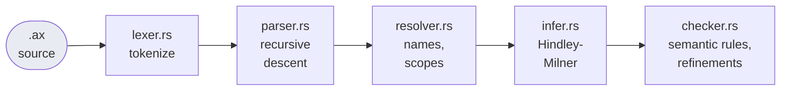
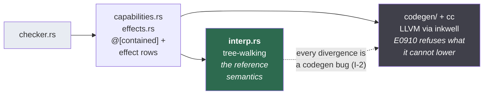
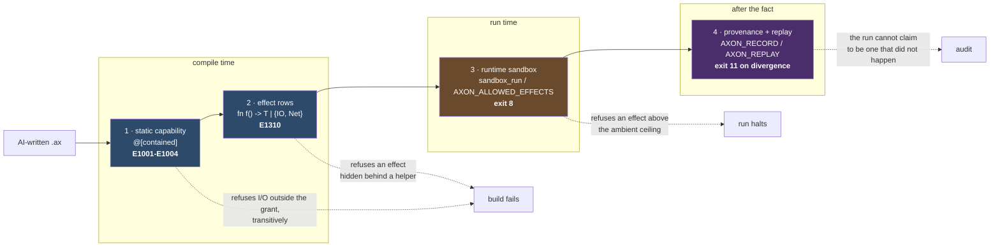
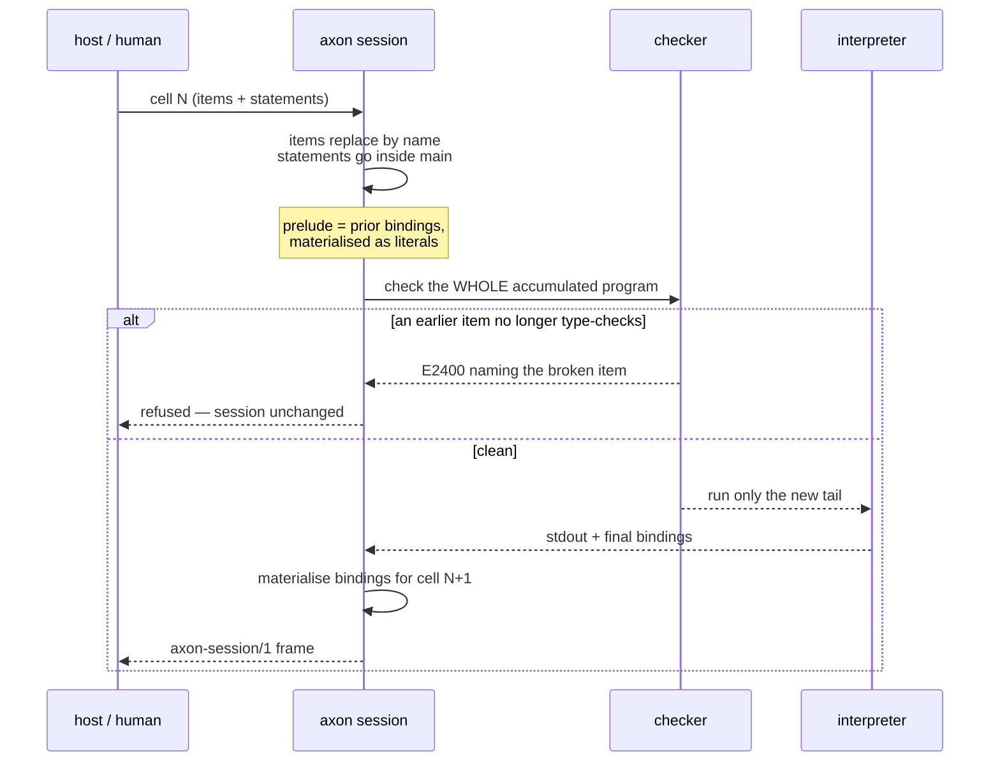

# Axon — Architecture

**What generation cannot produce.** `AXON_REFERENCE.md` is generated from the compiler's own
tables and lists *what* this build supports — every verb, builtin and attribute, exhaustively and
gated against drift. This document is the other half: *how the thing is put together, and why the
design forks resolved the way they did.* Read this first; reach for the reference when you need the
exact surface.

Audience: someone — human or model — who needs to extend Axon, or decide whether to build on it.

> Counts below were **measured on 2026-09-17**, not copied from older specs. Three numbers in this
> document's first draft *were* copied — parity-harness count, heuristic size, `Expr::` site count —
> and all three had drifted from the specs that stated them. Re-measure before citing; the commands
> are in §8.

---

## 1. What Axon is, in one paragraph

A statically-typed systems language whose thesis is that **AI-written code should be sandboxed by
the compiler rather than by trust**. It has Hindley-Milner inference, no null and no exceptions
(`Option<T>` / `Result<T,E>`), structural typing, refinement types, row-polymorphic effects, and
first-class AI/agent annotations. It runs **interpreter-first** — the tree-walking interpreter is
the reference semantics and the default execution path; native LLVM codegen is an optimisation that
must match it, not the other way round. Source is `.ax`.

The thing that makes it unusual is not any one feature but the **direction of the safety argument**:
capabilities are checked statically at compile time (`@[contained]`, E1001–E1004), enforced again at
runtime (`sandbox_create`, exit 8), and every consequential action is recorded in a provenance log
that can be replayed byte-for-byte with the environment stripped away.

---

## 2. The two-engine rule (the invariant everything else rests on)

**I-2: the interpreter is the reference semantics.** There are two execution engines —
`interp.rs` (tree-walking, always available) and LLVM codegen (`codegen/`, feature-gated but on by
default). When they disagree, the interpreter is right and codegen is wrong.

This is not a stylistic preference. It is what makes every other guarantee checkable:

* the self-improving compiler (`improve.rs`) uses the interpreter as its **equivalence oracle** —
  a rewrite is correct iff `interp(P(c)) == interp(c)` over a corpus, never because a model said so;
* 54 `scripts/*parity*.sh` harnesses plus a differential fuzzer (`fuzz_parity.sh`) exist solely to
  find places the two engines diverge;
* a feature the interpreter has and codegen cannot express is **E0910-refused at build time**, not
  silently mis-lowered. Sound-by-refusal is the house pattern: `host_await`, `kernel_*`, the
  `Sandbox` builtins and non-`balanced` AI tiers are all interpreter-only and say so.

If you add anything that executes, you own the parity question. The cheapest way to get it wrong is
to implement a builtin in one engine and assume the other follows.

---

## 3. Pipeline





**Each phase owns an error band**, so a code tells you which one rejected your program:

| Phase | Codes |
|---|---|
| `parser.rs` | `E0000` — the parse tier, historically where 100% of a model's failures landed, which is why it carries `help` naming the foreign habit (`mut`, `const`, `def`) rather than the confusing token |
| `resolver.rs` | `E0001`–`E0003`, `W0005` unreachable, `W0006` unused |
| `infer.rs` | `E0102` type mismatch, `E0305`–`E0308` |
| `checker.rs` | `E0304` non-exhaustive, `E0401`, `E0504` bounds, `E12xx` capabilities/purity, `E13xx` AI policy + effects |
| `capabilities.rs` | `E1001`–`E1005` (`E1005` = `--require-contained`, R45), `E1310` effect subsumption |
| `codegen/` | `E0910` — **a refusal, not a failure**: a construct the interpreter supports and codegen cannot faithfully lower is rejected at build time rather than mis-lowered. Sound-by-refusal is the house pattern |

Rough sizes, to calibrate where the mass is: `checker.rs` ~8k lines, `main.rs` ~7.9k (the CLI, 25
verbs), `interp.rs` ~5.1k, `parser.rs` ~4.8k, `builtins.rs` ~3.1k, `resolver.rs` ~3k. `axon-core` is
~99k lines; the workspace has 19 crates.

**Known debt worth knowing before you touch the front end:** type information is derived *three
separate times* — authoritatively in `infer.rs`, again inside `checker.rs`, and a third time by a
178-line heuristic in codegen (`infer_expr_sem_type`) that every new collection builtin must be
patched into. Spec
`R2a-type-map-threading.md` is the fix (persist and thread an `ExprId → Type` map); it is XL and
strictly serial, touching ~2,080 `Expr::` construction sites across 16 files. Until it lands, a
codegen-disagrees-with-HM bug is a live category.

---

## 4. Crate map

| Crate | Role |
|---|---|
| `axon-core` | the compiler: lexer → codegen, the interpreter, the CLI (all 25 verbs) |
| `axon-rt` | C-ABI runtime the native binaries link against (`__axon_*` externs) |
| `axon-ai` | live model routing — provider codecs, gateway URL, keys, tiers |
| `axon-audit` | the capability audit ledger (append-only, integrity-checked) |
| `axon-web` | the approval-flow UI: a thin JSON proxy over the Phase-10 CLI verbs |
| `axon-cortex` | the Cortex control-plane slice: typed contracts, an authority-checked repair episode, and its conformance run. A library plus its gates — **no CLI verb calls it yet**, so nothing here is on a user's path |
| `axon-vm` | confidential microVM substrate, attestation, cross-VM quorum |
| `axon-os` | supervisor: bounded jobs, operator kill, compliance monitor |
| `axon-wasm` | the interpreter as a wasm cdylib (browser tier) |
| `axon-guest-kernel` / `axon-guest-init` | freestanding kernel + guest init (R17) |
| `axon-gfx` / `axon-gfx-mock` | native FFI graphics module and its mock twin (R13) |
| `axon-attest` · `axon-ledger` · `axon-signal` · `axon-certcheck` · `axon-domain` · `axon-intent` · `axon-surface` | attestation, provenance ledger, signals, certificate checking, domain modules, intent compilation, surface syntax |

---

## 5. How to extend it

### Adding a builtin

**Fast path** — a plain scalar/handle extern with no special call-site lowering:

1. `builtins.rs` — add a `BuiltinFn` row (name, params, ret, doc).
2. `crates/axon-rt/src/lib.rs` — write the `#[no_mangle] extern "C" fn __axon_*` impl.
3. `codegen/builtin_externs.rs` — add one `ExternSig` row. This single row replaces both the old
   LLVM-declare block and the `infer.rs` return-type insert.
4. Add a parity case (a `fuzz_parity.sh` row or a dedicated differential test). The drift tests
   catch arity skew between the two tables; they do **not** check behaviour — that is the parity
   test's job.

**Full path** — bespoke call-site lowering (out-params like `str_slice`, dict get/set, `to_str`):
steps 1–2 plus `codegen/mod.rs` `emit_call`, a `Type::` mapping in `infer.rs`, and an example.

Then regenerate the reference (`axon reference > AXON_REFERENCE.md`) — a test fails until you do.

### Adding a CLI verb

Add the variant to `enum Command` in `main.rs` with a doc comment (the first line becomes its row in
the generated reference), wire the dispatch arm, implement `cmd_*`. Regenerate the reference.

### Adding a spec

`governance/specs/` is spec-first for anything with an architectural fork: write the spec, state the
**decisive fork** and resolve it, get to Reviewed, *then* write code (`BUILD_PROTOCOL.md` Gate 1).
Every spec carries a ```spec-meta``` block (id, status-claim, depends-on, blocks, blocked-by,
reserves, evidence) that `scripts/verify_all_specs.sh` and `scripts/r39_slice5_dag_check.sh`
validate — cycles, stale `blocked-by` pointers, and non-Draft specs with no re-runnable evidence all
fail. A non-Draft status needs an `evidence:` line naming a gate script that actually runs.

**Before writing one, grep for prior art.** It hides in `tasks/*.md`, env-var-gated prototypes, and
test fixtures — none of which surface from reading `ROADMAP.md` or the spec index. R44's first draft
re-derived its decisive fork from scratch while a working prototype, a prior spec and passing tests
for it sat in the repo, and rejected the right answer on a property that implementation did not have.

---

## 6. The safety architecture



Four layers, deliberately redundant:

1. **Static capability check.** `@[contained(fs: […], net: […], exec: none, never: […])]` is
   enforced by `capabilities.rs` (E1001–E1004). Transitive: a helper cannot launder the I/O one call
   away. Path traversal (`..`) is refused. `env_var` is denied inside `@[contained]` outright, because
   environment is an ungrantable ambient secret channel — read it outside the boundary and pass the
   value in.
2. **Effect rows.** `fn f() -> T | {IO, Net}` with subsumption checking (E1310) and handler
   discharge; anti-laundering is transitive here too.
3. **Runtime sandbox.** `sandbox_create` / `sandbox_run` enforce an effect ceiling at execution
   (`SandboxViolation`, exit 8). `AXON_ALLOWED_EFFECTS` is the ambient counterpart for a caller who
   cannot edit the program; an inner sandbox may only narrow it, never widen.
4. **Provenance + replay.** Every AI call and agent action lands in an append-only log with its
   principal and effect row. `AXON_RECORD` journals every host interaction; `AXON_REPLAY` serves a
   run from that journal with the filesystem and environment stripped, and any departure is a
   **divergence** the program cannot swallow (exit 11).

**Exit codes are a vocabulary, not a convention** (`governance/EXIT_CODES.md`): 3 verify-failed,
4 halted, 5 AI-policy, 6 refinement violation, 7 goal budget, 8 sandbox violation, 9 resource bound,
10 coalition bound, 11 replay divergence, 12 containment, 13/14 quorum, 15 chain verify, 101 panic.
Comparing only exit codes is lossy — Axon remaps returns 2..=15 and 101 onto exit 1 — so parity
harnesses must compare stdout, not just status.

The 15 numbered invariants in `governance/ARCHITECTURE_INVARIANTS.md` (I-1 … I-15) are citable in
commits and reviews (`preserves I-7`). A change that breaks one is wrong by definition, even if its
tests pass; the correct move is to propose the invariant change explicitly, as `R13-native-ffi.md`
did when native FFI forced I-11 from *total* to *edge-enforced + trusted-within*.

---

## 6.5 The accumulating session (R44), as a worked mechanism

The newest subsystem, and the one whose shape is least guessable from its name. A session is **text**,
not a live interpreter — which is what buys two properties that a live-value design cannot have.



**Why materialise rather than keep values live?** Two reasons, both discovered by building it:

* **Types get pinned.** A binding arrives in the next cell as the literal it evaluated to. Keeping
  live values would re-infer `let x = make()` against a *redefined* `make` while the heap still held
  the old value — a wrong answer with a compile-time blessing on top.
* **The re-check stays idempotent.** Each cell is parsed fresh, so `load_use_decls` — which *prepends*
  imported items and tracks "already loaded" per call — runs exactly once. Re-checking one long-lived
  program would duplicate every import and fail cell 2 with `E0002`.

The cost is honest and reported, never silent: a closure, a `Chan`, an aliased dict or a native
`Handle` cannot cross a cell boundary, so each is **named with its reason** rather than dropped. A
name the model can see but not reuse is the case it most needs told about.

A live-`Interp` design (carrying closures across cells) is possible but blocked: `Interp<'p>` holds
`&'p FnDef` references into the `Program`, so appending to the accumulated program while the
interpreter borrows it cannot borrow-check. That is spec R44 §2.4 — a real refactor, not a tweak.

---

## 7. What is genuinely built vs. aspirational

Phases 1–14 are complete: the language, generics/traits/closures, LSP and tooling, refinement types,
effects and handlers, kernel runtime services, the goal/agent surface, replay+audit+sandbox, the
prose→AST CLI flow, risk-typed deployment gates, the web approval UI, probabilistic refinement, and
distributed types. R26–R34 (the attestation stack) are landed or implementing. R44 (the accumulating
typed session) is landed.

**Six Draft platform-vision specs are NOT committed work** — R36 (full ASI OS), R37 (nano kernel),
R38 (embedded SDK), R40 (AI-native research compiler), R41 (polyglot runtime), plus R16's UI fork.
The roadmap names the risk itself: six competing fronts is identity sprawl, and each is sized for a
founder decision rather than for building. Treat a Draft spec as a proposal, not a plan.

**Documentation lags code, systematically.** This has bitten repeatedly: `IMPLEMENTATION_PLAN.md`
described a critical path that had been landed for three months, and its own §4 lists six wrong
matrix entries. Verify a done-claim against the gate that proves it — the `evidence:` line — before
believing it. That is why `AXON_REFERENCE.md` is generated and test-gated rather than written.

---

## 8. Where to look next

| Question | File |
|---|---|
| What does this build support, exactly? | `AXON_REFERENCE.md` (generated, gated) |
| How do I write `.ax`? | `spec/axon-for-llms.md`, then `spec/language-tour.md`, `spec/stdlib.md` |
| Exact syntax? | `spec/grammar.ebnf` |
| Rules no change may break | `governance/ARCHITECTURE_INVARIANTS.md` |
| Why was X designed this way? | `governance/specs/R*.md` — each states its decisive fork and the resolution |
| What is planned? | `ROADMAP.md` (note §10.7's uncommitted candidates) |
| Build/test commands, curated | `CLAUDE.md` (explicitly a selection, not exhaustive) |
| Runtime C ABI | `spec/runtime.md` |

### Re-measuring this document's numbers

```bash
ls scripts/*parity*.sh | wc -l                      # parity harnesses
ls crates/ | wc -l                                  # crates
grep -oE 'I-[0-9]+' governance/ARCHITECTURE_INVARIANTS.md | sort -u | wc -l
grep -ro 'Expr::' crates/axon-core/src/ | wc -l      # R2a blast radius
axon reference | head -8                             # verbs / builtins / attributes
```
