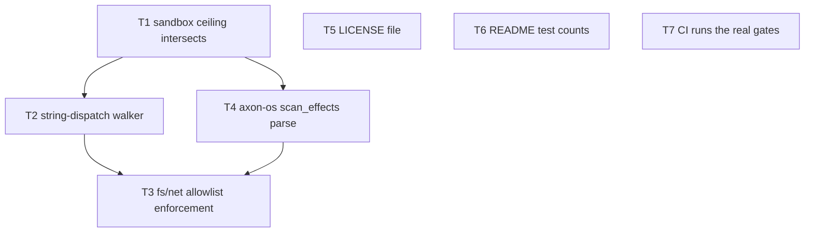

# Build loop — `governance/reviews/2026-07-31-deep-review.md`

Branch `governance-audit-2026-07-18` · baseline `20eb218` · DAG authored `2026-08-01`.

## Verification bar

- `<TEST_CMD>` = `cargo test --workspace` (~6 min; `cli_run` alone is 315 s)
- `<FAST_CMD>` = `cargo test -p <crate> <filter>` for the inner loop
- `<GATE>` = `scripts/gate.sh` (standard). **`--strict` SKIPs SMT silently without libz3** — check before trusting it.
- **Green = no failing test other than `wasm_interp_matches_native_on_pure_compute`** (see `baseline.md`)
- `<RUN_CMD>` / `<SMOKE_SCENARIO>` = `./flagship --ci` — verified by P5 to run cold-clone → exit 0 with all 4 sections, building axon-os/axon-vm and driving real Docker. Observable success signal: **exit 0 + 4 section headers present**.

Every security task additionally needs a **regression test that fails before the
fix and passes after**. A fix with no failing-first test does not count as done —
that is the exact class of defect this review found (gates that assert nothing).

## Scope decision

**[REVISED — full triage landed]** The 9-agent triage of all 185 findings
completed after this DAG was first drafted (it had been presumed dead; it was
not). It returned **338 verdicts**: 261 confirmed, 27 wrong-severity, 39
duplicate, 11 needs-human. Corrected severities: **27 critical**, 114 high,
113 medium, 84 low. Raw: `.archive/triage/full-185.json`.

This supersedes the narrow 20-critical triage for planning, and it moves the
plan in **both** directions:

- The 20-critical sample downgraded 17/20. The full triage confirms most
  findings *and* **promotes** several — notably `OSK-P4-H1` (HIGH → CRITICAL).
- So the original severity column was not uniformly inflated; it was **noisy**.
  Sampling 20 of 185 measured the noise, not a bias. Worth stating plainly
  because the earlier conclusion ("corrected count is 3, not 20") generalised
  from a sample that did not support it.

**This loop still does not implement all 185.** Effort distribution is 59
trivial / 125 small / 112 medium / 42 large. The ordering principle is
unchanged — implement what is *verified and reproduced*, prefer findings with
end-to-end repros over code-read-only ones — but the queue is now grounded in
338 verdicts instead of 20.

Independent corroboration of the original DAG: `OSK-P4-C1`, `INTERP-C01` and
`P4-INT-01` are three separate agents landing on T1's exact two lines, all with
executed repros. `OSK-P4-C2` and `P4-OS-02` likewise for T3.

## Task DAG

`T5`/`T6`/`T7` are independent of everything and of each other.

## Tasks

### T1 — `sandbox_run` must intersect, not replace, the effect ceiling
**Fixes F041 + F013 (2 of the 3 CRITICALs — one root cause).**
Files: `crates/axon-core/src/interp/builtins.rs` (~186-195, 2798-2840).

`:191` exempts `sandbox_create`/`sandbox_run` from the ceiling check; `:2836`
does `self.active_sandbox.replace(sb_handle)`. Together: a zero-cap job mints a
wider sandbox and runs inside it. Reproduced end-to-end through axon-os with a
zero-cap manifest — control exits 8, escape exits 0.

Fix: `sandbox_create` registers `requested ∩ active_ceiling`; `sandbox_run`
intersects rather than replaces. Keep the regress-guard the `:186-188` comment
intends without removing the floor.
Test: nested-sandbox escape must exit 8. Fails before, passes after.

### T2 — capability walker must follow string-named indirect dispatch
**Fixes F153 (CRITICAL).** Files: `crates/axon-core/src/capabilities.rs` (~630-712).

`check_expr` builds follow-edges only from `Expr::Call`/`MethodCall` callee
*names*; a function named by a string literal in argument position is walked as
data. The interpreter then dispatches exactly that string
(`interp/builtins.rs:116`, `:2832`). Same transitive-laundering class already
fixed twice in this repo (R6 taint, `@[contained]`).

Fix: when an arg is a string literal that resolves in `fn_map`, follow it.
Test: `sandbox_run(sb, "evil", 0)` where `evil` does IO must be refused statically.

### T3 — `fs:`/`net:` allowlists must actually constrain
**Fixes F014 + F040 (HIGH, independently corroborated by two agents).**
Files: `crates/axon-core/src/effects.rs`, `interp/builtins.rs`. **Largest task; do last.**

`effect_set()` reduces capabilities to booleans, discarding path prefixes and
host allowlists, and no path/host check exists downstream. So
`@[contained](fs: [write("./out/")], net: ["api.example.com"])` enforces only
"may write somewhere" / "may reach some host" — while the approval UI displays
the allowlist as though it binds.

Fix: carry prefixes/hosts into the runtime ceiling; check them at the FS/Net
builtin boundary. Reuse the existing `..`-traversal denial.
Test: write outside the prefix → exit 8; host not in allowlist → exit 8.

### T4 — axon-os `scan_effects` substring match is evadable
**[PROMOTED HIGH → CRITICAL by full triage — `OSK-P4-H1`.]** Fixes F042.
Files: `crates/axon-os/src/runtime.rs` (~218-242).

`let exec = source.contains("exec(") || source.contains("spawn_proc")`.
`exec ("touch", &args)` with one space parses identically and scans false.

The promotion rationale is the part I had wrong: `runtime.rs:251` documents in
its own comment that fs and exec collapse into a single `IO` bucket at runtime,
and that finer fs-vs-exec distinctions are enforced **only** by the static gate.
So for any job granted `fs_read` or `fs_write`, this substring scan is the *sole*
control separating `exec: "none"` from arbitrary process spawn — a one-space
bypass of the only exec gate. T1 does **not** restore a floor here, because at
runtime there is no fs/exec distinction left to restore.

Same fn, also confirmed: effects behind a `mod` import are invisible (only the
top-level file is read); `env_var`, `sleep_ms`/`now_ms`, `chan_*`,
`goal_run`/`goal_eval`, `sql_query` all scan as pure.

Fix: parse with axon-core and take the union of `builtin_effect_row` over the
resolved module graph (already available via `axon ast review`). Map any
parse/resolve/read failure to the existing deny-by-default path at `runtime.rs:280`.
Add a drift test: every `builtin_effect_row` name with a non-empty row must be
classified, so a newly-added capability builtin cannot scan as pure.
Note: this fn is duplicated verbatim in a second crate — fix both or extract one shared module.
Test: `exec (` variant must be caught; `mod`-imported effect must be caught.

### T8 — `builtin_effect_row` conflates exec with fs/env/exit
**`P6-COV-01` (CRITICAL), root cause beneath T4 and several others.**
Files: `crates/axon-core/src/builtins.rs`.

`read_file`/`write_file`/`env_var`/`exit` **and** `exec` all map to `&["IO"]`.
This is why the runtime cannot distinguish exec from fs, which is why T4's static
scan is load-bearing. Splitting the row is the structural fix; T4 is the local one.
Do T8 **before** T3, since T3 also depends on the row carrying more information.
Test: a sandbox granting fs must not thereby grant exec.

### T5 — add the MIT `LICENSE` file
`Cargo.toml:29` declares `license = "MIT"`; no `LICENSE` file exists. Mechanical.

### T6 — correct the README test counts
`README.md:290` claims "246 tests (189 unit + 57 integration)". Actual at baseline:
569 unit + 418 integration in `axon-core` alone. State the real number, or state
it as a workspace figure — do not leave a 2.4× understatement.

### T7 — CI must run the real gates
`.github/workflows/ci.yml` runs 4 commands, all `-p axon-core --no-default-features`.
**CI never builds codegen**, so every native/interp parity harness — the I-2
invariant this project rests on — is unexercised in CI and only ever runs locally.
Fix: add an LLVM-17 job running `gate.sh`, or at minimum the parity suite.
Note: this may surface pre-existing failures. Those go to `opportunities.md`; they
do not block T7, whose deliverable is *the gate running*, not the gate passing.

## Status (2026-08-01)

| task | state | commit |
|---|---|---|
| T1 nested sandbox narrows only | done | `d74d04c` |
| T8 IO does not imply exec | done | `71e135b` |
| T4 scan_effects hardened | done | `ac1a590` |
| T2 string-dispatch walker | done | `870469a` |
| T5 LICENSE / T6 README counts | done | `1a89758` |
| T3 fs/net allowlists bind | done | `4dd69e2` |
| T7 CI covers 19 crates + codegen | in progress | — |

All four confirmed sandbox-escape CRITICALs are closed, each with a regression
test verified to fail before the fix.

## Stop condition

Stop and report when **either**:
- T1–T7 are committed, `<TEST_CMD>` is green against baseline, and `./flagship --ci` exits 0; **or**
- 3 failed attempts on any single task (poison-task ceiling), or a task requires a
  `needs-human` decision.

Then report: what landed, what regressed, what is still untriaged (165 findings),
and the `needs-human` queue. **Do not** proceed to implement untriaged findings.

## needs-human queue — excluded from this run

The full triage independently flagged **11** findings as needs-human. Combined
with mine, grouped by decision:

**A. Exit-code semantics** (`F145`, `P6-EXIT-08`, `P6-EXIT-13`)
A program's `main()` return collides with the reserved exit contract: `3` →
VERIFY_FAILED, `6` → REFINE_VIOLATION, `8` → SANDBOX_VIOLATION, and **`256` →
exit 0, so a program returning 256 reports success**. Native agrees, so it is a
design property, not a divergence — and it is the direct cause of the axon-os
stderr-sniffing criticals. Every remedy (clamp `main` to outside 3..=12,
transform, or add a side channel) is a breaking semantics change. **This is the
highest-value decision in the queue**: several confirmed criticals collapse into
it, and none can be closed properly without it.

**B. Positioning vs. the SQL-injection claim** (`P5-POS-02`, `P5-26`, `F104`)
Sub-claims verified: there is no DB sink in the language (`sql_query` returns
`str`), it is E0910-refused in codegen, and E1210 keys on the literal ident so
interpolated SQL outside it is unguarded. The *disposition* — revert the headline
claim, or build the sink that would make it true — is a product call.

**C. v1 surface scope** (`P5-ECO-08`, `F116`, `P5-38`)
Zero regex builtins; date/time is `now_ms`/`temporal_now`/`sleep_ms` only, so an
epoch-millis value cannot be formatted. Whether regex/date-time/HTTP are v1 scope
is a roadmap decision, not a bug.

**D. Float display** (`P5-ECO-02`)
`1234567.891` → `1.23457e+06`, absolute error 2.109, and that value reaches the
filesystem. But `%.6g` is a *deliberate* choice converged with C printf to hold
interp/native parity. Changing it trades parity for precision — a real tradeoff.

**E. Audit-ledger integrity** (`P7-SEC-05`)
The default `provenance.jsonl` is unchained and **erasable by the audited program
itself** via `env_var` + `write_file`; the chained ledger is opt-in and
`append_global` returns `Ok(0)` when unconfigured. Making chaining the default is
a performance/compat decision.

**F. `principal_root` gating** (O003, mine)
Ungated — anyone mints root, so attenuation is bypassable without forgery.
Note the full triage independently confirms `P7-SEC-03` (forgeable handles) at
CRITICAL; my narrow triage refuted its *impact* on exactly this ground. Both
findings dissolve into one question: what establishes root authority?

**G. Product claims** (mine)
README's "~28 of 40 CVE-Bench by construction" — T3/T8 show fs/net allowlists do
not bind today, so the claim is unverified as written.

**H. O001 error precedence** (mine) — which error a user sees first on an
unconfigured host. A UX contract, and the test the gate is pinned to.
